# 🌊 MemoryOS API Message Flow Guide

## Overview

This guide documents the complete request flow logic for the MemoryOS API system, from initial HTTP request to final response. It covers the 3-plane architecture, middleware chain, routing logic, and backend integration patterns.

## 📐 Architecture Overview

MemoryOS uses a sophisticated 3-plane API architecture with a comprehensive middleware chain and port abstraction pattern:

```mermaid
graph TB
    subgraph "External Clients"
        WEB[Web Apps]
        MOBILE[Mobile Apps]
        CLI[CLI Tools]
        AGENTS[LLM Agents]
        ADMIN[Admin Console]
    end

    subgraph "API Entry Points - 3 Planes"
        APL["🤖 Agents Plane<br/>agents_tools.py<br/>mTLS Authentication<br/>/v1/tools/*"]:::plane
        APP["📱 App Plane<br/>app_frontend.py<br/>JWT Authentication<br/>/api/v1/*"]:::plane
        CTRL["🔐 Control Plane<br/>admin_index_security.py<br/>Admin/HSM Certs<br/>/admin/v1/*"]:::plane
    end

    subgraph "Middleware Chain (PEP)"
        MW_AUTH["1️⃣ MW_AUTH<br/>Authentication<br/>JWT/mTLS/Session"]:::middleware
        MW_PEP["2️⃣ MW_PEP<br/>Policy Enforcement<br/>RBAC/ABAC"]:::middleware
        MW_SEC["3️⃣ MW_SEC<br/>Security Controls<br/>MLS/Encryption"]:::middleware
        MW_QOS["4️⃣ MW_QOS<br/>Quality of Service<br/>Rate Limiting"]:::middleware
        MW_SAF["5️⃣ MW_SAF<br/>Safety Filters<br/>Content Safety"]:::middleware
        MW_OBS["6️⃣ MW_OBS<br/>Observability<br/>Metrics/Tracing"]:::middleware
    end

    subgraph "Ingress Adapter"
        ING["🔄 IngressAdapter<br/>Central Routing<br/>Operation Classification"]:::adapter
        INTENT["🧠 Intent Router<br/>Fast/Smart Path<br/>Decision Engine"]:::smart
    end

    subgraph "Port Abstractions"
        CMD["📝 CommandBusPort<br/>Write Operations<br/>Pipelines P01-P20"]:::port
        QRY["🔍 QueryFacadePort<br/>Read Operations<br/>Multi-store Queries"]:::port
        SSE["📡 SSEHubPort<br/>Stream Operations<br/>Real-time Events"]:::port
        OBS_PORT["📊 ObservabilityPort<br/>Metrics/Health<br/>Monitoring"]:::port
    end

    subgraph "Backend Services"
        PIPES["🔗 Pipeline Manager<br/>P01-P20 Coordination"]:::backend
        STORES["💾 Storage Layer<br/>Multi-store System"]:::backend
        EVENTS["⚡ Event Bus<br/>Async Processing"]:::backend
        COGN["🧠 Cognitive Services<br/>Memory Processing"]:::backend
    end

    %% Client Routing
    AGENTS --> APL
    WEB --> APP
    MOBILE --> APP
    CLI --> CTRL
    ADMIN --> CTRL

    %% Middleware Chain Flow (Sequential)
    APL --> MW_AUTH
    APP --> MW_AUTH
    CTRL --> MW_AUTH

    MW_AUTH --> MW_PEP
    MW_PEP --> MW_SEC
    MW_SEC --> MW_QOS
    MW_QOS --> MW_SAF
    MW_SAF --> MW_OBS

    %% Ingress Routing
    MW_OBS --> ING
    ING --> INTENT
    INTENT --> ING

    %% Port Distribution
    ING --> CMD
    ING --> QRY
    ING --> SSE
    ING --> OBS_PORT

    %% Backend Integration
    CMD --> PIPES
    QRY --> STORES
    SSE --> EVENTS
    OBS_PORT --> STORES

    PIPES --> STORES
    PIPES --> EVENTS
    STORES --> COGN
    EVENTS --> COGN

    classDef plane fill:#e1f5fe,stroke:#0277bd,stroke-width:2px
    classDef middleware fill:#f3e5f5,stroke:#7b1fa2,stroke-width:2px
    classDef adapter fill:#fff3e0,stroke:#f57c00,stroke-width:2px
    classDef smart fill:#e8f5e8,stroke:#388e3c,stroke-width:2px
    classDef port fill:#fce4ec,stroke:#c2185b,stroke-width:2px
    classDef backend fill:#f1f8e9,stroke:#689f38,stroke-width:2px
```



## 🎯 Core Components

### 1. API Planes (Entry Points)

#### **🤖 Agents Plane** (`agents_tools.py`)
- **Purpose**: LLM agent and tool integrations
- **Authentication**: mTLS certificates
- **Endpoints**: `/v1/tools/*`
- **Use Cases**: AI agents, external tool integrations

#### **📱 App Plane** (`app_frontend.py`)
- **Purpose**: User-facing application interfaces
- **Authentication**: JWT tokens
- **Endpoints**: `/api/v1/*`
- **Use Cases**: Web apps, mobile apps, user interactions

#### **🔐 Control Plane** (`admin_index_security.py`)
- **Purpose**: Administrative and security operations
- **Authentication**: Admin credentials + HSM certificates
- **Endpoints**: `/admin/v1/*`
- **Use Cases**: System administration, security management

### 2. Middleware Chain (PEP - Policy Enforcement Point)

The middleware chain implements a sophisticated security and processing pipeline:

```python
# Middleware execution order (first to last)
MW_AUTH → MW_PEP → MW_SEC → MW_QOS → MW_SAF → MW_OBS → IngressAdapter
```

#### **1️⃣ MW_AUTH - Authentication Middleware**
```python
# File: api/middleware/auth.py
class AuthenticationMiddleware:
    """
    Handles authentication across all three planes:
    - JWT token validation (App Plane)
    - mTLS certificate verification (Agents Plane)
    - Admin credential validation (Control Plane)
    """

    async def dispatch(self, request, call_next):
        # Extract and validate credentials
        security_context = await self.validate_credentials(request)
        request.state.security_context = security_context
        return await call_next(request)
```

#### **2️⃣ MW_PEP - Policy Enforcement Point**
```python
# File: api/middleware/policy.py
class PolicyEnforcementMiddleware:
    """
    Core policy enforcement using RBAC/ABAC:
    - Role-based access control
    - Attribute-based access control
    - Space-based permissions
    - Operation-level authorization
    """

    async def dispatch(self, request, call_next):
        policy_decision = await self.policy_service.evaluate_request(
            request, request.state.security_context
        )
        if policy_decision.is_denied():
            raise HTTPException(403, policy_decision.reason)
        request.state.policy_decision = policy_decision
        return await call_next(request)
```

#### **3️⃣ MW_SEC - Security Controls**
```python
# File: api/middleware/security.py
class SecurityControlsMiddleware:
    """
    Advanced security controls:
    - Multi-level security (MLS) enforcement
    - End-to-end encryption validation
    - Hardware security module integration
    - Security band enforcement (GREEN/AMBER/RED/BLACK)
    """
```

#### **4️⃣ MW_QOS - Quality of Service**
```python
# File: api/middleware/qos.py
class QualityOfServiceMiddleware:
    """
    Resource management and performance:
    - Rate limiting per user/endpoint
    - Request prioritization
    - Resource allocation
    - SLO enforcement
    """
```

#### **5️⃣ MW_SAF - Safety Filters**
```python
# File: api/middleware/safety.py
class SafetyFiltersMiddleware:
    """
    Content safety and abuse prevention:
    - Content safety scanning
    - Abuse detection
    - Harmful content filtering
    - Safety policy enforcement
    """
```

#### **6️⃣ MW_OBS - Observability**
```python
# File: api/middleware/observability.py
class ObservabilityMiddleware:
    """
    Comprehensive monitoring and observability:
    - Request/response logging
    - Performance metrics
    - Distributed tracing
    - Audit trail generation
    """
```

### 3. Ingress Adapter - Central Routing Hub

The `IngressAdapter` is the critical routing component that bridges HTTP endpoints to backend services:

```python
# File: api/ingress/adapter.py
class IngressAdapter:
    """
    Central routing component with operation classification:

    ROUTING_MAP = {
        # Memory Operations (Commands)
        "memory_submit": RoutingDecision(OperationType.COMMAND, "memory_submit", "P02"),
        "memory_project": RoutingDecision(OperationType.COMMAND, "memory_project", "P01"),

        # Query Operations
        "memory_recall": RoutingDecision(OperationType.QUERY, "memory_recall", "P03"),
        "memory_search": RoutingDecision(OperationType.QUERY, "memory_search", "P03"),

        # Stream Operations
        "events_stream": RoutingDecision(OperationType.STREAM, "events_stream"),

        # Observability Operations
        "health_check": RoutingDecision(OperationType.OBSERVABILITY, "health_check"),
    }
    """

    async def route_request(self, operation: str, data: Any,
                          envelope: Envelope, request: Request) -> Any:
        """
        Central routing logic:
        1. Classify operation type (COMMAND/QUERY/STREAM/OBSERVABILITY)
        2. Route through Intent Router for fast/smart path decision
        3. Delegate to appropriate port abstraction
        4. Return processed result
        """
```

#### Intent Router Integration

The Intent Router provides intelligent routing decisions:

```python
# File: intent/router.py
class IntentRouter:
    """
    Intelligent routing decisions:
    - FAST_PATH: Direct processing for simple operations
    - SMART_PATH: Route through attention gate for complex operations
    """

    def route(self, request: Dict[str, Any], metadata: Dict[str, Any]) -> IntentResult:
        # Analyze request complexity and context
        # Return routing decision with confidence score
```

### 4. Port Abstractions

#### **📝 CommandBusPort** - Write Operations
```python
# File: api/ports/command_bus.py
class CommandBusPort:
    """
    Handles all write operations:
    - memory_submit → Pipeline P02 (Write/Ingest)
    - memory_project → Pipeline P01 (Projection)
    - security operations → Pipeline P16 (Security)
    """

    async def execute_command(self, operation: str, payload: Dict[str, Any],
                            envelope: Envelope, metadata: Dict[str, Any]) -> Any:
        # Route to appropriate pipeline (P01-P20)
        pipeline = self.get_pipeline_for_operation(operation)
        return await pipeline.execute(payload, envelope, metadata)
```

#### **🔍 QueryFacadePort** - Read Operations
```python
# File: api/ports/query_facade.py
class QueryFacadePort:
    """
    Handles all read operations:
    - memory_recall → Multi-store query coordination
    - search operations → FTS + Vector + Semantic stores
    - analytics queries → Aggregated data retrieval
    """

    async def execute_query(self, operation: str, params: Dict[str, Any],
                          envelope: Envelope, metadata: Dict[str, Any]) -> Any:
        # Coordinate across multiple storage systems
        # Apply security filtering and redaction
```

#### **📡 SSEHubPort** - Stream Operations
```python
# File: api/ports/event_hub.py
class SSEHubPort:
    """
    Handles real-time streaming:
    - Server-sent events (SSE)
    - Real-time notifications
    - Event bus integration
    """

    async def create_stream(self, stream_type: str, params: Dict[str, Any],
                          envelope: Envelope, metadata: Dict[str, Any]) -> Any:
        # Create persistent connection for real-time data
```

#### **📊 ObservabilityPort** - Monitoring Operations
```python
# File: api/ports/observability.py
class ObservabilityPort:
    """
    Handles monitoring and observability:
    - Health checks
    - Metrics collection
    - Performance monitoring
    - System status reporting
    """
```

## 🌊 Complete Request Flow Examples

### Example 1: Memory Submit Operation (Write Path)


### Example 2: Memory Recall Operation (Read Path)


### Example 3: Real-time Events Stream (Stream Path)


## 🔧 Operation Classification

The IngressAdapter classifies all operations into four main types:

### **COMMAND Operations** (Write Path)
- **Purpose**: Modify system state, create/update/delete data
- **Target**: CommandBusPort → Pipelines P01-P20
- **Examples**:
  - `memory_submit` → Pipeline P02 (Write/Ingest)
  - `memory_project` → Pipeline P01 (Projection)
  - `security_update` → Pipeline P16 (Security)

### **QUERY Operations** (Read Path)
- **Purpose**: Retrieve data without modification
- **Target**: QueryFacadePort → Multi-store coordination
- **Examples**:
  - `memory_recall` → Vector + FTS + Semantic stores
  - `analytics_overview` → Aggregated data queries
  - `rbac_roles` → Policy system queries

### **STREAM Operations** (Real-time Path)
- **Purpose**: Establish persistent connections for real-time data
- **Target**: SSEHubPort → Event Bus integration
- **Examples**:
  - `events_stream` → Real-time event notifications
  - `memory_updates` → Live memory formation updates

### **OBSERVABILITY Operations** (Monitoring Path)
- **Purpose**: System monitoring, health checks, metrics
- **Target**: ObservabilityPort → Monitoring systems
- **Examples**:
  - `health_check` → System health validation
  - `metrics_collection` → Performance data gathering

## 🛡️ Security and Policy Integration

### Policy Enforcement Points (PEP)

The system implements comprehensive policy enforcement at multiple levels:

#### **1. Middleware Level (MW_PEP)**
```python
class PolicyEnforcementMiddleware:
    async def evaluate_request(self, request: Request,
                             security_context: SecurityContext) -> PolicyDecision:
        """
        Primary policy evaluation:
        - User authentication validation
        - Role-based access control (RBAC)
        - Attribute-based access control (ABAC)
        - Space-based permissions
        - Operation-level authorization
        """
```

#### **2. Operation Level (IngressAdapter)**
```python
class IngressAdapter:
    def validate_operation_permission(self, operation: str,
                                    security_context: SecurityContext) -> bool:
        """
        Operation-specific authorization:
        - Admin-only operations validation
        - Resource-specific permissions
        - Context-aware authorization
        """
```

#### **3. Data Level (QueryFacadePort)**
```python
class QueryFacadePort:
    async def apply_data_redaction(self, results: List[Any],
                                 security_context: SecurityContext) -> List[Any]:
        """
        Data-level security enforcement:
        - Field-level redaction
        - Row-level security
        - Attribute-based filtering
        - Privacy policy compliance
        """
```

### Security Bands

MemoryOS implements a multi-level security system with four security bands:

- **🟢 GREEN**: Public, low-sensitivity data
- **🟡 AMBER**: Internal, moderate-sensitivity data
- **🔴 RED**: Confidential, high-sensitivity data
- **⚫ BLACK**: Top Secret, maximum-sensitivity data

## 📊 Observability and Monitoring

### Multi-Layer Observability

#### **1. HTTP Layer Observability**
```python
class MemoryObservabilityMiddleware:
    """
    Tracks memory flow through 6 architectural layers:
    1. HTTP/API Layer
    2. Middleware Chain
    3. Ingress Adapter
    4. Port Abstractions
    5. Backend Services
    6. Storage Systems
    """
```

#### **2. Request Tracing**
- **Trace ID**: Unique identifier for end-to-end request tracking
- **Span Creation**: Each component creates spans for performance monitoring
- **Context Propagation**: Security and trace context flows through entire stack

#### **3. Performance Metrics**
- **Response Times**: Per-endpoint, per-operation timing
- **Throughput**: Requests per second by operation type
- **Error Rates**: 4xx/5xx error tracking by component
- **Resource Usage**: Memory, CPU, storage utilization

## 🔄 Pipeline Integration (P01-P20)

The CommandBusPort routes write operations to specific pipelines based on operation type:

### **Pipeline Categories**

#### **Core Memory Pipelines**
- **P01**: Memory Projection and Formation
- **P02**: Memory Write and Ingest
- **P03**: Memory Retrieval and Search
- **P04**: Memory Consolidation

#### **Cognitive Pipelines**
- **P05**: Attention Gate and Salience
- **P06**: Working Memory Management
- **P07**: Episodic Memory Formation
- **P08**: Semantic Knowledge Integration

#### **System Pipelines**
- **P16**: Security and Encryption
- **P17**: Sync and Replication
- **P18**: Analytics and Reporting
- **P19**: Administrative Operations
- **P20**: Health and Monitoring

### **Pipeline Coordination**
```python
class CommandBusPort:
    async def route_to_pipeline(self, operation: str,
                              payload: Dict[str, Any]) -> Any:
        """
        Pipeline routing logic:
        1. Determine target pipeline from operation
        2. Prepare pipeline context and metadata
        3. Execute pipeline with proper error handling
        4. Coordinate cross-pipeline dependencies
        """
```

## 🚀 Performance Optimization

### **Fast Path vs Smart Path**

The Intent Router optimizes request processing through intelligent path selection:

#### **Fast Path**
- **When**: Simple, deterministic operations
- **Route**: Direct to port → Immediate processing
- **Examples**: Health checks, simple queries, cached data retrieval

#### **Smart Path**
- **When**: Complex operations requiring cognitive processing
- **Route**: Through attention gate → Cognitive analysis → Processing
- **Examples**: Complex searches, memory formation, multi-step operations

### **Caching Strategy**
- **L1 Cache**: In-memory request cache at middleware level
- **L2 Cache**: Redis-based shared cache at port level
- **L3 Cache**: Persistent storage cache at pipeline level

### **Resource Management**
- **Connection Pooling**: Database and service connection reuse
- **Request Batching**: Efficient bulk operation processing
- **Async Processing**: Non-blocking I/O throughout the stack

## 🔍 Debugging and Troubleshooting

### **Request Flow Debugging**

#### **1. Enable Debug Logging**
```python
# Set environment variable for detailed logging
LOG_LEVEL=DEBUG

# Or configure specific component logging
MEMORY_OBS_DEBUG=true
INGRESS_DEBUG=true
```

#### **2. Trace Request Flow**
Each request generates a trace ID that flows through all components:

```
2025-09-18 14:30:15 [INFO] MW_AUTH: trace_id=mem_1726_req_abc123 - JWT validated
2025-09-18 14:30:15 [INFO] MW_PEP: trace_id=mem_1726_req_abc123 - Policy: ALLOW
2025-09-18 14:30:15 [INFO] IngressAdapter: trace_id=mem_1726_req_abc123 - Routing memory_submit → COMMAND
2025-09-18 14:30:15 [INFO] CommandBusPort: trace_id=mem_1726_req_abc123 - Pipeline P02 execution
```

#### **3. Common Debugging Scenarios**

**Authentication Issues:**
```
Check MW_AUTH logs for:
- Invalid JWT tokens
- mTLS certificate problems
- Session validation failures
```

**Authorization Issues:**
```
Check MW_PEP logs for:
- RBAC role assignments
- ABAC attribute evaluation
- Space permission denials
```

**Routing Issues:**
```
Check IngressAdapter logs for:
- Unknown operation names
- Missing routing decisions
- Intent router failures
```

**Performance Issues:**
```
Check observability metrics for:
- Slow middleware processing
- Pipeline execution times
- Database query performance
```

## 📋 API Operation Reference

### **Memory Operations**

| Operation        | Type    | Pipeline | Description                 |
| ---------------- | ------- | -------- | --------------------------- |
| `memory_submit`  | COMMAND | P02      | Submit new memory content   |
| `memory_recall`  | QUERY   | P03      | Retrieve memories by query  |
| `memory_search`  | QUERY   | P03      | Search across memory stores |
| `memory_project` | COMMAND | P01      | Project memory formation    |
| `memory_update`  | COMMAND | P02      | Update existing memory      |
| `memory_delete`  | COMMAND | P02      | Delete memory (soft delete) |

### **Administrative Operations**

| Operation         | Type          | Pipeline | Description              |
| ----------------- | ------------- | -------- | ------------------------ |
| `rbac_roles`      | QUERY         | -        | List RBAC roles          |
| `rbac_assign`     | COMMAND       | P16      | Assign user roles        |
| `security_update` | COMMAND       | P16      | Update security settings |
| `health_check`    | OBSERVABILITY | -        | System health status     |
| `metrics_get`     | OBSERVABILITY | -        | System metrics           |

### **Event Operations**

| Operation       | Type    | Pipeline | Description               |
| --------------- | ------- | -------- | ------------------------- |
| `events_stream` | STREAM  | -        | Real-time event stream    |
| `events_ack`    | COMMAND | -        | Acknowledge event receipt |

## 📖 Additional Resources

### **Related Documentation**
- [API Architecture Handbook](../docs/_quarantined/api_stuff/architecture-handbook.md)
- [Contract Change Workflow](../.github/instructions/contract-change-workflow.instructions.md)
- [Milestone-Epic-Issue Workflow](../.github/instructions/milestone-epic-issue-workflow.instructions.md)
- [Policy Implementation Guide](../policy/README.md)
- [Observability Implementation](../observability/README.md)

### **Code References**
- [API Routers](../api/routers/) - Entry point implementations
- [Middleware Chain](../api/middleware/) - Security and processing layers
- [Ingress Adapter](../api/ingress/adapter.py) - Central routing logic
- [Port Abstractions](../api/ports/) - Backend integration interfaces
- [Pipeline Implementations](../pipelines/) - Backend processing pipelines

### **Testing and Validation**
- [Integration Tests](../tests/integration/) - End-to-end flow validation
- [Middleware Tests](../tests/middleware/) - Component-level testing
- [Performance Tests](../tests/performance/) - Load and performance validation

---

*This guide represents the current state of the MemoryOS API message flow as of September 2025. For the latest updates and changes, refer to the project's documentation and commit history.*
