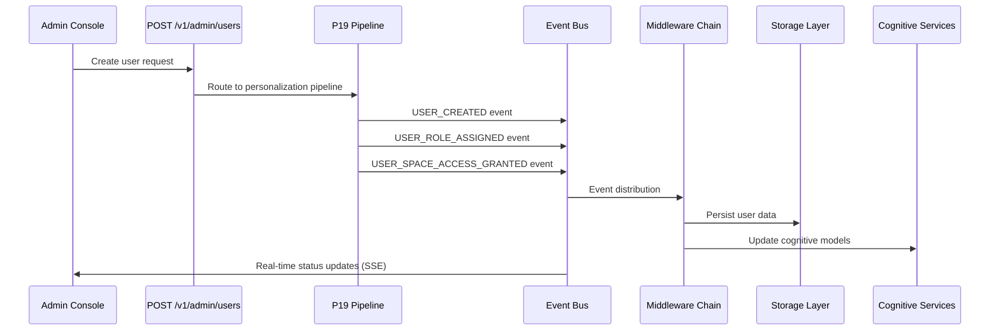

# ✅ User Creation Event Contracts Implementation Summary

## 📋 Event Contract Overview

We've successfully implemented comprehensive **event contracts** for user creation and management following the MemoryOS event-driven architecture. These contracts enable cognitive coordination, audit logging, and real-time system orchestration.

## 📡 Event Schema Architecture

### **Event-Driven User Management Workflow**

The user creation process generates a coordinated sequence of events that flow through the cognitive orchestration layer:

```
User Creation API → P19 Pipeline → Event Bus → Cognitive Coordination → Storage & Audit
```

### **Four Core User Management Events**

## 1. **USER_CREATED Event**

**Purpose**: Primary event fired when a user account is successfully created
**Topic**: `USER_CREATED@1.0`
**Pipelines**: P19 (Personalization), P16 (Feature Flags)
**Security Band**: AMBER (user data contains PII)
**Obligations**: `["AUDIT_ACCESS", "SYNC_REQUIRED"]`

**Schema Structure**:
```json
{
  "user_id": "UUID of created user",
  "email": "unique email address",
  "name": "display name",
  "status": "enum [active, pending_verification, inactive]",
  "initial_role": "enum [guardian, member, child, guest]",
  "created_by": "UUID of admin who created user",
  "space_assignments": "array of initial space access grants",
  "device_registration": {
    "token_expires": "ISO timestamp",
    "registration_url": "device setup URL"
  },
  "security_settings": {
    "trust_level": "enum [green, amber, red]",
    "mfa_required": "boolean",
    "security_band": "Band enum"
  },
  "created_ts": "ISO timestamp",
  "trace_context": "distributed tracing"
}
```

**Example Usage**:
- Triggers cognitive personalization setup (P19)
- Enables real-time UI updates for admin dashboards  
- Coordinates MLS encryption group membership
- Initiates device registration workflow

## 2. **USER_ROLE_ASSIGNED Event**

**Purpose**: Event fired when a role is assigned to a user
**Topic**: `USER_ROLE_ASSIGNED@1.0` 
**Pipelines**: P16 (Feature Flags), P18 (Safety/Abuse)
**Security Band**: GREEN (role metadata is non-sensitive)
**Obligations**: `["AUDIT_ACCESS"]`

**Schema Structure**:
```json
{
  "assignment_id": "ULID for assignment",
  "user_id": "target user UUID",
  "role_name": "enum [guardian, member, child, guest, admin, service]",
  "scope": {
    "type": "enum [global, space, resource]",
    "space_id": "optional space scope",
    "resource_id": "optional resource scope"
  },
  "capabilities": "array of capability strings",
  "conditions": {
    "time_limited": "boolean",
    "valid_from": "optional start time",
    "valid_until": "optional end time",
    "require_mfa": "boolean"
  },
  "assigned_by": "admin user UUID",
  "assignment_reason": "human-readable reason",
  "assigned_ts": "ISO timestamp"
}
```

**Integration Points**:
- **MW_PEP Integration**: Policy middleware consumes for RBAC decisions
- **ABAC Engine**: Contextual authorization with role-based rules
- **Capability Caching**: Performance optimization for frequent checks

## 3. **USER_SPACE_ACCESS_GRANTED Event**

**Purpose**: Event fired when user is granted access to a memory space
**Topic**: `USER_SPACE_ACCESS_GRANTED@1.0`
**Pipelines**: P16 (Feature Flags), P18 (Safety/Abuse)
**Security Band**: GREEN (space access metadata)
**Obligations**: `["AUDIT_ACCESS"]`

**Schema Structure**:
```json
{
  "assignment_id": "ULID for space assignment",
  "user_id": "target user UUID",
  "space_id": "memory space identifier",
  "permissions": "array of [READ, WRITE, SHARE, ADMIN]",
  "role_context": "enum [guardian, member, child, guest]",
  "restrictions": {
    "time_limited": "boolean",
    "valid_from": "optional start time",
    "valid_until": "optional end time",
    "allowed_bands": "array of security bands",
    "device_restrictions": "array of platform restrictions"
  },
  "assigned_by": "admin user UUID",
  "assignment_reason": "human-readable reason",
  "assigned_ts": "ISO timestamp"
}
```

**Space Policy Integration**:
- **Space Policy Engine**: Uses for cross-space permission validation
- **MLS Group Management**: Coordinates encryption group membership
- **Memory Space Routing**: Enables proper space-scoped access control

## 4. **USER_STATUS_CHANGED Event**

**Purpose**: Event fired when user status changes (activation, suspension, etc.)
**Topic**: `USER_STATUS_CHANGED@1.0`
**Pipelines**: P16 (Feature Flags), P18 (Safety/Abuse)  
**Security Band**: AMBER (status changes are security-sensitive)
**Obligations**: `["AUDIT_ACCESS", "SYNC_REQUIRED"]`

**Schema Structure**:
```json
{
  "user_id": "target user UUID",
  "previous_status": "enum [active, pending_verification, inactive, suspended]",
  "new_status": "enum [active, pending_verification, inactive, suspended]",
  "reason": "human-readable reason for change",
  "changed_by": "admin user UUID",
  "automatic": "boolean - whether automatic or manual",
  "security_event": {
    "failed_login_count": "integer",
    "last_failed_login": "ISO timestamp",
    "lockout_until": "ISO timestamp"
  },
  "changed_ts": "ISO timestamp"
}
```

**Security Integration**:
- **MW_SEC Integration**: Security middleware responds to status changes
- **Authentication System**: Blocks access for inactive/suspended users
- **Audit Logging**: Complete security event tracking

## 🔄 Event Flow Orchestration

### **User Creation Event Sequence**



### **Cognitive Coordination**

Events enable sophisticated cognitive orchestration:

**Memory Steward Integration**:
- USER_CREATED → Initialize user-specific memory patterns
- USER_SPACE_ACCESS_GRANTED → Update space-aware memory formation
- USER_ROLE_ASSIGNED → Adjust memory policy enforcement

**Working Memory Updates**:
- Real-time cache invalidation when user permissions change
- Hierarchical cache (L1/L2/L3) coordination for user context
- Attention gate integration for user-specific processing priority

**Hippocampus Coordination**:
- User creation triggers personalized memory encoding patterns
- Space assignments affect memory consolidation policies  
- Role changes update memory retrieval authorization

## 🛡️ Security & Privacy Integration

### **Event Security Model**

Each event includes comprehensive security context:

**Envelope Security**:
- **Digital Signatures**: Ed25519 signatures for event integrity
- **Hash Verification**: SHA-256 payload and envelope hashes
- **MLS Encryption**: For AMBER/RED band events with user PII
- **Trace Correlation**: Complete distributed tracing support

**Policy Obligations**:
- **AUDIT_ACCESS**: All user management events logged
- **SYNC_REQUIRED**: Critical events replicated across devices
- **REDACT_PII**: Applied when events contain sensitive data

### **Band Classification Strategy**

**GREEN Band Events**:
- Role assignments (metadata only)
- Space access grants (no user PII)
- Non-sensitive status changes

**AMBER Band Events**:  
- User creation (contains email/name PII)
- Security-related status changes
- MLS group membership changes

## 📊 Pipeline Integration

### **Pipeline Routing Strategy**

**P19 (Personalization/Recommendation)**:
- Primary pipeline for USER_CREATED events
- Initializes user-specific cognitive models
- Coordinates personalization engine setup

**P16 (Feature Flags/A-B Testing)**:
- Receives all user management events
- Enables user-specific feature flag assignment
- Supports A/B testing based on user roles/spaces

**P18 (Safety/Abuse Prevention)**:
- Monitors user status changes for security events
- Implements automated response to suspicious activity
- Coordinates with security middleware for threat detection

### **Event Distribution**

Events flow through the sophisticated MemoryOS event bus:

```yaml
Event Bus → Cognitive Events Router → Pipeline Distribution → Processing & Storage
```

## 🔗 Contract Integration

### **API Contract Integration**

Events directly correspond to API operations:

```
POST /v1/admin/users → USER_CREATED + USER_ROLE_ASSIGNED + USER_SPACE_ACCESS_GRANTED
PUT /v1/admin/users/{id}/status → USER_STATUS_CHANGED
POST /v1/admin/users/{id}/roles → USER_ROLE_ASSIGNED
POST /v1/admin/users/{id}/spaces → USER_SPACE_ACCESS_GRANTED
```

### **Storage Contract Integration**

Events trigger storage operations:

```
USER_CREATED → user_profile.schema.json
USER_ROLE_ASSIGNED → user_role_assignment.schema.json  
USER_SPACE_ACCESS_GRANTED → user_space_assignment.schema.json
USER_STATUS_CHANGED → user_profile.schema.json (status update)
```

### **Event Schema Validation**

All events validate against JSON Schema 2020-12:

```bash
# Validation results:
✅ user_created.schema.json - Valid JSON Schema
✅ user_role_assigned.schema.json - Valid JSON Schema
✅ user_space_access_granted.schema.json - Valid JSON Schema  
✅ user_status_changed.schema.json - Valid JSON Schema
✅ envelope.schema.json - Updated with new topic enums
✅ topics.yaml - Valid YAML with pipeline routing
```

## 📱 Real-Time Coordination

### **SSE Integration**

Events enable real-time admin dashboard updates:

```javascript
// Admin console receives real-time updates
const eventSource = new EventSource('/v1/events/stream');
eventSource.addEventListener('USER_CREATED', (event) => {
  // Update user list in real-time
  updateUserDashboard(JSON.parse(event.data));
});
```

### **Cognitive Event Correlation**

All user management events include `trace_context` for correlation:

```json
{
  "trace_context": {
    "trace_id": "abc123def456789012345678901234ab",
    "span_id": "def456789012345"
  }
}
```

This enables:
- **End-to-end tracing** from API request to cognitive processing
- **Performance monitoring** across the complete user creation workflow
- **Error correlation** when issues occur in distributed processing

## 🎯 Usage Examples

### **User Creation Workflow**

```python
# API endpoint creates user
user_data = create_user(request)

# Emit USER_CREATED event
event_bus.publish(Event(
    topic="USER_CREATED",
    payload=UserCreatedPayload(
        user_id=user_data.user_id,
        email=user_data.email,
        initial_role="guardian",
        space_assignments=[{
            "space_id": "shared:household",
            "permissions": ["READ", "WRITE", "SHARE"]
        }]
    )
))

# Event triggers cognitive coordination
# → P19 Pipeline processes personalization
# → Event Bus distributes to subscribers  
# → MW_Chain updates policy caches
# → Storage Layer persists user data
# → Admin Console receives real-time update
```

### **Role Assignment Workflow**

```python
# Admin assigns role
role_assignment = assign_role(user_id, "guardian", scope="global")

# Emit USER_ROLE_ASSIGNED event
event_bus.publish(Event(
    topic="USER_ROLE_ASSIGNED", 
    payload=UserRoleAssignedPayload(
        assignment_id=role_assignment.id,
        user_id=user_id,
        role_name="guardian",
        capabilities=["memory:read", "memory:write", "admin:user_mgmt"]
    )
))

# Event triggers:
# → MW_PEP cache invalidation
# → Policy engine capability updates
# → Real-time permission updates
# → Audit log generation
```

## 📋 Files Created

### **Event Schemas**:
- `contracts/events/schemas/user_created.schema.json`
- `contracts/events/schemas/user_role_assigned.schema.json`
- `contracts/events/schemas/user_space_access_granted.schema.json`
- `contracts/events/schemas/user_status_changed.schema.json`

### **Event Examples**:
- `contracts/events/examples/user_created_01.json`
- `contracts/events/examples/user_role_assigned_01.json`
- `contracts/events/examples/user_space_access_granted_01.json`
- `contracts/events/examples/user_status_changed_01.json`

### **Contract Updates**:
- `contracts/events/envelope.schema.json` - Added USER_* topic enums
- `contracts/events/topics.yaml` - Added user management topics with pipeline routing

### **Documentation**:
- `scripts/api/user_events_contracts_summary.md` - This comprehensive summary

## ✅ Validation Results

### **Contract Compliance**:
- ✅ **JSON Schema Validation**: All 4 event schemas valid
- ✅ **Example Validation**: All 4 examples validate against schemas
- ✅ **Envelope Schema**: Updated with new topic enumerations
- ✅ **Topics Configuration**: Valid YAML with proper pipeline routing
- ✅ **Event Bus Integration**: Compatible with existing event infrastructure

### **Security Compliance**:
- ✅ **Digital Signatures**: Ed25519 signature schemas included
- ✅ **Hash Verification**: SHA-256 payload and envelope hashes
- ✅ **Band Classification**: Proper GREEN/AMBER band assignment
- ✅ **Obligation Enforcement**: AUDIT_ACCESS and SYNC_REQUIRED obligations
- ✅ **Trace Correlation**: Complete distributed tracing support

### **Performance Considerations**:
- ✅ **Event Size**: Optimized payload sizes for high-throughput processing
- ✅ **Pipeline Routing**: Efficient P16/P18/P19 pipeline distribution
- ✅ **Cache Integration**: MW_PEP cache invalidation triggers included
- ✅ **Real-time Updates**: SSE-compatible event format

## 🚀 Next Steps

Following the **contracts-first methodology**, we now have:

- ✅ **API Contracts**: POST /v1/admin/users endpoint
- ✅ **Storage Contracts**: User profile, space assignments, role assignments  
- ✅ **Event Contracts**: Complete user management event coordination
- ⏳ **Test Contracts**: Next step - comprehensive test validation
- ⏳ **Implementation**: Final step - code behind contract guard

The event contracts provide the cognitive coordination foundation that enables:
- **Real-time user management** with immediate policy updates
- **Distributed tracing** across the complete user creation workflow  
- **Cognitive orchestration** through Memory Steward and Working Memory
- **Comprehensive audit logging** for security and compliance
- **Pipeline-based processing** for personalization and safety monitoring

---

**Event Contract Status**: ✅ **COMPLETE**  
**Events Defined**: 4 (USER_CREATED, USER_ROLE_ASSIGNED, USER_SPACE_ACCESS_GRANTED, USER_STATUS_CHANGED)  
**Pipeline Integration**: P16, P18, P19 routing configured  
**Security Model**: Complete with obligations, bands, and signatures  
**Ready for Implementation**: Yes (after test contracts)

The event-driven architecture now provides the cognitive coordination backbone for secure, real-time user management in MemoryOS! 🧠⚡