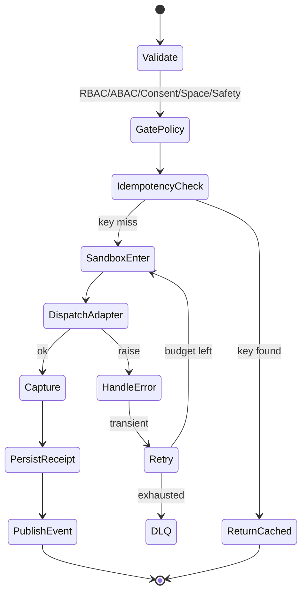
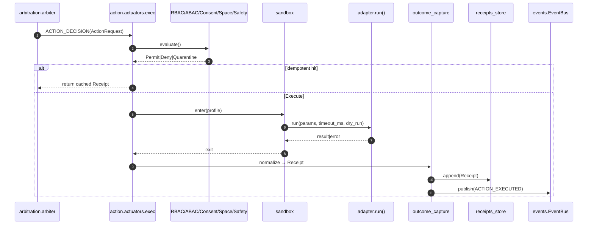

# `action/` — Actuators, Receipts, and Safe‑Effects (P04 Last‑Mile)

**Compiled:** 2025‑09‑06
**Philosophy:** *Production‑first, privacy‑first, explainable.*
**Role:** The **only** layer in the system allowed to create **durable side‑effects** (write files, create artifacts, send device‑local notifications, etc.). Everything else (retrieval, planning, learning) proposes; **`action/` executes and audits**.

---

## 0) Where `action/` sits (system view)

```mermaid
flowchart LR
  subgraph CORE["Global Workspace & Planning"]
    WS[workspace.global_workspace]
    ARB[arbitration.arbiter (P04)]
  end

  subgraph ACTION["action/ (this module)"]
    ACT[actuators.exec()]
    SBX[sandbox]
    CAP[outcome_capture]
    RNR[runner]
  end

  subgraph POLICY["policy/ & safety"]
    RBAC[policy.rbac]
    ABAC[policy.abac]
    SPACE[policy.space_policy]
    CONS[policy.consent]
    SAFE[policy/content_safety]
    RED[policy/redactor (P10)]
  end

  subgraph BUS["events/ (in‑process durable bus)"]
    BUS[(event bus)]
  end

  subgraph ST["storage/"]
    REC[receipts_store]
    BLOB[blob_store]
  end

  WS -->|WORKSPACE_BROADCAST| ARB
  ARB -->|ACTION_DECISION| ACT
  ACT -->|policy gate| POLICY
  ACT -->|enter| SBX
  SBX -->|call tool| ACT
  ACT -->|normalize| CAP --> REC
  CAP -->|ACTION_EXECUTED| BUS
  ACT -->|artifacts| BLOB
  BUS -->|replayable events| learning.coordinator
```

> The **Event Bus** is local, durable (JSONL WAL), and supports ack/nack, retries, DLQ, and consumer‑group replay—this is what turns our actions into trustworthy system‑wide signals.&#x20;

---

## 1) What this module **is** / **is not**

**Is:**

* A **tool execution engine** with **policy gates**, **sandboxing**, **idempotency**, and **auditable receipts**.
* A single choke‑point for **observability** (metrics, structured logs, traces) and **learning signals**.

**Is NOT:**

* A planner or agent—it does not decide *what* to do (P04 Arbiter does).
* A network client—**no outbound network** by default; tool adapters must declare and be whitelisted.

**Trust boundaries:**

* *Upstream* trusts `action/` to gate and audit effects.
* *Downstream* (Learning, QoS, Safety) trusts **Receipts** and **ACTION\_EXECUTED** events as the source of truth.

---

## 2) Directory layout

```
action/
├─ registry/
│  └─ tools_registry.py       # register_tool(), get_tool_spec(), get_adapter()
├─ tools/
│  ├─ __init__.py
│  ├─ files_write_text.py     # example adapter
│  └─ ...                     # add your tools here
├─ actuators.py               # wiring: validate → gate → sandbox → dispatch → receipt
├─ runner.py                  # retries, backoff, circuit breaker, idempotency lookup/commit
├─ outcome_capture.py         # normalize outputs → Receipt (+ reward hints)
├─ sandbox.py                 # FS allowlist, no‑net, CPU/time budgets
├─ capabilities.py            # RBAC/ABAC/consent/space_policy integration
├─ validators.py              # JSON‑schema + extra rules for params/results
├─ specs.py                   # ToolSpec dataclass + safety class & schema helpers
├─ types.py                   # ActionRequest, Receipt, PolicyStatus, enums
├─ errors.py                  # Typed exceptions (PolicyDenied, SafetyBlocked, Timeout,...)
├─ register_default_tools.py  # pre‑register core tools on boot
└─ README.md                  # this file
```

---

## 3) Contracts (envelopes & types)

### 3.1 `ToolSpec` (registry → actuator)

```python
# specs.py
from dataclasses import dataclass
from typing import List, Dict, Any, Optional

@dataclass
class ToolSpec:
    tool_id: str                   # "files.write_text"
    version: str                   # "1.0.0"
    caps_required: List[str]       # ["files.write", "workspace:shared:write"]
    params_schema: Dict[str, Any]  # JSON Schema
    result_schema: Dict[str, Any]  # JSON Schema for adapter output
    side_effects: List[str]        # ["filesystem_write"]
    safety_class: str              # "LOW"|"MEDIUM"|"HIGH"
    timeout_ms: int = 5000
    idempotency_key_fields: List[str] = None  # e.g. ["path", "sha256(text)"]
    sandbox_profile: str = "default"          # "default"|"high_isolation"|...
```

### 3.2 `ActionRequest` (arbiter → action)

```json
{
  "action_id": "uuid",
  "subject_id": "agent://planner@deviceA",
  "space_id": "shared:household",
  "tool_id": "files.write_text",
  "params": {"path":"workspace/notes/w36.txt","text":"hello","space_id":"shared:household"},
  "qos": {"timeout_ms": 3000, "max_retries": 2, "circuit_breaker_key": "files.write_text"},
  "policy_ctx": {"actor":"alice","device":"phone1","time":"2025-09-06T12:00:00Z"},
  "idempotency_key": "files.write_text|workspace/notes/w36.txt|<sha256>",
  "dry_run": false,
  "trace_id": "trace-123"
}
```

### 3.3 `Receipt` (action → storage/receipts\_store)

```json
{
  "receipt_id": "uuid",
  "action_id": "uuid",
  "tool_id": "files.write_text",
  "space_id": "shared:household",
  "subject_id": "agent://planner@deviceA",
  "status": "ok|error|skipped|quarantined",
  "error": null,
  "inputs": {"path":"workspace/notes/w36.txt","sha256_text":"..."},
  "outputs": {"bytes_written":421,"artifact_ids":["blob:..."]},
  "policy": {"rbac":"ok","abac":"ok","consent":"ok","space":"ok","safety":"ok","redaction":"n/a"},
  "cost": {"cpu_ms":82,"energy_mwh":0.7},
  "timing": {"queued_ms":12,"exec_ms":41,"total_ms":92,"started_at":"...","ended_at":"..."},
  "idempotency_key": "files.write_text|...",
  "trace_id": "trace-123",
  "reward": {"scalar":0.72,"components":{"latency":0.12,"success":1.0,"quality":0.5}}
}
```

### 3.4 Event bus payloads (publish/subscribe)

* **Input**: `ACTION_DECISION` (from Arbiter) with an embedded `ActionRequest`.
* **Output**: `ACTION_EXECUTED` (with `receipt_id`, `status`, minimal summary).
  Durable, acked, and replayable via the **events bus**.&#x20;

---

## 4) Execution pipeline (state machine)



**Phases:**

1. **Validate** params against `ToolSpec.params_schema` (+ adapter‑specific rules).
2. **GatePolicy** with `policy_ctx`:

   * RBAC (capability checks), ABAC (device/actor/space/time), Consent, Space policy, Safety class, and **Redaction (P10)** pre‑adapter.
3. **IdempotencyCheck**: lookup previous receipt by `idempotency_key`.
4. **SandboxEnter**: enforce **FS allowlist**, **no network**, **CPU/time limits**.
5. **DispatchAdapter**: call `tools/<name>.py:run(params, timeout_ms, dry_run)`.
6. **Capture**: normalize outputs, compute reward hints.
7. **PersistReceipt**: append to `receipts_store` (append‑only).
8. **PublishEvent**: emit `ACTION_EXECUTED` to the bus for learning, dashboards, and prosocial effects.&#x20;

---

## 5) Policy & safety (the gates)

1. **RBAC** (`policy.rbac`): must cover all `caps_required` in `ToolSpec`.
2. **ABAC** (`policy.abac`): verify device class, space visibility, and time rules (e.g., night‑time restrictions).
3. **Consent** (`policy.consent`): *purpose‑based*—e.g., `tool:files.write_text`.
4. **Space policy** (`policy.space_policy`): disallow cross‑space writes unless tool is whitelisted; enforce **risk band** (GREEN/AMBER/RED/BLACK).
5. **Safety** (`policy/content_safety`): class‑specific checks. If fails → **quarantine** (status=`"quarantined"`) and **no effect**.
6. **Redaction** (`policy/redactor`, P10): strip emails, phone numbers, and faces from **params** before adapter execution.

> These gates happen **before** sandbox/adapter. If any gate denies, we **skip side‑effects** and produce a receipt with `status="error"` or `"quarantined"` (with reasons).

---

## 6) Sandbox profiles (runtime safety)

* **default**:

  * **No network** (adapters must not import network clients; runner enforces via monkey‑patch + audit).
  * **FS allowlist**: `workspace/**`, `tmp/**`.
  * **CPU/time**: per‑call `timeout_ms`, cooperative time checks.
  * **Memory**: soft cap; abort if adapter exceeds.

* **high\_isolation** (optional flag):

  * Separate Python interpreter process; strictly limited env; explicit IPC.

---

## 7) Idempotency & retries

**Key formation:** concatenate deterministic fields (e.g., path + `sha256(text)`), normalize whitespace and path, **lowercase** for case‑insensitive FS.
**Lookup:** if a previous successful receipt exists → **return it** (idempotent).
**Retries:** exponential backoff for transient errors; **circuit breaker** per `circuit_breaker_key` to avoid thrash.

---

## 8) Rewards (learning signal)

We produce a scalar reward $r\in[-1,1]$ per receipt:

$$
r = w_s\,\text{success} + w_q\,\text{quality} - w_c\,\text{cost\_norm} - w_\ell\,\text{latency\_norm}
$$

* `success ∈ {0,1}` (status ok).
* `quality ∈ [0,1]` (adapter‑specific; e.g., bytes written normalized).
* `cost_norm` uses `cpu_ms`/energy, normalized to a budget.
* Defaults: $w_s=0.6, w_q=0.3, w_c=0.05, w_\ell=0.05$.

Learning (P06) consumes these to update success priors per tool and inform arbitration. **ACTION\_EXECUTED** events are **replayable** via the bus for offline learning.&#x20;

---

## 9) Observability

* **Tracing**: span `action.exec` with tags `tool_id`, `space_id`, `retry`, `caps`, `sandbox_profile`.
* **Metrics** (per tool): p50/p95 latency, success rate, error codes, retries, energy, CPU.
* **Logs**: structured JSON; sensitive fields **hashed**; include `trace_id` in every line.

---

## 10) Adapter authoring (add a tool)

### 10.1 Write the adapter

```python
# action/tools/files_write_text.py
import pathlib, hashlib

def run(params: dict, timeout_ms: int, dry_run: bool = False) -> dict:
    path = pathlib.Path(params["path"])
    text = params["text"]
    if dry_run:
        return {"bytes_written": 0, "dry_run": True}
    path.parent.mkdir(parents=True, exist_ok=True)
    with path.open("w", encoding="utf-8") as f:
        f.write(text)
    return {
      "bytes_written": len(text),
      "sha256_text": hashlib.sha256(text.encode("utf-8")).hexdigest()
    }
```

### 10.2 Register the spec

```python
# action/registry/tools_registry.py
from action.specs import ToolSpec
from action.tools.files_write_text import run as files_write_text
register_tool(ToolSpec(
  tool_id="files.write_text",
  version="1.0.0",
  caps_required=["files.write","workspace:shared:write"],
  params_schema={"type":"object","required":["path","text","space_id"],
    "properties":{"path":{"type":"string"},"text":{"type":"string"},"space_id":{"type":"string"}}},
  result_schema={"type":"object","required":["bytes_written"],
    "properties":{"bytes_written":{"type":"integer","minimum":0},"sha256_text":{"type":"string"}}},
  side_effects=["filesystem_write"],
  safety_class="LOW",
  timeout_ms=4000,
  idempotency_key_fields=["path","sha256(text)"],
  sandbox_profile="default"
), files_write_text)
```

### 10.3 Checklist

* Schema validates **params** and **results**.
* Declare **caps** and **side\_effects**.
* Choose sensible **idempotency** fields.
* Add unit tests (see §13).

---

## 11) Event wiring (with durable bus)



> The bus persists a WAL (JSONL), supports **consumer groups** with **offset commits**, and **DLQ** on exhausted retries—so Learning and dashboards can **replay** or **resubscribe** safely.&#x20;

---

## 12) Storage & retention

* **Receipts**: append‑only, space‑scoped; indexed by `action_id`, `tool_id`, `idempotency_key`, `status`, `ts`.
* **Artifacts**: `blob_store` paths recorded in receipts.
* **Retention**: configurable (e.g., 180 days) with compaction; DLQ kept longer for forensics.
* **Privacy**: inputs are stored **hashed** when sensitive; raw payloads are **never** stored.

---

## 13) Testing strategy (unit + integration)

1. **Adapter unit tests**: happy path, bad params, dry‑run.
2. **Policy tests**: missing caps, consent denied, space block, safety quarantine.
3. **Sandbox tests**: path escape attempts, network usage attempts (blocked).
4. **Idempotency tests**: second call returns previous receipt; timing under cached path.
5. **Retry/breaker**: inject transient error → backoff → success; then breaker after N failures.
6. **Event bus**: assert `ACTION_EXECUTED` published and replayable by a durable group.&#x20;

---

## 14) Runbook (operations)

* **Abort a noisy tool:** set `caps_required` to an ungranted cap or flip **feature flag**; breaker trips on error rate.
* **Drain DLQ:** inspect `workspace/.bus/dlq/<topic>.jsonl`; re‑enqueue after fix.
* **Pause execution:** Arbiter can emit **dry\_run** for all actions (planning continues).
* **Audit:** filter receipts by `subject_id` or `tool_id` and verify `policy` gates.
* **Space breach suspicion:** search receipts for cross‑space `space_id` anomalies and quarantine artifacts.

---

## 15) Security & privacy (threat‑model highlights)

* **Exfiltration**: default **no network**; any network‑using adapter must be explicitly whitelisted, gated, and logged.
* **Path traversal**: sandbox restricts to **allowlists**; normalize & resolve paths to block `../`.
* **Privilege escalation**: RBAC caps + ABAC context; **consent** for sensitive tools.
* **Replay attacks**: `idempotency_key` → dedupe; **bus** uses event IDs and consumer offsets.&#x20;
* **PII minimization**: P10 redactor pre‑adapter; store **hashes** in receipts, not raw secrets.

---

## 16) API quickstart

```python
from action.actuators import exec_action
from action.types import ActionRequest

req = ActionRequest(
  action_id="a-1",
  subject_id="agent://planner@deviceA",
  space_id="shared:household",
  tool_id="files.write_text",
  params={"path":"workspace/notes/w36.txt","text":"hello","space_id":"shared:household"},
  qos={"timeout_ms": 3000},
  policy_ctx={"actor":"alice","device":"phone1","time":"2025-09-06T12:00:00Z"},
  idempotency_key="files.write_text|workspace/notes/w36.txt|<sha256>",
  dry_run=False,
  trace_id="trace-123"
)
receipt = exec_action(req)
print(receipt.status, receipt.reward)
```

---

## 17) Roadmap / future work

* **High‑isolation sandbox** process with syscall allowlist (seccomp‑like on Linux).
* **Batch** actions with transactional receipts and partial rollback markers.
* **Signed receipts** with device private key (non‑repudiation).
* **Human‑in‑the‑loop** tools: structured confirmation prompts when band=AMBER/RED.
* **Counterfactual simulation** via `imagination/simulation_engine.py` prior to risky commits.

---

## 18) Appendix A — Safety classes (defaults)

| Safety class | Defaults                                              | Examples                             |
| ------------ | ----------------------------------------------------- | ------------------------------------ |
| **LOW**      | default sandbox, 4s timeout, FS allowlist             | local file write, local notification |
| **MEDIUM**   | stricter timeout, extra ABAC rules                    | photo organization, batch file ops   |
| **HIGH**     | high isolation, explicit consent, manual confirmation | any network, camera/mic, cross‑space |

---

## 19) Appendix B — ToolSpec template

```python
ToolSpec(
  tool_id="package.operation",
  version="1.0.0",
  caps_required=["<cap1>", "<cap2>"],
  params_schema={...}, result_schema={...},
  side_effects=["filesystem_write" | "network_call" | "device_notification" | ...],
  safety_class="LOW|MEDIUM|HIGH",
  timeout_ms=4000,
  idempotency_key_fields=["..."],
  sandbox_profile="default"
)
```

---

## 20) Appendix C — Event examples

**ACTION\_DECISION → action**: contains `ActionRequest` (see §3.2).
**ACTION\_EXECUTED → bus**: minimal receipt summary for learning; bus guarantees **at‑least‑once**, ack/nack, retries, **DLQ**, and **consumer‑group replay**.&#x20;

---

## 21) Appendix D — Merge checklist

* [ ] Spec registered with version; `result_schema` present
* [ ] Params & result schemas validate edge cases
* [ ] Safety class and sandbox profile correct
* [ ] Unit tests: adapter, policy denials, sandbox, idempotency, retries, DLQ
* [ ] Metrics & traces emit tags (`tool_id`, `space_id`, `caps`, `sandbox_profile`)
* [ ] Receipt shows reward components with sane bounds

---
