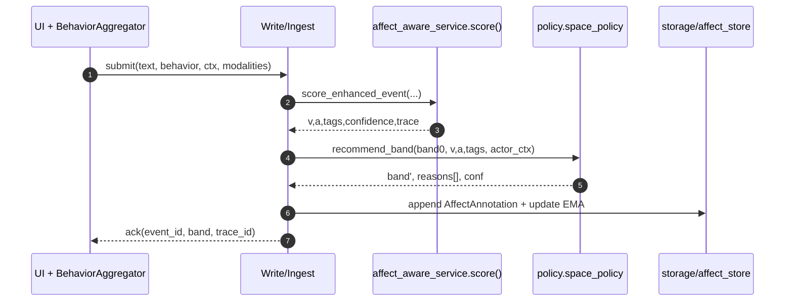

# affect/ — **Affect Sensing, Fusion & Policy Bridge**

**Compiled:** 2025‑09‑06
**Philosophy:** *Production‑first, privacy‑first, explainable.*
This module estimates **Valence** (how positive/negative), **Arousal** (how calm/excited), and small **behavioral tags** from the event you’re writing **on‑device**. It then **fuses** optional modalities (text, behavior, prosody, face AUs, HRV), smooths the state per person/space, and returns a **policy band** recommendation to keep the family safe and private.

> TL;DR – it’s the system’s *emotional proprioception*: fast, local, auditable, and designed to never ship raw media off device.

---

## 0) Where affect sits (system view)

```mermaid
flowchart LR
  subgraph Write P02
    W[services/write_service.py]
  end
  subgraph Affect
    AFXS[affect_aware_service.py]
    CLF[enhanced_classifier.py]
    RT[realtime_classifier.py]
    AST[affect/state.py]
  end
  subgraph Policy
    POL[policy/space_policy.py]
  end
  subgraph Workspace
    GWS[workspace/global_workspace.py]
  end
  W -- scoring request --> AFXS
  AFXS -- v,a,tags,conf --> W
  W -- band ask --> POL
  POL -- band(reasons) --> W
  AFXS -- AffectAnnotation + EMA --> AST
  GWS <-.- affect state -.- AFXS
```

* **Inbound:** scoring requests from P02 Write (after redaction).
* **Outbound:** (1) per‑event AffectAnnotation, (2) updated per‑person/space EMA state, (3) advisory policy **band** (“GREEN/AMBER/RED/BLACK”).
* **Events & bus:** affect can publish/consume via the edge event bus with **Ack/Nack, WAL, DLQ** when you wire it to streams like `ACTION_EXECUTED` or `WORKSPACE_BROADCAST`. See events/ for bus semantics (durable subscribers, replay, offsets).&#x20;

---

## 1) Folder map (what each file does)

```
affect/
├─ affect_aware_service.py     # Facade used by Write/Recall: validates envelope, calls analyzer/classifier, persists annotations & EMA
├─ analyzer.py                 # Orchestrates source extraction, feature plumbing, fusion, calibration, smoothing
├─ realtime_classifier.py      # Tier‑0 (≤2ms) text+behavior rules; always on, no external deps
├─ enhanced_classifier.py      # Tier‑1 (≤30–60ms) ensemble (Lexicon, VADER, TextBlob, optional ONNX tiny transformer)
├─ state.py                    # Per-person/space EMA and persistence helpers (in-memory + storage/affect_store.py)
├─ affect_state.py             # Data classes for annotations and rolling state
└─ tests/                      # Unit tests (text ensemble, fusion, thresholds, policy rules)
```

---

## 2) Contracts (envelopes)

### 2.1 **Input** — scoring request

(Write sends this right before it decides whether to project/share the event.)

```json
{
  "person_id": "alice",
  "space_id": "shared:household",
  "event_id": "evt-2025-09-04-00123",
  "text": "I absolutely love this outcome!! best day ever :)",
  "behavior": {
    "inter_request_deltas": [0.5, 1.0, 0.4, 0.6],
    "keystrokes_total": 80,
    "backspaces": 20,
    "retries": 3,
    "session_seconds": 700,
    "active_seconds": 90
  },
  "ctx": {
    "battery_low": false,
    "cpu_throttled": false,
    "intent_urgent": true,
    "time_of_day_hours": 14.3
  },
  "modalities": {
    "prosody_feats": [0.7, 0.3, 0.4],      // z_pitch_std, z_energy, z_rate (optional, on-device)
    "face_aus_z": [0.2, -0.1, 0.4],        // z-scored AUs (optional; off by default)
    "hrv_z": -0.8                           // z-HRV (opt-in wearables)
  },
  "trace_id": "trace-abc123",
  "model_prefs": {
    "text_onnx_path": null,
    "use_vader": true,
    "use_textblob": true
  }
}
```

**Collection of behavioral fields (on device):**
`inter_request_deltas` from request timestamps; `keystrokes_total/backspaces` are counters with **no characters stored**; `retries` from similarity+time gates; `session_seconds/active_seconds` from foreground/activity pings; `battery_low/cpu_throttled` from OS thermal/power APIs. (Only aggregate numbers leave the aggregator.)

### 2.2 **Outputs** — three objects

**A) AffectAnnotation (persisted, per event)**

```json
{
  "affect_annotation": {
    "event_id": "evt-2025-09-04-00123",
    "space_id": "shared:household",
    "valence": 0.78,
    "arousal": 0.67,
    "tags": ["urgent","toxic_light"],
    "confidence": 0.72,
    "model_version": "affect-enhanced:2025-09-04",
    "ts": "2025-09-04T12:34:56.000Z"
  }
}
```

**B) AffectState (EMA, per person×space)**

```json
{
  "affect_state": {
    "person_id": "alice",
    "space_id": "shared:household",
    "v_ema": 0.51,
    "a_ema": 0.58,
    "confidence": 0.70,
    "updated_at": "2025-09-04T12:34:56.000Z"
  }
}
```

**C) Policy recommendation (banding)**

```json
{
  "policy_recommendation": {
    "band": "AMBER",
    "reasons": ["downshift: high arousal + negative valence"],
    "confidence": 0.70
  }
}
```

> **Band rules (MVP):**
> • If **a ≥ 0.70** & **v ≤ −0.40** → downshift 1 (min **RED**)
> • If `family_conflict_hint` & **actor is minor** → min **RED**
> • If **v ≥ 0.50** & **a ≥ 0.40** & tag `positive_family_moment` → allow **GREEN** (+ extend rollup half‑life ×2)

---

## 3) Algorithms (math that runs on device)

### 3.1 Text sentiment (valence) with rules

Let lexicon weight $L(t)\in[-1,1]$. Apply **negation scope** (window 3–4 tokens) and **boosters** (“very”, “extremely”) → multiplier $\text{boost}(i)\ge1$.

$$
S_{\text{text}}=\frac{1}{N}\sum_{i=1}^{N} L(t_i)\cdot \text{neg}(i)\cdot \text{boost}(i)
$$

Add light punctuation/emoji cues and squash with `tanh`:

$$
v_{\text{text}} = \tanh\!\left(S_{\text{text}} + \alpha\,\text{exclaim} - \beta\,\text{ALLCAPS} + \gamma\,\text{emoji}^+ - \delta\,\text{emoji}^- \right)
$$

Typical: $\alpha=0.25,\;\beta=0.3,\;\gamma=\delta=0.2$.

**Text arousal proxy** from magnitude + density:

$$
a_{\text{text}} = \sigma\!\left(\eta_1 |S_{\text{text}}| + \eta_2\,\text{punct\_density} + \eta_3\,\text{booster\_rate}\right)
$$

with $\eta_1\approx1.2,\;\eta_2\approx0.8,\;\eta_3\approx0.6$.

**Tags:**

* **Hedging** $h\in[0,1]$ = fraction of hedge tokens (e.g., “maybe”, “perhaps”); tag if $h\ge0.25$.
* **Negation** tag if any negation scope applied.
* **Toxicity**: light bag‑of‑ngrams or tiny transformer head → `toxic_light (≥0.5)`, `toxic_high (≥0.8)`.

**Confidence (text):**

$$
c_{\text{text}}=\min\!\left(1,\, 0.1+0.9\frac{N}{N+20}\right)\cdot\left(1-0.3\,\mathbb{1}[\text{SNR}<\tau]\right)
$$

(SNR ≈ $|S_{\text{text}}|/\text{var}$).

### 3.2 Behavioral arousal (from the last \~60–120 s)

Compute **burstiness** $B$ = Coefficient of Variation of inter‑request intervals; **backspace ratio** $R_{bs}$; **rapid retries** $R_r$. Time‑of‑day terms feed as covariates; session length $T_s$ damps arousal (fatigue).

Normalize vs personal baselines:

$$
z_B=\frac{B-\mu_B}{\sigma_B+\epsilon},\quad z_{bs}=\frac{R_{bs}-\mu_{bs}}{\sigma_{bs}+\epsilon},\quad z_r=\frac{R_r-\mu_r}{\sigma_r+\epsilon}
$$

Combine:

$$
a_{\text{beh}}=\sigma\!\Big(\kappa_1 z_B + \kappa_2 z_{bs} + \kappa_3 z_r + \kappa_4 \mathbb{1}[\text{friction}] + \kappa_5 f_{\text{tod}}(t) - \kappa_6 g(T_s)\Big)
$$

with typical $\kappa=\{0.9,0.5,0.7,0.4,0.2,0.2\}$,
$f_{\text{tod}}(t)=0.1\sin\! \frac{2\pi t}{24}+0.1\cos\!\frac{2\pi t}{24}$, $g(T_s)=\min(T_s/60,1)$.

**Confidence (behavior)**:

$$
c_{\text{beh}}=\text{clip}\!\left(\frac{\text{active\_seconds}}{120}\cdot\frac{1}{1+e^{-(|z_B|+|z_{bs}|+|z_r|-1)}},\,0,1\right)
$$

> The **time‑of‑day** basis we use mirrors the temporal module’s circadian features, keeping math consistent across subsystems.&#x20;

### 3.3 Context “urgent” bump

If intent classifier detects *urgent/quickly*: $a_{\text{ctx}}=0.15$; else 0.

### 3.4 Optional modalities (opt‑in; never stored raw)

* **Prosody (on‑device)** – per‑utterance $z$-scores: pitch variance $\sigma_{F0}$, energy $E$, speech rate.

  $$
  a_{\text{prosody}}=\sigma\!\left(0.5 z_{\sigma_{F0}}+0.3 z_E+0.4 z_{\text{rate}}\right)
  $$

* **Face AUs (off by default)** – coarse 12‑D AU vector → linear map to $(v,a)$; confidence clipped by detection quality.

* **Wearables HRV (opt‑in)** – higher arousal ↔ **lower HRV**;

  $$
  a_{\text{hrv}}=\sigma(-\lambda z_{\text{HRV}}),\;\lambda\approx0.8
  $$

### 3.5 Late fusion (confidence‑weighted, explainable)

Let sources $s\in\{\text{text},\text{beh},\text{prosody},\text{face},\text{hrv}\}$ have $(v_s,a_s,c_s)$. Priors $w$: text=1.0, behavior=0.8, prosody=0.6, face=0.4, hrv=0.5 (tiny transformer text head, if present, gets 1.2 inside “text”).

$$
v=\frac{\sum w_s c_s v_s}{\sum w_s c_s+\epsilon},\qquad
a=\text{clip}\!\left(\frac{\sum w_s c_s a_s}{\sum w_s c_s+\epsilon}+a_{\text{ctx}},\,0,1\right)
$$

**Smoothing (EMA per person×space):**

$$
\bar v_t=(1-\alpha)\bar v_{t-1}+\alpha v_t,\quad \bar a_t=(1-\alpha)\bar a_{t-1}+\alpha a_t
$$

with $\alpha=0.25$. You can keep slow/fast EMAs.

**Calibration (tiny, safe):**
Valence: $v^*=\tanh(\theta_v v + b_v)$.
Arousal: $a^*=\sigma(\text{logit}(a)/T_a)$.
Update occasionally with implicit feedback (undo, user correction) under strong regularization.

**Confidence (head‑agnostic):**
For logits $z$, $c=\frac{1}{1+e^{-|z|}}$; for lexicon heads, use length and SNR heuristic; **never** report $c=1$.

---

## 4) Tiered design & performance budgets

* **Tier‑0 (always on, ≤2 ms for short text)**: `realtime_classifier.py`
  Lexicon+rules (negation, boosters), punctuation cues, hedging/toxicity heuristics, behavior arousal, urgent bump.
* **Tier‑1 (optional, ≤30–60 ms CPU)**: `enhanced_classifier.py`
  Adds VADER, TextBlob, and an **edge‑quantized** tiny transformer (≤15M params, int8, ONNX) with dual heads (valence + toxicity). Degrades gracefully if deps aren’t present.

---

## 5) Privacy & storage decisions

* **Store only**: $(v,a),\;\text{tags},\;c,\;\text{model\_ver},\;\text{ts}$ per event + EMA state.
* **Do not store** raw audio, raw frames, or raw keystrokes; only transient aggregates/z‑scores.
* Space‑scoped replication uses your **MLS** keys; **events/ bus** persists only redacted JSONL WAL.&#x20;

---

## 6) Sequence diagrams (how it runs)

### 6.1 Write path (score → band → persist)



### 6.2 Sources → Fusion breakdown (trace)

```mermaid
flowchart LR
  subgraph Sources
  T[Text] -->|v,a,c| F
  B[Behavior] -->|a,c| F
  PR[Prosody] -->|a,c| F
  FA[Face AUs] -->|v,a,c| F
  HV[HRV] -->|a,c| F
  end
  C[Context bump (urgent)] --> F
  F[Late Fusion] --> V[v,a,c overall]
  V --> EMA[EMA update]
  V --> POL[Policy band rules]
```

---

## 7) API quickstart

```python
from affect.enhanced_classifier import score_enhanced_event, EnhancedConfig
from affect.realtime_classifier import TinyTextConfig
from affect.state import BehaviorWindow, ContextInfo, MemoryAffectStateStore

store = MemoryAffectStateStore()
state = store.get_state(person_id="alice", space_id="shared:household")

behavior = BehaviorWindow(inter_request_deltas=[0.5,1.0,0.4,0.6], keystrokes_total=80,
                          backspaces=20, retries=3, session_seconds=700, active_seconds=90)
ctx = ContextInfo(battery_low=False, cpu_throttled=False, intent_urgent=True, time_of_day_hours=14.3)

res = score_enhanced_event(
    text="I absolutely love this outcome!! best day ever :)",
    behavior=behavior,
    ctx=ctx,
    state=state,
    text_cfg=TinyTextConfig(use_vader=True, use_textblob=True, onnx_model_path=None),
    cfg=EnhancedConfig(),
    prosody_feats=(0.7, 0.3, 0.4),    # optional
    face_aus_z=None,                  # optional
    hrv_z=-0.8                        # optional
)
print(res["v"], res["a"], res["tags"], res["policy"]["band"])
```

---

## 8) Integration notes (who calls whom, why, when)

* **Write/Ingest (P02)** calls `affect_aware_service.score()` **synchronously** while building the event. Its decision on **projection** (what space gets a copy) is shaped by the **band** and **reasons**.
* **Policy** (P18) reads the affect outputs; “min RED for minors in conflict” gates sharing.
* **Arbiter/Planning (P04)** can read $a$ and tags to **slow down** or require confirm when arousal is high before acting.
* **Prospective (P05)** uses tags like `urgent` to bump **trigger priority**; also consults circadian hints from **temporal** to schedule when calm, not frantic.&#x20;
* **Learning (P06)** ingests **outcomes** (undo, corrections) to **calibrate** the tiny heads (slow, safe updates).
* **Events (bus)** can carry AFFECT\_ANNOTATED and ACTION\_EXECUTED; durable groups & replay help learners catch up without data loss.&#x20;

---

## 9) Validation & errors

* Missing fields → treated as unavailable; confidence drops and trace notes **coverage**.
* Out‑of‑range values are clipped; malformed optional streams ignored with a **warning** in `trace`.
* If any policy rule fires **hard‑deny**, `band="BLACK"` and Write will keep the event personal & unshared.

---

## 10) Development notes

* External libs are **optional**: if `vaderSentiment`/`textblob`/`onnxruntime` are missing, the ensemble simply skips those heads.
* The ONNX tiny transformer is exported int8 and runs **offline**.
* The entire module is **pure Python**, single‑file imports, no network.

**Tests** (examples we provide):

* Ensemble behavior / late‑fusion weighting
* Modality fusion (prosody/HRV bumps)
* Policy downshift thresholds (high‑a + negative‑v)
* Edge cases (short text, all behavior missing, malformed modalities)

---

## 11) Why this design (research intuition in plain words)

* **Explainability first:** lexicon rules + simple math give reasons you can show: “high burstiness + urgent word → arousal bump.”
* **Edge‑safety:** no raw mic/camera stored, ever. Optional streams are opt‑in and reduced to **momentary aggregates**.
* **Human‑centric:** tiny **band rules** map directly to the family context (e.g., minors, conflict hints) instead of generic internet toxicity.
* **Consistency with time:** the time‑of‑day sin/cos features mirror the **temporal** module’s features, so the entire architecture “agrees” on what “morning” or “late night” looks like mathematically.&#x20;

---

## 12) What you can build with it (today)

* **Safer sharing:** AMBER/RED downshifts avoid oversharing when someone’s upset.
* **Emotion‑aware recall:** retrieval can bias toward calmer memories when a user is tense.
* **Gentle UX:** planners can **slow mode** when arousal spikes (debounce notifications, ask confirmation).
* **Personalization:** EMA curves per person/space enable *just‑right* reminders and rollups that match family rhythms.

---

## 13) Future work

* Replace linear toxicity with a compact **on‑device** classifier head (multi‑lingual, calibrated).
* **Per‑family lexicon deltas** (subtle positivity/negativity shifts over time).
* VAD‑quality gating and per‑device **prosody calibration**.
* Optional **counterfactual checks** (simulate if a high‑arousal share would have been undone).

---

## 14) Appendix — Minimal JSON schemas

```json
// AffectAnnotation
{"type":"object","required":["event_id","space_id","valence","arousal","tags","confidence","model_version","ts"]}

// AffectState
{"type":"object","required":["person_id","space_id","v_ema","a_ema","confidence","updated_at"]}

// PolicyRecommendation
{"type":"object","required":["band","reasons","confidence"]}
```

---

## 15) Maintainers’ checklist

* [ ] Tier‑0 path ≤ 2 ms for \~<120‑token text on target devices
* [ ] Tier‑1 path ≤ 60 ms CPU, no allocation spikes, int8 ONNX only
* [ ] No raw media or keystrokes persisted; only aggregates/z‑scores
* [ ] Unit tests: ensemble, fusion, thresholds, policy
* [ ] Trace includes **per‑source** $(v,a,c)$, priors and bumps used
* [ ] All writes scoped to **space** and covered by MLS keys (replication)

---

**Related modules**

* **events/** — durable in‑process bus (WAL JSONL, Ack/Nack, DLQ) for affect‑adjacent streams.&#x20;
* **temporal/** — circadian features & phrase parsing that align with affect’s time‑of‑day features.&#x20;