# Family OS API Layer - Complete Reference

**Version**: 2.0.0 • **Architecture**: Three-Tier Presidential Security • **Philosophy**: Family-first, privacy-by-design, explainable AI

The Family OS API layer provides a comprehensive, secure, and scalable interface to all Family OS capabilities through a modern three-tier architecture designed for presidential-grade security and family-friendly operation.

## 🏗️ Architecture Overview

### API Module Map - Component Relationships


### API Data Flow - Request Processing Pipeline


### Three-Tier Security Architecture

```mermaid
graph TB
    subgraph "Client Layer"
        WEB[Web Apps]
        MOBILE[Mobile Apps]
        CLI[CLI Tools]
        AGENTS[LLM Agents]
        ADMIN[Admin Console]
    end

    subgraph "API Gateway Layer"
        PROXY[Auth Proxy<br/>Port 8080]
    end

    subgraph "Three-Tier API Layer"
        TIER1[🤖 Agent Tool API<br/>Port 7443<br/>mTLS + JWT]
        TIER2[👤 App Frontend API<br/>Port 8443<br/>Session + Device]
        TIER3[🔐 Control Plane API<br/>Port 9443<br/>HSM Certificates]
    end

    subgraph "Core Services"
        BUS[EventBus<br/>Security Middleware]
        MEMORY[Memory System<br/>Policy Enforcement]
        POLICY[Policy Service<br/>RBAC + ABAC]
        AUDIT[Audit Logger]
    end

    WEB --> PROXY
    MOBILE --> PROXY
    CLI --> TIER2
    AGENTS --> TIER1
    ADMIN --> TIER3

    PROXY --> TIER1
    PROXY --> TIER2
    PROXY --> TIER3

    TIER1 --> BUS
    TIER2 --> BUS
    TIER3 --> BUS

    BUS --> MEMORY
    BUS --> POLICY
    BUS --> AUDIT
```



### 🤖 Tier 1: Agent Tool API (Port 7443)

**Purpose**: Secure function calls for LLM agents and automated systems
**Security**: mTLS + JWT authentication with tool validation
**Target Users**: LLM agents, automation scripts, AI assistants

**Key Features**:
- Presidential-grade security for AI agents
- Tool execution with RBAC validation
- Memory operations with band-based access control
- Event emission with policy enforcement
- Reasoning and analysis capabilities
- Strategic planning and operational planning

**Authentication**:
```http
Authorization: Bearer <JWT_TOKEN>
X-Actor: agent_name
X-Device: device_id
X-Space: operational_space
X-Trace-ID: trace_identifier
```

### 👤 Tier 2: App Frontend API (Port 8443)

**Purpose**: Human-facing APIs optimized for user experience
**Security**: Session + device attestation with UX optimization
**Target Users**: Family members, web apps, mobile applications

**Key Features**:
- Family-friendly interfaces
- Policy enforcement with graceful degradation
- Content redaction for privacy protection
- Real-time cognition and memory access
- Privacy controls and data subject rights
- Health monitoring and system status

**Authentication**:
```http
Authorization: Bearer <SESSION_TOKEN>
X-Actor: family_member
X-Device: family_device
X-Space: family_space
```

### 🔐 Tier 3: Control Plane API (Port 9443)

**Purpose**: Quarantined admin functions requiring highest security
**Security**: HSM certificates with RED band authorization
**Target Users**: System administrators, compliance officers

**Key Features**:
- System administration and configuration
- Policy rotation and security management
- Audit trail export and compliance reporting
- Emergency procedures and incident response
- Data purging and consent management
- System health and performance monitoring

**Authentication**:
```http
X-Admin-Cert: HSM_CERTIFICATE
X-Actor: admin_user
X-Device: admin_console
X-Space: system:admin
```

## 🔒 Security Model

### Authentication & Authorization

**Transport Security**:
- HTTPS with TLS 1.3 minimum
- Optional mTLS for enhanced security
- Certificate pinning for admin operations

**Authentication Methods**:
1. **JWT Tokens** - For agents and programmatic access
2. **Session Tokens** - For human users and applications
3. **HSM Certificates** - For administrative operations

**Authorization Framework**:
- **RBAC** (Role-Based Access Control) for basic permissions
- **ABAC** (Attribute-Based Access Control) for contextual decisions
- **Band-based Security** (GREEN/AMBER/RED/BLACK) for risk assessment
- **Policy Enforcement Points** at every API layer

### Security Context

Every API request is enriched with a comprehensive security context:

```python
@dataclass
class SecurityContext:
    actor: str              # User/agent identifier
    device: str             # Device identifier
    space_id: str           # Operational space
    session: str            # Session identifier
    scopes: List[str]       # Authorized scopes
    clearance_level: str    # Security clearance
    compartments: List[str] # Access compartments
    risk_band: str          # Current risk assessment
```

### Policy Enforcement

The API layer implements comprehensive policy enforcement:

1. **Pre-Request Validation** - Authentication and basic authorization
2. **Operation Authorization** - RBAC/ABAC policy decisions
3. **Content Filtering** - PII redaction and content sanitization
4. **Audit Logging** - Complete decision trail for compliance
5. **Post-Request Processing** - Response filtering and redaction

## 📡 Core API Endpoints

### Memory & Cognition

#### Write Operations (P02 Pipeline)
```http
POST /v1/cognition/write
Content-Type: application/json
Authorization: Bearer <token>

{
  "content": "Family vacation photos from beach trip",
  "space_id": "shared:household",
  "tags": ["vacation", "photos", "family"],
  "classification": "GREEN"
}
```

#### Recall Operations (P01 Pipeline)
```http
POST /v1/cognition/recall
Content-Type: application/json
Authorization: Bearer <token>

{
  "query": "beach vacation photos",
  "space_id": "shared:household",
  "max_results": 10,
  "classification_limit": "AMBER"
}
```

### Event System

#### Event Publishing
```http
POST /v1/events/publish
Content-Type: application/json
Authorization: Bearer <token>

{
  "topic": "family_activities",
  "type": "ACTIVITY_SCHEDULED",
  "payload": {
    "activity": "family_movie_night",
    "scheduled_time": "2025-09-08T19:00:00Z"
  },
  "classification": "GREEN"
}
```

#### Server-Sent Events Stream
```http
GET /v1/events/stream?topic=family_activities&group=mobile_app
X-Actor: family_member
X-Device: mobile_phone
Accept: text/event-stream
```

### Privacy & Data Rights

#### Data Subject Access Request (DSAR)
```http
POST /v1/privacy/dsar
Content-Type: application/json
Authorization: Bearer <token>

{
  "request_type": "export",
  "space_id": "personal:alice",
  "data_categories": ["memories", "preferences", "activity_logs"],
  "format": "json"
}
```

#### Privacy Controls
```http
POST /v1/privacy/redact
Content-Type: application/json
Authorization: Bearer <token>

{
  "content_id": "mem_12345",
  "redaction_categories": ["pii.email", "pii.phone"],
  "reason": "privacy_request"
}
```

### Agent Tool Operations

#### Tool Execution
```http
POST /v1/agents/tools/execute
Content-Type: application/json
Authorization: Bearer <agent_token>

{
  "tool_name": "family_calendar_manager",
  "parameters": {
    "action": "schedule_event",
    "event_details": {
      "title": "Doctor Appointment",
      "date": "2025-09-10",
      "time": "14:00"
    }
  },
  "classification": "AMBER"
}
```

#### Memory Operations for Agents
```http
POST /v1/agents/memory/store
Content-Type: application/json
Authorization: Bearer <agent_token>

{
  "content": "Analysis: Family spending patterns show increased grocery costs",
  "content_type": "analysis",
  "classification": "AMBER",
  "tags": ["financial_analysis", "spending_patterns"]
}
```

### Administrative Operations

#### Policy Management
```http
POST /v1/control/policy/rotate
Content-Type: application/json
X-Admin-Cert: <hsm_certificate>

{
  "policy_type": "access_control",
  "rotation_reason": "scheduled_rotation",
  "effective_date": "2025-09-08T00:00:00Z"
}
```

#### System Health
```http
GET /v1/control/system/health
X-Admin-Cert: <hsm_certificate>
```

## 🛡️ Security Features

### Feature Flag System

The API layer includes a comprehensive feature flag system for security and operational control:

```yaml
feature_flags:
  # Authentication & Security
  enable_auth: true
  enable_mTLS: true
  enable_hsm_certs: true
  enable_policy_enforcement: true

  # API Features
  enable_cors: true
  enable_rate_limiting: true
  enable_api_versioning: true

  # Privacy & Policy
  enable_data_redaction: true
  enable_privacy_controls: true
  enable_consent_management: true
```

### Middleware Stack

The API layer implements a comprehensive middleware stack:

1. **Security Middleware** - Authentication and authorization
2. **Policy Enforcement Middleware** - RBAC/ABAC decisions
3. **Tracing Middleware** - Request tracing and correlation
4. **Metrics Middleware** - Performance and usage metrics
5. **Audit Middleware** - Security audit logging
6. **Rate Limiting Middleware** - Request throttling
7. **CORS Middleware** - Cross-origin resource sharing

### Error Handling

Comprehensive error handling with security considerations:

```python
class APIError(Exception):
    def __init__(self,
                 status_code: int,
                 error_code: str,
                 message: str,
                 details: Optional[Dict] = None,
                 redact_details: bool = True):
        self.status_code = status_code
        self.error_code = error_code
        self.message = message
        self.details = details if not redact_details else {}
```

## 📊 Data Models & Schemas

### Core Data Models

#### Event Schema
```python
@dataclass
class Event:
    meta: EventMeta
    payload: Dict[str, Any]

@dataclass
class EventMeta:
    topic: str
    type: EventType
    space_id: str
    actor: Optional[str] = None
    trace_id: Optional[str] = None
    ts: float = field(default_factory=time.time)
    classification: str = "GREEN"
```

#### Memory Schema
```python
@dataclass
class MemoryEntry:
    id: str
    content: str
    space_id: str
    actor: str
    timestamp: float
    tags: List[str]
    classification: str
    vector_embedding: Optional[List[float]] = None
```

#### Policy Decision Schema
```python
@dataclass
class PolicyDecision:
    decision: Literal["ALLOW", "DENY"]
    reason: str
    obligations: Optional[Obligation] = None
    model_version: str = "1.0"
    timestamp: float = field(default_factory=time.time)
```

### API Response Models

#### Standard Response
```python
class APIResponse(BaseModel):
    status: str
    data: Optional[Any] = None
    message: Optional[str] = None
    trace_id: Optional[str] = None
    timestamp: datetime
```

#### Error Response
```python
class ErrorResponse(BaseModel):
    error_code: str
    message: str
    status_code: int
    trace_id: Optional[str] = None
    timestamp: datetime
```

## 🔄 Event-Driven Architecture

### EventBus Integration

The API layer is deeply integrated with the Family OS EventBus:

```python
class EventBusIntegration:
    def __init__(self, bus: EventBus, policy_service: PolicyService):
        self.bus = bus
        self.policy_service = policy_service

        # Add security middleware to bus
        security_middleware = SecurityMiddleware(policy_service)
        self.bus.add_middleware(security_middleware)

    async def publish_with_policy(self, event: Event, context: SecurityContext):
        # Check publication permissions
        decision = await self.policy_service.check_event_operation(
            event=event,
            operation="publish"
        )

        if decision.decision == "DENY":
            raise PermissionError(decision.reason)

        # Apply any redaction obligations
        if decision.obligations and decision.obligations.redact:
            event = await self.apply_redaction(event, decision.obligations.redact)

        await self.bus.publish(event)
```

### Event Types

The API layer handles numerous event types:

- **Memory Events**: HIPPO_ENCODE, CONSOLIDATION_COMPLETE
- **Action Events**: ACTION_DECISION, ACTION_EXECUTED
- **Privacy Events**: DSAR_EXPORT_READY, REDACTION_APPLIED
- **System Events**: SYSTEM_START, POLICY_ROTATION
- **Family Events**: FAMILY_ACTIVITY, SCHEDULE_REMINDER

## 🎯 Performance & Scalability

### Caching Strategy

Multi-layer caching for optimal performance:

1. **Policy Decision Cache** - Short TTL for policy decisions
2. **Memory Retrieval Cache** - Embedding and search result caching
3. **Event Metadata Cache** - Event type and routing information
4. **Static Content Cache** - API documentation and schemas

### Rate Limiting

Sophisticated rate limiting with family-friendly defaults:

```python
rate_limits = {
    "family_member": "100/minute",
    "agent": "1000/minute",
    "admin": "500/minute",
    "guest": "10/minute"
}
```

### Monitoring & Observability

Comprehensive monitoring across all tiers:

- **Request/Response Metrics** - Latency, throughput, error rates
- **Security Metrics** - Authentication failures, policy violations
- **Business Metrics** - Family activity, memory usage, privacy requests
- **System Metrics** - Resource utilization, queue depths, cache hit rates

## 🧪 Testing & Quality Assurance

### Test Coverage

The API layer maintains comprehensive test coverage:

- **Unit Tests** - Individual endpoint testing
- **Integration Tests** - Cross-component integration
- **End-to-End Tests** - Complete user journey testing
- **Security Tests** - Penetration testing and vulnerability assessment
- **Performance Tests** - Load testing and stress testing

### Security Testing

Dedicated security testing framework:

- **Authentication Bypass Testing**
- **Authorization Escalation Testing**
- **Input Validation Testing**
- **Policy Enforcement Testing**
- **Data Leakage Testing**

## 📋 Compliance & Auditing

### Audit Trail

Complete audit trail for all API operations:

```python
@dataclass
class AuditEvent:
    timestamp: datetime
    actor: str
    operation: str
    resource: str
    decision: str
    reason: str
    trace_id: str
    classification: str
```

### Compliance Features

- **GDPR Compliance** - Data subject rights and privacy controls
- **Family Privacy** - Enhanced protection for minors
- **Data Retention** - Configurable retention policies
- **Export Capabilities** - Standards-compliant data export

## 🚀 Deployment & Operations

### Configuration Management

Environment-specific configuration:

```yaml
# Development
family_os:
  api:
    enable_auth: false
    enable_debug_endpoints: true
    log_level: debug

# Production
family_os:
  api:
    enable_auth: true
    enable_hsm_certs: true
    log_level: info
```

### Health Checks

Multi-level health checking:

- **Shallow Health** - Basic API responsiveness
- **Deep Health** - Component health and connectivity
- **Security Health** - Security posture validation
- **Business Health** - Core functionality validation

### Graceful Degradation

The API layer implements graceful degradation:

- **Policy Service Unavailable** - Fail-safe mode with basic policies
- **Memory Service Unavailable** - Read-only mode with cached data
- **EventBus Unavailable** - Synchronous processing mode

## 🔮 Future Roadmap

### Planned Enhancements

1. **GraphQL Interface** - Flexible query capabilities for complex data relationships
2. **WebSocket Support** - Real-time bidirectional communication
3. **SDK Generation** - Auto-generated client SDKs for multiple languages
4. **Enhanced Analytics** - Real-time analytics and family insights
5. **Federated Identity** - Integration with external identity providers
6. **Advanced Caching** - Distributed caching for improved performance

### Research Areas

- **Zero-Knowledge Proofs** - Enhanced privacy for sensitive operations
- **Homomorphic Encryption** - Computation on encrypted data
- **Federated Learning** - Privacy-preserving model training
- **Differential Privacy** - Statistical privacy guarantees

## 📚 API Folder Structure

```
api/
├── __init__.py                    # Package initialization
├── README.md                      # This comprehensive documentation
├── auth.py                        # Enhanced authentication with business logic
├── schemas.py                     # Consolidated API schemas (1,509 lines)
├── integration_example.py         # Router integration examples
│
├── routers/                       # Three-tier API endpoints
│   ├── __init__.py               # Router setup and configuration
│   ├── agents_tools.py           # 🤖 Tier 1: Agent Tool API (mTLS)
│   ├── app_frontend.py           # 👤 Tier 2: App Frontend API (Session)
│   ├── admin_index_security.py   # 🔐 Tier 3: Control Plane API (HSM)
│   ├── health.py                 # Health check endpoints
│   ├── rbac.py                   # Role-based access control (310 lines)
│   ├── app.py                    # Core application routes
│   └── control.py                # Control plane routes (empty - placeholder)
│
├── middleware/                    # Security and processing pipeline
│   ├── __init__.py               # Middleware chain setup (58 lines)
│   ├── auth.py                   # Authentication middleware (production)
│   ├── pep.py                    # Policy Enforcement Point
│   ├── security.py               # Security controls
│   ├── observability.py          # Monitoring and tracing
│   ├── validation.py             # Request validation
│   ├── capability_decorators.py  # Capability-based auth decorators
│   ├── error_handling.py         # Error processing middleware
│   ├── middleware_integration.py # Integration layer
│   ├── orchestration.py          # Request orchestration
│   ├── performance.py            # Performance monitoring
│   ├── policy.py                 # Policy middleware
│   ├── qos.py                    # Quality of Service controls
│   ├── rbac_middleware.py        # RBAC enforcement
│   ├── safety.py                 # Safety checks
│   └── types.py                  # Middleware type definitions
│
├── schemas/                       # Contract-compliant data models
│   ├── __init__.py
│   ├── common.py                 # Common schemas from contracts (167 lines)
│   ├── core.py                   # Core data structures
│   ├── events.py                 # Event-related schemas
│   ├── memory.py                 # Memory operation schemas
│   ├── requests.py               # Request schemas
│   ├── responses.py              # Response schemas
│   ├── security.py               # Security-related schemas
│   └── validation.py             # Validation schemas
│
├── handlers/                      # Business logic layer
│   ├── __init__.py
│   └── memory/                   # Memory operation handlers
│       ├── recall.py
│       └── submit.py
│
├── ports/                         # Adapter interfaces to backend
│   ├── __init__.py
│   ├── command_bus.py            # Command pattern implementation
│   ├── event_hub.py              # Event system integration
│   ├── observability.py          # Observability port
│   ├── query_facade.py           # Query abstraction
│   └── transaction_manager.py    # Transaction coordination
│
├── transaction/                   # Distributed transaction support
│   ├── __init__.py
│   ├── api.py                    # Transaction API
│   ├── coordinator.py            # Transaction coordination
│   ├── engine.py                 # Transaction engine
│   ├── manager.py                # Transaction manager
│   ├── state.py                  # Transaction state
│   └── types.py                  # Transaction types
│
├── ingress/                       # Request routing and adaptation
│   ├── __init__.py
│   └── adapter.py                # Ingress adapter
│
├── validation/                    # Input validation
│   └── __init__.py               # (empty - placeholder)
│
├── utils/                         # Utilities
│   └── __init__.py               # (empty - placeholder)
│
├── auth/                          # Authentication system
│   └── (directory exists but contents not detailed)
│
├── contracts/                     # API contracts
│   └── (directory exists but contents not detailed)
│
└── core/                          # Core functionality
    └── (directory exists but contents not detailed)
```

### 🧹 Recent Cleanup (2025-09-14)

**Files Quarantined** (moved to `_quarantine/2025-09-14/api/`):
- `auth_broken.py` - Duplicate auth implementation with internal duplication (20,182 bytes)
- `auth_clean.py` - Unused duplicate of auth.py (9,990 bytes)
- `test_capability_auth.py` - Test file in wrong location (should be in tests/)

**Import Structure Fixed**:
- Updated `routers/__init__.py` to properly import all available routers
- Cleaned up router registration to match actual file structure
- Maintained backward compatibility

**Total Space Saved**: 30,322 bytes of redundant code

---

## 🎖️ Security Classifications

This API layer implements presidential-grade security with the following classifications:

- **🟢 GREEN**: Family-safe operations, general use
- **🟡 AMBER**: Elevated operations, requires authentication
- **🔴 RED**: Sensitive operations, requires elevated privileges
- **⚫ BLACK**: Critical operations, requires administrative access

---

*Family OS API Layer - Where security meets family-friendly functionality* 🏠🔒

---

*Family OS API Layer - Where security meets family-friendly functionality* 🏠🔒 fileciteturn1file8
