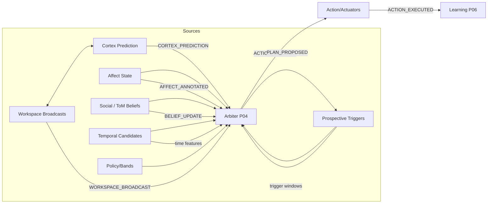
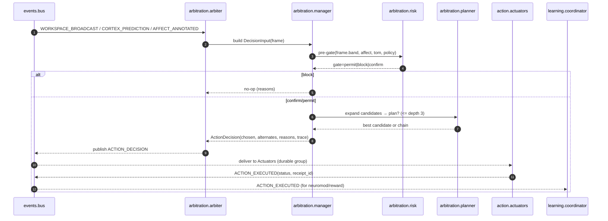

# arbitration/ — P04 Arbitration & Planning (Production)

**Compiled:** 2025‑09‑06
**Philosophy:** *Production‑first. Privacy‑first. Explainable by design.*
**Mission:** Convert **workspace context** + **predictions** + **policy** into **safe, high‑utility actions or plans** under device budgets and family policy.

The Arbiter sits at the **center of agency**: it watches what the system is thinking, what the family wants, what policy allows, and then chooses **the next best safe thing to do**—or decides to do nothing.

---

## 0) Where P04 lives in the system



* **Event transport:** in‑process durable event bus with WAL, ack/nack, retries, and consumer groups (edge‑optimized). The Arbiter **subscribes** and **publishes** over this bus.&#x20;
* **Time‑aware:** integrates **temporal indexing & features** (recency, circadian) for timing‑sensitive decisions and plan scheduling.&#x20;

---

## 1) Contracts (I/O Envelopes)

### 1.1 `DecisionInput` (internal aggregate)

The Arbiter synthesizes a **single decision frame** from latest signals:

```json
{
  "space_id": "shared:household",
  "focus_event_id": "evt-...",
  "band": "AMBER",
  "affect": {"v": -0.10, "a": 0.72, "tags": ["urgent"], "c": 0.71},
  "cortex": {
    "need_action": 0.64,
    "need_recall": 0.28,
    "expected_reward": 0.51,
    "conf": 0.70
  },
  "tom": {"prosocial": 0.66, "minor_present": false, "conflict_hint": false},
  "temporal": {
    "recency": 0.82,
    "circadian": {"sin_tod": 0.26, "cos_tod": 0.96, "sin_dow": -0.78, "cos_dow": 0.62},
    "window_score": 0.41
  },
  "features": {
    "relevance": 0.84,
    "goal_alignment": 0.60,
    "cost": 0.10,
    "wm_load": 0.20,
    "friction": 0.0
  },
  "candidates": [
    {"action": "draft_reply", "args": {}, "source": "workspace", "prior": 0.64},
    {"action": "set_reminder", "args": {"when":"18:00","who":"alice"}, "source": "cortex", "prior": 0.71}
  ],
  "time_budget_ms": 25,
  "actor": {"id":"agent://home", "caps":["calendar.write","message.draft"], "risk_pref": 0.5},
  "trace_id": "trace-123"
}
```

> **Where does this data come from?**
>
> * `WORKSPACE_BROADCAST`, `CORTEX_PREDICTION`, `AFFECT_ANNOTATED`, `BELIEF_UPDATE`, `PROSPECTIVE_TRIGGER` feed the Arbiter via the **events bus** (durable groups & replay).&#x20;
> * `temporal.*` is derived by querying the **temporal module** for recency/circadian features.&#x20;

### 1.2 `ActionDecision` (published on the bus)

```json
{
  "space_id": "shared:household",
  "decision_id": "dec-2025-09-06-001",
  "chosen": {"action":"set_reminder","args":{"when":"18:00","who":"alice"}},
  "alternates": [
    {"action":"draft_reply","score":0.62,"reasons":["utility lower","cost higher"]}
  ],
  "score": 0.74,
  "reasons": ["U=0.84*1.0 + 0.60*0.9 - 0.10*0.7 - 0.20*0.4 + urgency_bump", "risk=low", "band=AMBER pass"],
  "band": "AMBER",
  "trace": {
    "features_used":{"relevance":0.84,"goal_alignment":0.60,"cost":0.10},
    "policy_gates":{"rbac":"ok","abac":"ok","consent":"ok"},
    "weights":{"wr":1.0,"wg":0.9,"we":0.8,"wh":0.3,"wp":0.2,"wc":0.7,"wl":0.4,"wf":0.3}
  }
}
```

### 1.3 `Plan` (proposed to Prospective)

```json
{
  "plan_id":"plan-2025-09-06-abc",
  "space_id":"shared:household",
  "goal":"prepare_birthday",
  "steps":[
    {"action":"create_list","args":{"name":"party"}},
    {"action":"add_item","args":{"list":"party","item":"balloons"}},
    {"action":"invite","args":{"who":["grandparents"],"channel":"sms"}}
  ],
  "expected_utility": 0.68,
  "reasons":["goal alignment high","cost moderate","risk low"]
}
```

### 1.4 Observability / Decision Trace

Every decision carries **why** it happened and **what was ignored**—safe for logs (no PII).

---

## 2) Selection Math (Explainable)

We rank candidate actions with a **linear utility** that’s fast, tunable, and auditable.

$$
\begin{aligned}
U &= w_r\,\text{relevance} + w_g\,\text{goal\_alignment} + w_e\,\text{expected\_reward} \\
  &\quad + w_h\,\text{habitibility} + w_p\,\text{prosocial} \\
  &\quad - w_c\,\text{cost} - w_l\,\text{wm\_load} - w_f\,\text{friction} \\
\end{aligned}
$$

**Defaults (safe edge profile)**
`wr=1.0, wg=0.9, we=0.8, wh=0.3, wp=0.2, wc=0.7, wl=0.4, wf=0.3`.

**Affect nudges**

* If `urgent` tag → add `+0.2 * a` to U.
* If `v < 0` and band ≥ AMBER → damp with `−0.2 * |v|`.

**Temporal timing**

* Multiply U by `timing = 0.5 + 0.5 * window_score` to gently favor presently favorable windows (circadian/recency).&#x20;

**Confidence**

* We compute `conf = mean(conf_cortex, conf_affect, conf_tom)` and annotate the decision’s **confidence interval** in the trace (no hard block).

**Tie‑breakers**

* Prefer lower cost; then lower risk; then higher prior; then lexicographic action name (determinism).

---

## 3) Risk Gate (Safety before Utility)

Utility alone is not enough. We apply **policy & safety** gates **before** executing.

1. **Bands** (`BLACK < RED < AMBER < GREEN`)

   * `BLACK` → **block**.
   * `RED` + (`minor_present` or `conflict_hint`) → **block**.
   * `AMBER` + `a≥0.85` + *sharing* action → **require confirm/slowdown**.
   * `GREEN` → proceed (still subject to RBAC/ABAC/consent).

2. **RBAC & ABAC**

   * Must hold the tool’s **capabilities** (RBAC).
   * **Context** (ABAC): actor, device, space, time must satisfy **space policy**.

3. **Consent**

   * Sensitive actions (e.g., share to extended space) require **consent** feature flags/records.

4. **Risk penalty** (explainability)

$$
U' = U - \lambda \cdot \text{risk},\quad \lambda=0.8
$$

Risk is a scalar derived from band, affect arousal, social divergence, and content type.

---

## 4) Tiny Planner (Forward Search ≤ depth 3)

Some goals take 2–3 steps (e.g., “plan dinner” → create list → add items → set reminder).

* **Action schema (DSL)**: `ToolSpec` + `preconditions` + `effects` + `cost`.
* **Search**: guided forward search (beam ≤ 6, depth ≤ 3), discount $\gamma=0.9$ per step.
* **Stop** when: (a) goal satisfied; (b) time budget exhausted; (c) risk gate fails.
* **Habits**: P20 procedures mark pre‑approved low‑risk chains (no confirm).

Optional: top‑1 candidate can be sent to **simulation engine** (imagination module) for quick counterfactual before commit (flag‑guarded).

---

## 5) Event Flow (bus → decision → action → learning)



The bus provides **durable fanout**, **ack/nack**, **WAL**, and **dead‑letter** on repeated failures—ideal for **edge** reliability.&#x20;

---

## 6) Files & Responsibilities

```
arbitration/
├─ arbiter.py          # Bus adapter; subscribes/aggregates signals; publishes decisions
├─ manager.py          # Frame synthesis, gating, scoring, tie-breakers, final selection
├─ planner.py          # Tiny forward-search planner (preconditions/effects)
├─ planner_bridge.py   # Translates workspace goals/prompts → planner goals
├─ risk.py             # Band-driven gates; ABAC/RBAC/consent hooks; risk scalar
├─ self_model.py       # Capability profile & per-action success priors (edge cache)
├─ habit.py            # P20 procedures; cache of recent “safe chains”
├─ impact_assessor.py  # Estimates memory, privacy, social impact costs
├─ types.py            # Dataclasses for frames, candidates, plans, decisions
└─ __init__.py         # Public exports
```

* **actuators** implement side‑effects + receipts (idempotent, sandboxed). See `action/` module.
* **learning** consumes `ACTION_EXECUTED` to update rewards and adjust weights online.

---

## 7) Configuration (safe defaults)

```toml
# arbitration/config.toml
[weights]
relevance=1.0; goal=0.9; expected_reward=0.8; habit=0.3; prosocial=0.2
cost=0.7; wm_load=0.4; friction=0.3

[thresholds]
max_depth=3
time_budget_ms=25
confirm_if_arousal_ge=0.85
risk_penalty_lambda=0.8
beam_width=6

[flags]
use_simulation=false
respect_habits=true
temporal_timing_boost=true
```

* **Budgeting:** If `time_budget_ms` is tight, manager **skips planning** and picks best atomic candidate.
* **Feature flags:** planner and simulation can be toggled without code changes.

---

## 8) Determinism & Idempotency

* **Deterministic selection** given the same frame (including tie‑breakers).
* **Idempotent execution** by relying on the **action** layer’s idempotency keys and the **bus** event IDs (at‑least‑once model).&#x20;

---

## 9) Privacy & Policy

* No raw payloads; only **derived scores** and **tool arguments** (already redacted in P10).
* Decisions are **space‑scoped**; ABAC verifies actor/device/space/time; consent is enforced for sensitive tools.
* **Affect‑aware** safety: high arousal + negative valence or family conflict raises bar for share‑like actions.

---

## 10) Developer API (example)

```python
from events.bus import EventBus
from arbitration.arbiter import Arbiter

bus = EventBus()
arb = Arbiter(config_path="arbitration/config.toml")
arb.attach_bus(bus)      # subscribes to required topics, starts decision loop
# Arbiter will now publish ACTION_DECISION events for permitted cases.
```

---

## 11) Testing & SLOs

**Unit tests (must pass):**

* Risk gates (band matrix, minors/conflict, arousal confirm).
* Utility math (weights, timing boosts, nudges).
* Planning (preconditions/effects, depth/beam cutoffs).
* Tie‑breakers and determinism.
* ABAC/RBAC/consent hooks (mocks).
* Bus interaction: at‑least‑once + idempotent handler.&#x20;

**Performance:**

* p95 `time_budget_ms ≤ 25` for short decision frames.
* CPU bound, zero network I/O. All external calls are to local modules (temporal, policy, action).

**Reliability:**

* Decisions are traced; on failure to act, an **alternates** list with **reasons** is logged for learning.

---

## 12) Failure Modes & Mitigations

| Failure                           | Symptom               | Mitigation                                   |
| --------------------------------- | --------------------- | -------------------------------------------- |
| Band=BLACK or consent denied      | No action             | Record reason; emit **no‑op** decision trace |
| Tight budget                      | Skips planner         | Fall back to atomic highest U                |
| Tool not available / caps missing | Action error          | Pre‑filter by **self\_model** and RBAC       |
| High arousal + share              | Confirmation required | Send **confirm** action or **slow down**     |
| Bus handler exceptions            | Retries then DLQ      | Subscriber idempotency + inspect DLQ path    |

---

## 13) How Temporal Improves Planning

* **Recency** and **circadian** features steer reminders and scheduling so actions land when they’ll be accepted/seen.
* Summaries like **weekly periodicity** can propose **weekly plans** (e.g., “Friday 6pm family review”).&#x20;

---

## 14) Roadmap

* Replace linear U with a **calibrated tiny NN** (int8 edge) under a feature flag.
* **Counterfactual simulation** for top candidate (few‑shot imagination) before commit.
* **False‑belief modeling** (ToM) to avoid actions that help one member but surprise another.
* Richer **prospective constraints** (school/holiday anchors from calendar).

---

## 15) Quick sanity check (runbook)

1. Start the **EventBus**.
2. Launch Arbiter with defaults.
3. Publish a `WORKSPACE_BROADCAST` with 1–2 candidate hints.
4. Publish a `CORTEX_PREDICTION` with moderate `need_action`.
5. Verify `ACTION_DECISION` appears on the **actions** topic. (Durable group receives it and actuators execute.)&#x20;

---

### Why this module matters

* It’s the **bridge** between thought and deed: **cognition → safe effect**.
* It proves we can be **smart and careful** at the same time: explainable math, strong policy gates, privacy‑first traces.
* It feels like a **new family member**: anticipates needs, plans gently, asks when in doubt, never ships data off‑device.

---

*End of `arbitration/README.md`.*
