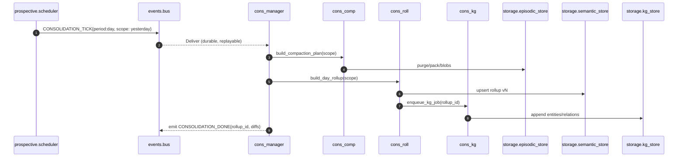

# consolidation/ — P03 Consolidation, Rollups & Reconciliation

**Compiled:** 2025‑09‑06
**Philosophy:** *Production‑first · privacy‑first · explainable.*
P03 turns raw, noisy, per‑event memories into **clean, compact, durable knowledge**.
It **compresses**, **deduplicates**, **summarizes**, **builds a knowledge graph**, and **repairs history** across spaces—without ever leaving the device.

---

## 0) Where P03 sits (system view)

```mermaid
flowchart LR
  subgraph WRITE[P02 Write/Ingest]
    Wcore[core/writer.py]
  end

  subgraph EVENTBUS[events/ (WAL, durable groups)]
    Pub[publish]:::bus
    Sub[subscribe]:::bus
  end

  subgraph P03[P03 Consolidation]
    MAN[cons_manager.py]
    COMP[cons_comp.py]
    ROLL[cons_roll.py]
    RECON[cons_recon.py]
    RECX[cons_recx/reconsolidator.py]
    KGJOB[cons_kg_jobs.py]
    KGMOD[cons_kg.py]
  end

  subgraph STORES[Edge Stores]
    EPI[storage/episodic_store.py]
    SEM[storage/semantic_store.py]
    VEC[storage/vector_store.py]
    KG[storage/kg_store.py]
    RCPT[storage/receipts_store.py]
  end

  subgraph OTHER[Other Systems]
    TMP[temporal/]:::mod
    HIPPO[hippocampus/*]
    RET[retrieval/*]
    LRN[learning/*]
    PROS[prospective/*]
    POL[policy/*]
  end

  Wcore -- HIPPO_ENCODE / WRITE_DONE --> Pub
  Pub -->|replay & fanout| Sub
  Sub --> MAN
  MAN --> COMP & ROLL & RECON & KGJOB
  COMP --> EPI & VEC & SEM
  ROLL --> EPI & SEM
  RECON --> EPI
  RECX --> SEM
  KGJOB --> KGMOD --> KG
  P03 --> PROS
  P03 --> RET
  P03 --> LRN
  TMP --> P03
  HIPPO --> P03

  classDef bus fill:#eef,stroke:#89f,stroke-width:1px;
  classDef mod fill:#ffd,stroke:#cc8,stroke-width:1px;
```

**Event backbone.** P03 consumes durable topics via the **in‑process Event Bus** (append‑only JSONL WAL, ack/nack, retry, DLQ, durable consumer groups) so we can replay, backfill, and recover after crashes with **at‑least‑once** delivery.&#x20;

**Temporal glue.** Recency half‑life, circadian features, and weekly periodicity used inside rollups are provided by the `temporal/` module (relative phrases, features, patterns).&#x20;

---

## 1) What P03 delivers (responsibilities)

1. **Compaction** — remove near‑duplicates, shrink blobs, purge low‑value debris while keeping provenance.
2. **Rollups & Summaries** — produce time‑boxed, policy‑aware summaries (day/week/month), plus *rollup receipts*.
3. **Reconsolidation** — rewrite old summaries after new high‑signal evidence arrives (e.g., late receipts).
4. **Reconciliation** — repair out‑of‑order/duplicated events and **canonize** threads and conversations.
5. **KG Construction** — extract entities/relations from summaries and append to the local **Knowledge Graph**.
6. **Signals for others** — feed **Prospective (P05)** with periodicity/suggested habits, **Retrieval (P01)** with concise semantic anchors, **Learning (P06)** with targets and drift metrics.

---

## 2) Envelopes (contracts)

> All envelopes are **space‑scoped** and redacted by P10 before P03 touches them.

### 2.1 Trigger (from Event Bus)

```json
{
  "type": "CONSOLIDATION_TICK",                // or "IDLE_WINDOW", "NREM_START", "REINDEX_REQUEST"
  "space_id": "shared:household",
  "scope": {"from":"2025-09-05T00:00:00Z","to":"2025-09-06T00:00:00Z"},
  "budget_ms": 1200,
  "reason": ["idle", "daily"]
}
```

### 2.2 CompactionPlan (internal)

```json
{
  "space_id": "shared:household",
  "candidates": [
    {"event_id":"evt-1","dup_group_id":"dg-abc","score":0.92},
    {"event_id":"evt-2","dup_group_id":"dg-abc","score":0.88}
  ],
  "blob_moves": [
    {"source":"blob://raw/...", "dest":"blob://pack/day/2025-09-05.pack", "bytes": 42137}
  ]
}
```

### 2.3 RollupRecord (persisted)

```json
{
  "rollup_id":"ru-2025-09-05-shared:household",
  "space_id":"shared:household",
  "period":"day",
  "from":"2025-09-05T00:00:00Z",
  "to":"2025-09-06T00:00:00Z",
  "summary_md":"- Groceries...\n- Called grandparents...",
  "highlights":[{"ts":"...","why":["affect:positive","usage:clicked"]}],
  "features":{"circadian":0.41,"weekly":0.36,"token_cost_saved":3241},
  "provenance":{"event_ids":["evt-1","evt-2","evt-3"],"version":"p03-2025-09-06"}
}
```

### 2.4 ReconAction (audit trail)

```json
{
  "type":"MERGE_DUPLICATES",
  "space_id":"shared:household",
  "group_id":"dg-abc",
  "kept":"evt-1",
  "discarded":["evt-2","evt-9"],
  "reason":["sim>0.92","same author","same minute"],
  "ts":"2025-09-06T01:02:03Z"
}
```

### 2.5 KGJob → KGAppend (internal)

```json
{
  "job_id":"kg-ru-2025-09-05",
  "space_id":"shared:household",
  "source_rollup":"ru-2025-09-05-shared:household",
  "entities":[{"type":"PERSON","text":"Grandma"}],
  "relations":[{"type":"CALL","subj":"Alice","obj":"Grandma","time":"2025-09-05"}]
}
```

---

## 3) Algorithms (explainable math & rules)

### 3.1 Near‑duplicate detection (content canon)

We compute a **composite similarity** $S$ between two events $i,j$:

$$
S(i,j) = \alpha \cdot \text{Jaccard}_{3\mathrm{g}}(i,j) + 
         \beta \cdot \cos(\mathbf{e}_i,\mathbf{e}_j) +
         \gamma \cdot \mathbb{1}[\Delta t < \tau_t] +
         \delta \cdot \mathbb{1}[\text{same\_author}]
$$

* **Jaccard$_{3g}$**: character trigram overlap (fast, resilient to edits)
* **cos**: vector similarity from `storage/vector_store.py` (if present)
* **Time/author** guards: boost for near‑simultaneous, same‑actor writes

Default weights: $\alpha=0.45,\;\beta=0.45,\;\gamma=0.05,\;\delta=0.05$.
**Duplicate if** $S \ge \theta$, with $\theta=0.86$.
We **keep** the highest quality exemplar (longest content, highest affect confidence, earliest ts), link others as **tombstoned duplicates** with pointers for provenance.

### 3.2 Compaction policy (size vs value)

Each event gets a **keep‑score** $K$:

$$
K = w_r s_{\text{rec}} + w_s s_{\text{sal}} + w_u s_{\text{usage}} + w_a (1 - |v|)
$$

* $s_{\text{rec}}$: **recency** from temporal half‑life $2^{-\Delta t/h}$ (default $h=72h$)
* $s_{\text{sal}}$: salience from writer/attention features
* $s_{\text{usage}}$: #opens/#links normalized
* $v$: fused valence (affect)

Default weights: $w_r\!=\!0.35,w_s\!=\!0.35,w_u\!=\!0.2,w_a\!=\!0.1$.
We keep all events with $K \ge 0.25$, compact the rest into **pack files** with block‑level de‑dup (ROARING bitmap of offsets), never destroying policy‑protected items (BLACK/RED).

> **Why half‑life?** It’s explainable and aligns with human forgetting; we reuse `temporal/` features and thresholds for consistent behavior across the stack.&#x20;

### 3.3 Rollup summarization (day/week/month)

We use an **extractive + light abstractive** hybrid:

1. **Candidate selection (extractive).**
   Rank sentences by **Maximal Marginal Relevance (MMR)** on a sparse TF‑IDF bag, biased by recency/affect:

   $$
   \text{score}(s) = \lambda \cdot \text{tfidf}(s) + (1-\lambda)\cdot s_{\text{rec}} - \mu \cdot \max_{s' \in S} \cos(s,s')
   $$

   with $\lambda=0.7,\;\mu=0.3$.

2. **Light rewriting (abstractive).**
   A rules‑first pass (tense normalization, de‑pronounization) + optional tiny NN (edge‑quantized) to compress lists (“Bought apples, milk, bread” → “Groceries restocked”).

3. **Budgeting.**
   Token budget $B$ per period (e.g., 400 tokens/day, 1.2k/week). Coverage target $>80\%$ of high‑salience items.

**Outputs:** Markdown summary with **highlights** (timestamped bullets), links to exemplars, and **delta** vs previous rollup (for reconsolidation bookkeeping).

### 3.4 Reconsolidation (fix history with new facts)

When **late receipts** arrive or **replies** extend threads, we **patch** past rollups:

* **Detect drift:** if new evidence lifts an event’s $K$ above keep‑threshold or flips affect banding, mark *stale* rollups.
* **Rewrite policy:** patch in place if the change is **local** (same period and scope) else generate a **v2** rollup with **diff**.
* **Audit:** write a `ReconAction` (MERGE, SPLIT, UPDATE\_SUMMARY) in `storage/receipts_store.py`.

### 3.5 Reconciliation (order, threads, and canon)

* **Out‑of‑order repair:** sort within sessions by **logical clock** if present; else use ts ± network skew window (e.g., 10s) and cross‑check **action receipts** to infer true order.
* **Thread canon:** conversations have a **canonical root**; we compute a DAG by reply edges and collapse trivial forks.
* **Projection repair:** if `PROJECT` created multi‑space links and **policy** later downgrades a segment, we propagate **tombstones** and **diffs** to maintain **referential integrity**.

### 3.6 KG construction (entities, relations, time)

* **Chunk** rollup sentences; **extract** entities with rule‑lexicons (names, places, orgs) + optional light MLP.
* **Relate** with typed patterns (“called”, “visited”, “bought”, “promised”, “due on”).
* **Temporalize** relations with `temporal/` ranges to support queries like “**who did we call last Sunday evening?**”.&#x20;

---

## 4) Schedulers & triggers

* **Idle windows** (screen locked, charger connected) → micro‑compaction (budget 0.5–2s).
* **Nightly** (e.g., 02:00 local) → day rollup, KG append, duplicate sweep.
* **Weekly** (Sun night) → weekly rollup and reconsolidation sweep.
* **Signals from outside:** `ACTION_EXECUTED`, `NREM/REM` start, and `REINDEX_REQUEST` all arrive on the **Event Bus** with durable offsets and replay, so nothing is lost on crash.&#x20;

**Sequence — nightly day‑rollup**



---

## 5) Files (suggested layout)

```
consolidation/
├── cons_manager.py              # Orchestrates schedules & budgets; attaches to Event Bus
├── cons_comp.py                 # Compaction planner (dup groups, pack moves) + executor
├── cons_comp_impl.py            # Platform-specific blob packs (ROARING bitmaps, delta encode)
├── cons_roll.py                 # Day/week/month rollup builder (MMR + rewrite)
├── cons_recon.py                # Out-of-order/thread repair; projection diffs
├── reconsolidation/
│   └── reconsolidator.py        # Staleness detect + rewrite & audit trail
├── cons_kg_jobs.py              # Build KG jobs from rollups
├── cons_kg.py                   # Entity/relation extract + store adapters
├── __init__.py
└── README.md                    # This file
```

---

## 6) Integration notes

* **Event Bus**: subscribe with **durable group** name `p03`; the bus persists offsets (`./workspace/.bus/offsets`) and supports **Ack/Nack** with retry+DLQ; **handlers must be idempotent**.&#x20;
* **Temporal**: call `temporal.patterns.summarize()` for circadian/weekly metrics; reuse half‑life functions for consistent recency scoring.&#x20;
* **Policy**: query `policy/space_policy.py` for banding on projection repair; **never** up‑scope content during reconsolidation.
* **Retrieval**: hand rollup embeddings + anchors to `retrieval/indexing_service.py` to reduce p99 recall latency.
* **Learning**: emit **metrics** (`token_cost_saved`, `dup_groups_merged`, `rollup_coverage`) for neuromodulated adaptation.

---

## 7) Privacy & safety

* **Keep raw → local.** Pack files live under device `workspace/blobs/pack/…`, never synced cross‑space.
* **Minimize & redact.** Only summary text + provenance IDs leave the raw tier; **no raw media** moves across spaces.
* **Undoable.** AMBER undo within 15 minutes **replays** rollup diffs to remove projected snippets.
* **GDPR/DSAR** ready: rollups carry provenance → we can **locate & scrub** derived text on delete.

---

## 8) Observability (what to log & graph)

* **Counters**: `compaction.bytes_saved`, `duplicates.merged`, `rollups.written`, `kg.triples_appended`.
* **Timers**: p50/p95 per phase; budget adherence (`budget_overrun_ms`).
* **Quality**: `rollup.coverage`, `rollup.novelty`, `recon.actions_count`.
* **Tracing**: span `"p03.rollup"` with tags `period`, `space_id`, `delta_size`, `coverage`.

---

## 9) Performance budgets

* **Idle micro‑pass**: ≤ 2s CPU, ≤ 10MB I/O.
* **Nightly day‑rollup**: ≤ 30s CPU (chunked), pack I/O ≤ 80MB, memory peak ≤ 200MB.
* **Weekly reconsolidation**: split into **segments** of ≤ 10k events to avoid long single runs.
* **Backpressure**: if the bus backlog grows, reduce rollup budget and favor compaction (I/O bound).&#x20;

---

## 10) Quickstart (minimal, synchronous sketch)

```python
# cons_manager.py (usage sketch)
from consolidation.cons_manager import ConsolidationManager
from events.bus import EventBus
from temporal.patterns import summarize as temporal_summarize

bus = EventBus()
mgr = ConsolidationManager(bus=bus)

# attach durable subscriber group "p03"
mgr.attach()

# elsewhere (scheduler) publish a daily tick
from events.types import Event, EventMeta, EventType
bus.publish(Event(
    meta=EventMeta(topic="consolidation", type=EventType("CONSOLIDATION_TICK"), space_id="shared:household"),
    payload={"scope":{"from":"2025-09-05T00:00:00Z","to":"2025-09-06T00:00:00Z"}, "budget_ms": 2000}
))
```

---

## 11) Test plan (what good looks like)

1. **Compaction**

   * Synthetic bundles of 1k events with 10% near‑dups → expect ≥9% merge rate; zero false merges with $S<0.86$.
   * Pack/unpack round‑trip → byte equivalence.

2. **Rollup**

   * Coverage ≥80% of salience‑top events; token budget respected.
   * Diff application (v1→v2) leaves **no orphan links**.

3. **Reconsolidation**

   * Late receipts flip keep‑score → old rollup patched, audit entry emitted.
   * Thread merge creates a DAG with a single canonical root.

4. **Event Bus semantics**

   * Crash after WAL append but before Ack → replay and exactly‑once effects via idempotent handlers.&#x20;

5. **Privacy**

   * DSAR delete on a person → rollups and KG entries referencing that person are scrubbed and tombstoned.

---

## 12) What this unlocks (capabilities)

* **“What mattered this week?”** → instantly from weekly rollup.
* **“Show me the last time we called Grandpa on a Sunday evening.”** → KG + temporalized relations.&#x20;
* **Space‑safe projection** → home vs selective spaces remain consistent even when policies change later.
* **Cheaper retrieval** → shorter, denser semantic anchors reduce p99 search latency.

---

## 13) Roadmap (future upgrades)

* **Segment compaction** with **content‑aware dedupe** (SimHash/MinHash) for multimedia.
* **Personalized half‑life** calibration using P06 feedback loops (shorter for quick‑changing domains).
* **Learned abstractive head** (≤15M int8) with **factuality guardrails**; still edge‑friendly.
* **Rollup conversations** with **speaker diarization** features (if available, on‑device only).
* **KG constraints** (SHACL‑like) to auto‑detect contradictory facts and trigger reconciliation.

---

## 14) Appendix — Definitions & formulas

* **Recency half‑life:**
  $s_{\text{rec}} = 2^{-\Delta t/h}$ (hours). Defaults $h=72$. From `temporal/` module for coherence across the stack.&#x20;

* **Circadian/weekly periodicity:**
  Hour/DOW histograms vs uniform using **KL divergence** (rescaled), weekly autocorrelation at lag 7. (Inputs from `temporal.patterns`.)&#x20;

* **MMR extractive criterion:** balance **relevance** (tf‑idf or vec similarity) and **novelty** (diversity) with $\lambda\in[0,1]$.

* **At‑least‑once bus semantics:**
  WAL append → fan‑out → handler Ack/Nack with replay/backoff/DLQ; durable **consumer groups** persist offsets for crash‑safe progress.&#x20;

---

### Final notes

* P03 has **no network deps**, runs **on‑device**, and respects **space policy** at all times.
* All outputs carry **provenance** so every summary is **explainable** and **reversible**.
* The design intentionally composes with **Event Bus** durability and **Temporal** recency/circadian math for coherence and simplicity. &#x20;

---

*End of `consolidation/README.md`.*
