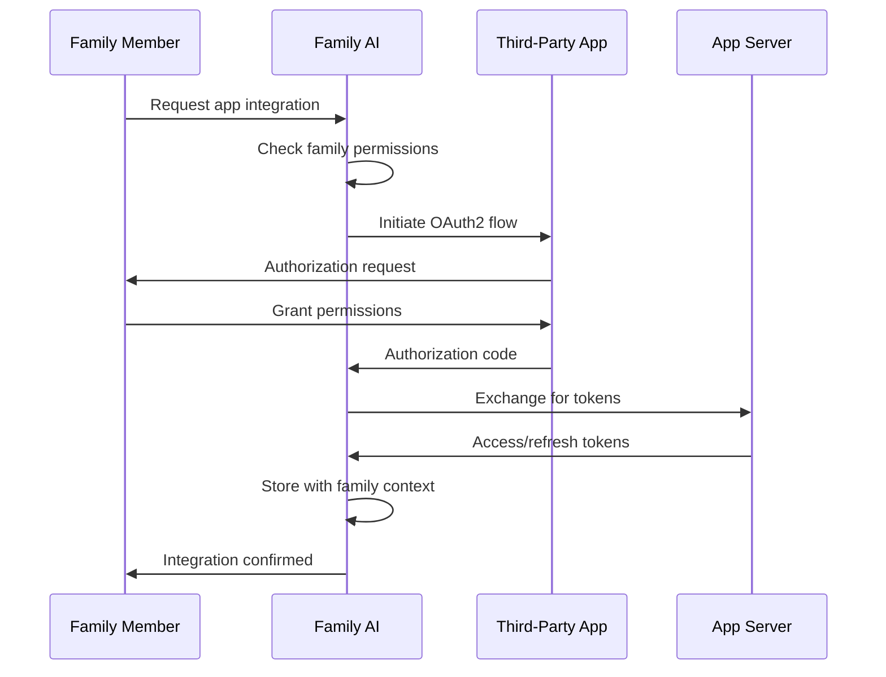
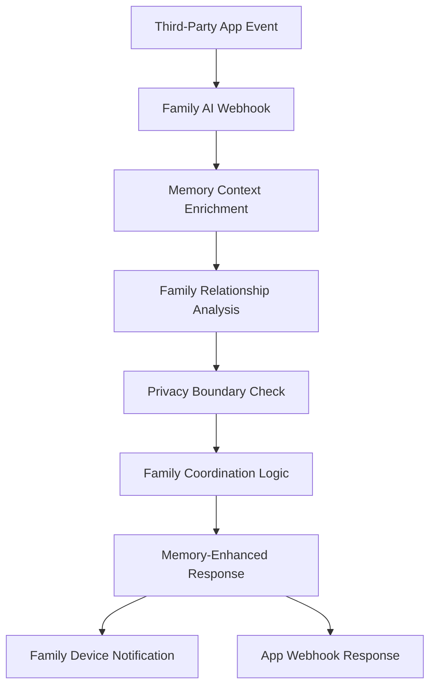
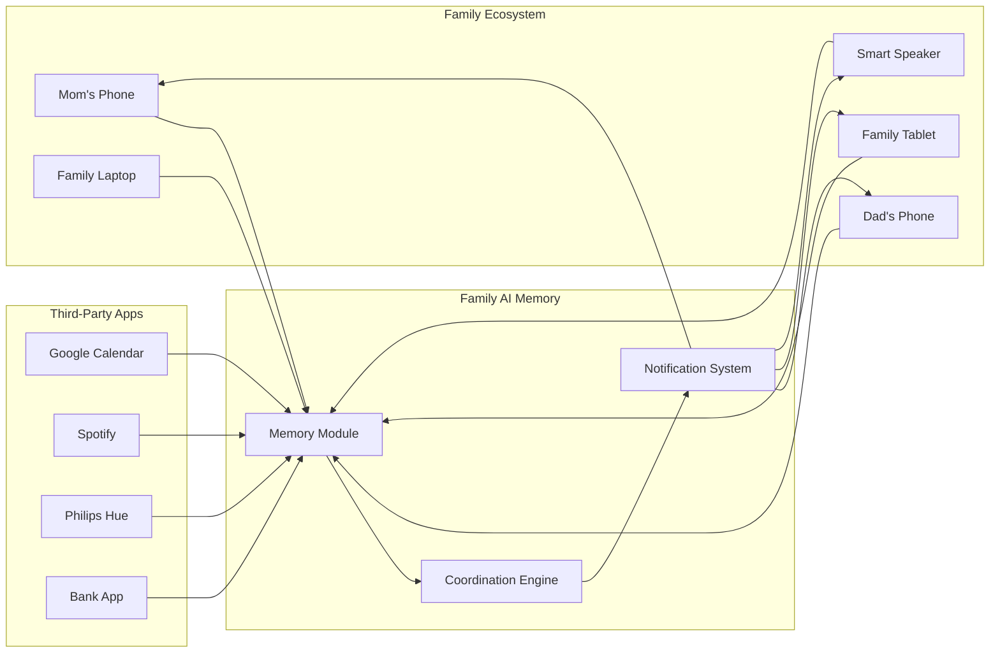

# App Plane Documentation

Complete documentation for the Memory-Centric Family AI App Plane, enabling third-party application integration while maintaining family privacy and coordination.

## Overview

The **App Plane** is one of three core API planes in Family AI, specifically designed for third-party application integration and family-aware external service coordination. It provides a secure, privacy-preserving gateway for apps to enhance family life while respecting family boundaries and leveraging family memory intelligence.

### App Plane Mission

**"Enable third-party applications to enhance family life through memory-aware, privacy-preserving integration that respects family relationships and coordinates across the family ecosystem."**

## Architecture Principles

### 1. Memory-Centric Integration
- All third-party integrations leverage the Family AI memory backbone
- App data is contextualized within family relationships and patterns
- Memory-driven insights enhance app functionality with family intelligence
- Cross-app coordination through shared family memory context

### 2. Privacy-First Design
- OAuth2 flows with family-aware consent and approval
- Granular permissions based on family roles and relationships
- Data minimization and purpose limitation for third-party access
- End-to-end encryption for all family data shared with apps

### 3. Family Coordination
- Apps coordinate across all family devices and members
- Presence-aware delivery and timing optimization
- Family relationship-aware feature enablement
- Child safety and parental control integration

### 4. Intelligent Automation
- Memory-driven proactive suggestions and reminders
- Family pattern recognition for enhanced app experiences
- Emotional intelligence and context-aware app behavior
- Cross-domain intelligence coordination across multiple apps

## Core APIs

### 1. App Connectors API (`/v1/app/connectors`)

**Purpose**: Manage third-party application connections with OAuth2 authentication, webhook coordination, and family-aware capability management.

**Key Features**:
- **OAuth2 Integration**: Complete OAuth2 flows with family consent management
- **Webhook Management**: Bidirectional webhook coordination for real-time family integration
- **Capability Discovery**: App capability mapping and family compatibility assessment
- **Family Configuration**: Family-specific app settings and preference management

**Core Endpoints**:
```
GET    /connectors                    # List family app connectors
POST   /connectors                    # Add new app connector
GET    /connectors/{id}               # Get connector details
PUT    /connectors/{id}/configure     # Configure family-specific settings
DELETE /connectors/{id}               # Remove app connector

POST   /connectors/{id}/auth/initiate # Start OAuth2 authorization
POST   /connectors/{id}/auth/complete # Complete OAuth2 flow
DELETE /connectors/{id}/auth/revoke   # Revoke app authorization

POST   /connectors/{id}/webhooks      # Configure webhooks
PUT    /connectors/{id}/webhooks/{wid} # Update webhook settings
POST   /connectors/{id}/sync          # Manual sync trigger
```

### 2. App Users API (`/v1/app/users`)

**Purpose**: Manage family members, devices, memory spaces, and presence coordination within the app ecosystem.

**Key Features**:
- **Family Member Management**: Add, update, and coordinate family members
- **Device Coordination**: Multi-device family ecosystem management
- **Memory Space Administration**: Family memory space creation and access control
- **Presence and Availability**: Real-time family presence coordination

**Core Endpoints**:
```
GET    /                              # List family members
POST   /                              # Add family member
GET    /{user_id}                     # Get user profile
PUT    /{user_id}                     # Update user profile
DELETE /{user_id}                     # Remove family member

GET    /{user_id}/devices             # List user devices
POST   /{user_id}/devices             # Register new device
PUT    /{user_id}/devices/{device_id} # Update device
DELETE /{user_id}/devices/{device_id} # Unregister device

GET    /{user_id}/spaces              # List memory spaces
POST   /{user_id}/spaces              # Create memory space
PUT    /{user_id}/spaces/{space_id}   # Update memory space
DELETE /{user_id}/spaces/{space_id}   # Delete memory space

GET    /{user_id}/presence            # Get presence status
PUT    /{user_id}/presence            # Update presence
GET    /presence/family               # Family presence overview

GET    /family/structure              # Get family structure
PUT    /family/structure              # Update family structure
GET    /family/invitations            # List invitations
POST   /family/invitations            # Create invitation
```

### 3. App Notifications API (`/v1/app/notifications`)

**Purpose**: Coordinate family notifications with intelligent delivery timing, family context awareness, and multi-device synchronization.

**Key Features**:
- **Device Token Management**: Family device notification token registration
- **Channel Management**: Family notification channels and subscription management
- **Preference Management**: Family and individual notification preferences
- **Smart Delivery**: Memory-driven notification timing and coordination

**Core Endpoints**:
```
GET    /tokens                        # List device tokens
POST   /tokens                        # Register device token
GET    /tokens/{token_id}             # Get token details
PUT    /tokens/{token_id}             # Update token
DELETE /tokens/{token_id}             # Unregister token

GET    /channels                      # List notification channels
POST   /channels                      # Create channel
GET    /channels/{channel_id}         # Get channel details
PUT    /channels/{channel_id}         # Update channel
DELETE /channels/{channel_id}         # Delete channel

GET    /preferences                   # Get notification preferences
PUT    /preferences                   # Update preferences
GET    /preferences/family            # Get family preferences
PUT    /preferences/family            # Update family preferences

POST   /send                          # Send notification
POST   /send/test                     # Send test notification
POST   /send/batch                    # Send batch notifications

GET    /history                       # Get notification history
GET    /history/{notification_id}     # Get notification details

GET    /templates                     # List templates
POST   /templates                     # Create template
GET    /templates/{template_id}       # Get template details
PUT    /templates/{template_id}       # Update template
DELETE /templates/{template_id}       # Delete template
```

## Integration Patterns

### 1. OAuth2 Family Authorization Flow



### 2. Memory-Enhanced App Interaction



### 3. Family Device Coordination



## Family Safety and Privacy

### Privacy Boundaries

**Memory Space Integration**:
- `personal:*` - No third-party access, strictly personal
- `selective:context` - Limited third-party access with explicit consent
- `shared:household` - Family app integration with household coordination
- `extended:network` - Community app integration with family oversight
- `interfamily:*` - Cross-family coordination with privacy protection

**Data Minimization**:
- Apps receive only minimum necessary family context
- Family relationships inform but don't expose personal details
- Child data receives enhanced protection and parental oversight
- Automatic data expiration and cleanup for third-party integrations

### Child Safety Features

**Age-Appropriate Integration**:
- Content filtering based on family member age groups
- Parental approval required for child app integrations
- Supervised access modes for teen family members
- Educational app prioritization for school-age children

**Parental Controls**:
- All child app integrations require parental approval
- Real-time monitoring of child app interactions
- Time-based restrictions and usage limits
- Emergency override capabilities for safety situations

## Memory-Driven Intelligence

### Family Pattern Recognition

**Activity Coordination**:
- Learn family routines and optimize app suggestions
- Recognize family stress patterns and adapt app behavior
- Coordinate family schedules across multiple calendar apps
- Optimize family resource usage (streaming, utilities, etc.)

**Emotional Intelligence**:
- Detect family emotional states from interaction patterns
- Adapt app notifications and suggestions based on family mood
- Provide family harmony support through coordinated app experiences
- Support family celebration and milestone recognition

### Proactive Assistance

**Memory-Enhanced Suggestions**:
- Proactive reminders based on family memory patterns
- Contextual app recommendations for family activities
- Coordination suggestions to prevent family conflicts
- Resource optimization across family app ecosystem

**Cross-Domain Intelligence**:
- Health app coordination with family meal planning
- Finance app integration with family budget coordination
- Entertainment app suggestions based on family presence
- Home automation coordination with family routines

## Development Guidelines

### API Design Principles

1. **Family-First Design**: Every endpoint considers family relationships and dynamics
2. **Memory Integration**: All responses enhanced with family memory context
3. **Privacy by Design**: Default privacy settings protect family boundaries
4. **Child Safety**: Special protections for family members under 18
5. **Transparent AI**: All AI decisions are explainable to family members

### Authentication and Authorization

**Family Authentication**:
```http
Authorization: Bearer <family_member_jwt>
X-Device-ID: <family_device_identifier>
X-Family-Context: <family_relationship_context>
```

**Permission Model**:
- Family member permissions based on role and relationships
- Device permissions based on family device registration
- App permissions based on family consent and configuration
- Memory space permissions based on family privacy boundaries

### Error Handling

**Family-Aware Error Responses**:
```json
{
  "error": "insufficient_family_permissions",
  "message": "This action requires parental approval",
  "family_context": {
    "required_role": "parent",
    "approval_process": "parental_consent_required",
    "family_policy": "child_protection_active"
  },
  "suggested_actions": [
    "request_parental_approval",
    "use_supervised_mode",
    "contact_family_admin"
  ]
}
```

## Best Practices

### Third-Party App Integration

1. **Start with Family Consent**: Always begin integration with clear family consent and permission management
2. **Respect Privacy Boundaries**: Honor family privacy levels and never access more data than necessary
3. **Coordinate Across Devices**: Design for family device ecosystem, not individual device usage
4. **Learn Family Patterns**: Use Family AI memory insights to enhance app experience
5. **Support Family Harmony**: Design features that bring families together, not drive them apart

### Family Coordination

1. **Presence-Aware Delivery**: Time notifications and suggestions based on family availability
2. **Relationship-Aware Features**: Adapt app behavior based on family relationships
3. **Child-Safe Design**: Always prioritize child safety and parental oversight
4. **Emergency Protocols**: Include family emergency coordination in critical app functions
5. **Transparent Decision-Making**: Make AI reasoning clear and accessible to family members

### Memory Integration

1. **Contextual Enhancement**: Use family memory to provide richer, more relevant app experiences
2. **Pattern Learning**: Learn from family interactions to improve app suggestions over time
3. **Cross-App Coordination**: Share appropriate context across apps for better family coordination
4. **Privacy Protection**: Never expose sensitive family memory to third-party apps
5. **Family Intelligence**: Leverage family relationships and dynamics for smarter app behavior

The App Plane represents the bridge between Family AI's memory-centric intelligence and the broader app ecosystem, enabling third-party applications to enhance family life while maintaining the privacy, safety, and coordination principles that make Family AI a trusted family member.
