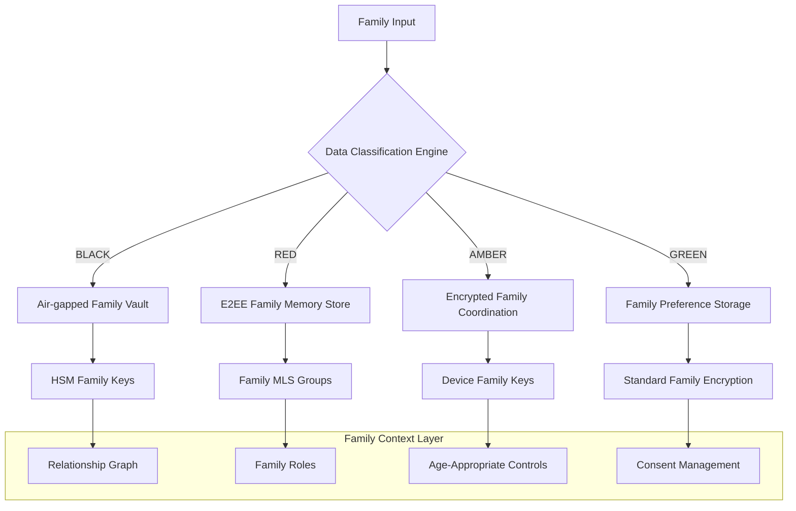

# Family AI Threat Model v1.0

**Module:** `security/`
**Classification:** CONFIDENTIAL
**Threat Level:** CRITICAL
**Effective:** 2025-09-19

---

## Executive Summary

The Memory-Centric Family AI platform handles intimate family data across multiple devices, generations, and relationship contexts, making it a high-value target for diverse threat actors. This threat model identifies attack vectors, threat actors, and mitigation strategies specific to family AI systems.

## 1. Assets and Data Classification

### 1.1 Protected Family Assets

| Asset | Classification | Family Context | Threat Level |
|-------|---------------|----------------|--------------|
| **Family Memories** | PERSONAL/RED | Intimate family moments, photos, videos | HIGH |
| **Child Data** | PROTECTED/AMBER | Educational, behavioral, developmental data | CRITICAL |
| **Family Relationships** | SENSITIVE/RED | Relationship dynamics, family structure | HIGH |
| **Health Information** | PHI/BLACK | Family medical history, mental health data | CRITICAL |
| **Financial Data** | SENSITIVE/BLACK | Family finances, transactions, planning | CRITICAL |
| **Location Data** | PERSONAL/AMBER | Family member locations, travel patterns | HIGH |
| **Communication Logs** | PERSONAL/RED | Family conversations, coordination messages | HIGH |
| **Behavioral Patterns** | SENSITIVE/AMBER | AI-learned family behavior, predictions | HIGH |
| **Device Credentials** | SYSTEM/BLACK | Cross-device authentication, sync keys | CRITICAL |
| **Biometric Data** | IMMUTABLE/BLACK | Family member biometrics, voice prints | CRITICAL |

### 1.2 Family Data Flow Classification



## 2. Family-Specific Threat Actors

### 2.1 External Threat Actors

#### **Malicious Family Members**
- **Motivation:** Domestic abuse, custody disputes, financial gain, revenge
- **Capabilities:** Insider knowledge, physical device access, family trust exploitation
- **Attack Vectors:**
  - Unauthorized family member surveillance
  - Child data exploitation and grooming
  - Family financial fraud and identity theft
  - Domestic violence enablement through surveillance
  - Custody battle data manipulation
- **Target Assets:** Child data, location information, family communications, financial records
- **Likelihood:** MEDIUM | **Impact:** CRITICAL

#### **Child Predators and Groomers**
- **Motivation:** Child exploitation, grooming, abuse material creation
- **Capabilities:** Social engineering, technical exploitation, psychological manipulation
- **Attack Vectors:**
  - Family AI system infiltration for child targeting
  - Fake family member account creation
  - Child communication interception and manipulation
  - Family routine pattern exploitation
  - Grooming through AI-generated family-like interactions
- **Target Assets:** Child data, communication logs, behavioral patterns, location data
- **Likelihood:** MEDIUM | **Impact:** CRITICAL

#### **Data Brokers and Advertisers**
- **Motivation:** Family data monetization, targeted advertising, behavioral profiling
- **Capabilities:** Large-scale data aggregation, correlation analysis, persistent tracking
- **Attack Vectors:**
  - Family behavior pattern harvesting
  - Cross-device family tracking
  - Child development data collection
  - Family financial pattern analysis
  - Relationship dynamic profiling for marketing
- **Target Assets:** Behavioral patterns, family relationships, purchasing data, preferences
- **Likelihood:** HIGH | **Impact:** MEDIUM

#### **Nation-State Actors**
- **Motivation:** Intelligence gathering, social control, population monitoring
- **Capabilities:** Advanced persistent threats, zero-day exploits, supply chain attacks
- **Attack Vectors:**
  - Mass family surveillance programs
  - Social graph mapping for population control
  - Family loyalty and political opinion profiling
  - Child indoctrination and influence operations
  - Family structure analysis for social engineering
- **Target Assets:** Family relationships, political preferences, social networks, communications
- **Likelihood:** LOW | **Impact:** CRITICAL

### 2.2 Internal Threat Actors

#### **Rogue Family Members**
- **Motivation:** Privacy violation, control, manipulation, abuse
- **Capabilities:** Legitimate system access, family trust, physical proximity
- **Attack Vectors:**
  - Guardian privilege abuse for excessive surveillance
  - Sibling privacy violation and harassment
  - Partner surveillance and control
  - Elder abuse through AI manipulation
  - Teen rebellion through system exploitation
- **Target Assets:** Private communications, location data, personal memories, health information
- **Likelihood:** MEDIUM | **Impact:** HIGH

#### **Compromised Family Devices**
- **Motivation:** N/A (Compromised systems used by external actors)
- **Capabilities:** Device-level access, family network position, trust relationships
- **Attack Vectors:**
  - Malware on family devices spreading to AI system
  - IoT device compromise for family surveillance
  - Smart home device exploitation
  - Family network lateral movement
  - Cross-device credential harvesting
- **Target Assets:** All family data accessible from compromised device
- **Likelihood:** MEDIUM | **Impact:** HIGH

## 3. Family-Specific Attack Scenarios

### 3.1 Child Targeting Scenarios

#### **Scenario: AI-Enabled Child Grooming**
```yaml
Attack Flow:
  1. Attacker infiltrates family AI through social engineering
  2. Analyzes child behavioral patterns and preferences
  3. Creates AI-generated interactions mimicking family communication style
  4. Gradually builds trust through family-context-aware conversations
  5. Escalates to inappropriate requests and manipulation
  6. Leverages family schedule and location data for physical approaches

Impact: CRITICAL - Child safety compromise
Likelihood: MEDIUM
Mitigation Priority: IMMEDIATE
```

#### **Scenario: Predatory Family Member Surveillance**
```yaml
Attack Flow:
  1. Family member with legitimate access enables excessive monitoring
  2. Uses guardian privileges to bypass child privacy settings
  3. Monitors child communications, locations, and activities
  4. Uses AI insights to predict and control child behavior
  5. Escalates to inappropriate contact and abuse
  6. Uses family AI data to manipulate custody proceedings

Impact: CRITICAL - Child welfare and safety
Likelihood: MEDIUM
Mitigation Priority: IMMEDIATE
```

### 3.2 Family Manipulation Scenarios

#### **Scenario: Domestic Abuse Enablement**
```yaml
Attack Flow:
  1. Abusive family member gains control of family AI system
  2. Uses location tracking to monitor victim movements
  3. Intercepts victim communications and support attempts
  4. Manipulates AI recommendations to isolate victim
  5. Uses family financial data for economic abuse
  6. Leverages child data as manipulation and control tool

Impact: CRITICAL - Family safety and welfare
Likelihood: MEDIUM
Mitigation Priority: IMMEDIATE
```

#### **Scenario: Family Financial Fraud**
```yaml
Attack Flow:
  1. Attacker compromises family member account
  2. Uses family AI financial insights for targeted fraud
  3. Manipulates family coordination system for fraudulent transactions
  4. Uses child data for identity theft and long-term fraud
  5. Exploits family trust relationships for social engineering
  6. Uses family pattern analysis to avoid detection

Impact: HIGH - Financial damage and family trust erosion
Likelihood: MEDIUM
Mitigation Priority: HIGH
```

### 3.3 Mass Surveillance Scenarios

#### **Scenario: Population-Scale Family Monitoring**
```yaml
Attack Flow:
  1. Nation-state actor infiltrates family AI infrastructure
  2. Deploys persistent surveillance across family networks
  3. Builds comprehensive family relationship graphs
  4. Analyzes family political opinions and loyalty patterns
  5. Identifies dissidents and social influencers through family connections
  6. Uses family AI for targeted influence and control operations

Impact: CRITICAL - Democratic freedom and privacy
Likelihood: LOW
Mitigation Priority: HIGH
```

## 4. Technical Attack Vectors

### 4.1 Family-Specific Vulnerabilities

#### **Trust Relationship Exploitation**
- **Vector:** Abuse of family trust for unauthorized access
- **Techniques:**
  - Social engineering using family context
  - Guardian privilege escalation
  - Family device credential sharing exploitation
  - Emergency access mechanism abuse
- **Mitigation:** Multi-factor family authentication, consent validation, audit trails

#### **Age-Based Security Bypasses**
- **Vector:** Exploitation of age-appropriate control weaknesses
- **Techniques:**
  - Minor account privilege escalation
  - Age verification bypass
  - Parental control circumvention
  - Consent mechanism manipulation
- **Mitigation:** Robust age verification, graduated controls, family consensus requirements

#### **Cross-Device Attack Propagation**
- **Vector:** Family device ecosystem lateral movement
- **Techniques:**
  - Device trust relationship abuse
  - Family network propagation
  - Cross-device credential harvesting
  - Family sync mechanism exploitation
- **Mitigation:** Device isolation, zero-trust networking, encrypted sync protocols

### 4.2 AI-Specific Attack Vectors

#### **Family AI Model Poisoning**
- **Vector:** Corruption of family AI models for manipulation
- **Techniques:**
  - Training data injection attacks
  - Family behavior pattern manipulation
  - AI recommendation system corruption
  - Family relationship dynamic distortion
- **Mitigation:** Model integrity validation, anomaly detection, federated learning protections

#### **Family Context Inference Attacks**
- **Vector:** Unauthorized family information inference from AI outputs
- **Techniques:**
  - Family member identification through AI behavior
  - Relationship inference from interaction patterns
  - Family secret discovery through AI recommendations
  - Privacy setting inference from AI responses
- **Mitigation:** Differential privacy, output sanitization, family context masking

## 5. Family-Aware Defense Strategies

### 5.1 Family Relationship Protection

#### **Relationship-Based Access Control**
```yaml
Protection Mechanism: Dynamic RBAC based on family relationships
Implementation:
  - Real-time family relationship graph validation
  - Age-appropriate access control enforcement
  - Guardian authority validation with limits
  - Sibling peer access controls
  - Extended family access restrictions

Threat Coverage:
  - Malicious family member access
  - Inappropriate guardian surveillance
  - Sibling privacy violations
  - Extended family data access abuse
```

#### **Family Consent Orchestration**
```yaml
Protection Mechanism: Multi-party family consent management
Implementation:
  - Age-appropriate consent collection
  - Guardian co-consent requirements
  - Family consensus for sensitive operations
  - Dynamic consent withdrawal handling
  - Emergency consent override protocols

Threat Coverage:
  - Unauthorized family data usage
  - Child consent manipulation
  - Family decision bypassing
  - Privacy setting circumvention
```

### 5.2 Child-Specific Protections

#### **Enhanced Child Data Protection**
```yaml
Protection Mechanism: COPPA-plus family privacy controls
Implementation:
  - Automatic child data classification
  - Enhanced encryption for child data
  - Limited child data retention periods
  - Child-safe AI interaction protocols
  - Parental oversight with privacy balance

Threat Coverage:
  - Child data exploitation
  - Grooming and predatory behavior
  - Inappropriate data collection
  - Child privacy violations
```

#### **Child Safety Monitoring**
```yaml
Protection Mechanism: AI-powered child safety monitoring
Implementation:
  - Grooming behavior pattern detection
  - Inappropriate interaction identification
  - Child distress signal recognition
  - Family communication anomaly detection
  - Emergency contact activation protocols

Threat Coverage:
  - Child grooming attempts
  - Family abuse situations
  - Child exploitation
  - Inappropriate family interactions
```

### 5.3 Family Privacy Architecture

#### **Privacy-Preserving Family AI**
```yaml
Protection Mechanism: Differential privacy for family operations
Implementation:
  - Family-wide privacy budget management
  - Individual privacy preservation within family context
  - Selective family data sharing protocols
  - Privacy-preserving family analytics
  - Family anonymization techniques

Threat Coverage:
  - Family behavior pattern extraction
  - Individual privacy within family
  - Family data aggregation attacks
  - Cross-family correlation attacks
```

#### **Family Memory Protection**
```yaml
Protection Mechanism: E2EE family memory storage with selective sharing
Implementation:
  - Per-family-member encryption keys
  - Selective memory sharing protocols
  - Family memory access logging
  - Memory significance classification
  - Family memory inheritance controls

Threat Coverage:
  - Memory unauthorized access
  - Family memory manipulation
  - Cross-generation memory access
  - Memory-based family profiling
```

## 6. Incident Response for Family Threats

### 6.1 Child Safety Incidents

#### **Child Exploitation Response**
```yaml
Trigger Conditions:
  - Grooming behavior pattern detection
  - Inappropriate child interaction alerts
  - Child distress signal activation
  - Family member reported child safety concern

Response Protocol:
  1. Immediate threat isolation and evidence preservation
  2. Child safety contact activation (parents, authorities)
  3. Family notification with appropriate sensitivity
  4. Law enforcement coordination if required
  5. Family counseling resource provision
  6. Long-term family AI safety review
```

#### **Family Abuse Response**
```yaml
Trigger Conditions:
  - Domestic abuse pattern detection
  - Victim help request through AI system
  - Emergency contact activation
  - Family member welfare check request

Response Protocol:
  1. Victim safety prioritization and secure communication
  2. Abuse evidence preservation with legal compliance
  3. Emergency service coordination if immediate danger
  4. Victim resource and support provision
  5. Abuser access restriction and monitoring
  6. Family safety plan development and implementation
```

### 6.2 Privacy Breach Response

#### **Family Data Breach Response**
```yaml
Response Protocol:
  1. Breach scope assessment and family impact analysis
  2. Individual family member notification with appropriate detail
  3. Child-specific breach response and protection measures
  4. Family data recovery and integrity restoration
  5. Enhanced family security implementation
  6. Family counseling and support for privacy trauma
```

## 7. Compliance and Regulatory Alignment

### 7.1 Family Privacy Regulations

#### **COPPA Compliance Enhancement**
- Enhanced child data protection beyond minimum requirements
- Age verification with family context awareness
- Parental consent with child privacy balance
- Child data minimization and retention limits

#### **GDPR Family Data Protection**
- Family-aware data subject rights implementation
- Child-specific right to erasure protocols
- Family consent management with individual rights
- Cross-border family data transfer protections

#### **Domestic Violence Protection Laws**
- Family AI system domestic violence safeguards
- Victim privacy protection within family context
- Evidence preservation for legal proceedings
- Mandatory reporting compliance with family sensitivity

## 8. Continuous Family Threat Assessment

### 8.1 Family Threat Intelligence

#### **Family Attack Pattern Recognition**
```yaml
Monitoring Scope:
  - Family-targeted attack campaigns
  - Child exploitation technique evolution
  - Domestic abuse technology trends
  - Family privacy threat landscape
  - AI-specific family attack methods

Intelligence Sources:
  - Child safety organizations
  - Domestic violence prevention groups
  - Family privacy advocacy organizations
  - Law enforcement family crime units
  - Academic family technology research
```

### 8.2 Family Security Metrics

#### **Family Safety Indicators**
```yaml
Key Metrics:
  - Child safety incident rate and response time
  - Family privacy breach impact assessment
  - Family member security awareness levels
  - Family AI abuse attempt frequency
  - Family consent violation rates
  - Family trust and satisfaction scores

Reporting Frequency: Monthly family security reviews
Escalation Triggers: Any child safety or family abuse indicators
```

---

## Implementation Priorities

### **Immediate (Week 1-2)**
1. Child safety monitoring system activation
2. Family abuse detection protocol implementation
3. Emergency family response system deployment
4. Family privacy control enhancement

### **Short-term (Month 1-3)**
1. Comprehensive family threat monitoring
2. Family-specific security training program
3. Family AI abuse prevention system
4. Enhanced family audit and compliance

### **Long-term (Month 3-12)**
1. Advanced family threat intelligence system
2. Family privacy innovation research
3. Family security technology advancement
4. Family AI safety standard development

This threat model ensures Memory-Centric Family AI operates with comprehensive protection against family-specific threats while maintaining the trust and safety essential for family technology adoption.
