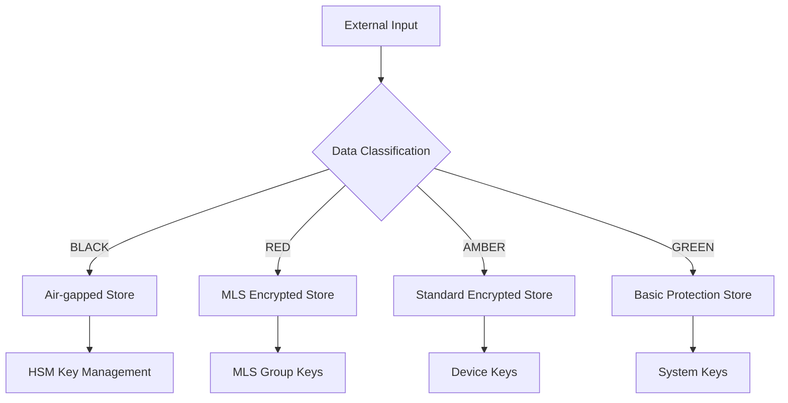

# Storage Threat Model v1.0

**Module:** `storage/`
**Classification:** TOP SECRET
**Threat Level:** HIGH
**Effective:** 2025-09-12

---

## Executive Summary

The storage layer handles family data across multiple security bands and spaces, making it a high-value target for attackers. This threat model identifies attack vectors, threat actors, and mitigation strategies for storage security.

## 1. Assets and Data Classification

### 1.1 Protected Assets

| Asset | Classification | Storage Pattern | Threat Level |
|-------|---------------|-----------------|--------------|
| **Family memories** | PERSONAL/RED | Encrypted episodic store | HIGH |
| **Financial data** | SENSITIVE/BLACK | Encrypted with HSM keys | CRITICAL |
| **Health records** | PHI/RED | HIPAA-compliant encryption | HIGH |
| **Child data** | PROTECTED/AMBER | Enhanced access controls | HIGH |
| **Biometric data** | IMMUTABLE/BLACK | Air-gapped storage | CRITICAL |
| **Authentication tokens** | SYSTEM/AMBER | Secure key storage | MEDIUM |
| **Configuration data** | OPERATIONAL/GREEN | Standard encryption | LOW |

### 1.2 Data Flow Classification



## 2. Threat Actors

### 2.1 External Threat Actors

#### **Nation-State Actors**
- **Motivation:** Intelligence gathering, surveillance
- **Capabilities:** Advanced persistent threats, zero-day exploits
- **Targets:** Financial data, family communications, biometrics
- **Likelihood:** MEDIUM (for high-value families)

#### **Cybercriminal Organizations**
- **Motivation:** Financial gain, identity theft, ransomware
- **Capabilities:** Malware, social engineering, credential theft
- **Targets:** Financial records, personal data, authentication
- **Likelihood:** HIGH

#### **Corporate Espionage**
- **Motivation:** Competitive intelligence, insider trading
- **Capabilities:** Targeted surveillance, data brokers
- **Targets:** Business communications, financial decisions
- **Likelihood:** MEDIUM

### 2.2 Internal Threat Actors

#### **Malicious Family Members**
- **Motivation:** Financial gain, revenge, control
- **Capabilities:** Legitimate access, social engineering
- **Targets:** Other family members' data, financial controls
- **Likelihood:** LOW-MEDIUM

#### **Compromised Devices**
- **Motivation:** Lateral movement, persistent access
- **Capabilities:** Device-level access, credential harvesting
- **Targets:** All accessible storage, cross-space data
- **Likelihood:** MEDIUM

#### **Rogue Administrators**
- **Motivation:** Financial gain, curiosity, revenge
- **Capabilities:** Administrative access, audit bypass
- **Targets:** All stored data, encryption keys
- **Likelihood:** LOW (but HIGH impact)

## 3. Attack Vectors

### 3.1 Data at Rest Attacks

#### **Disk Encryption Bypass**
```
Attack Vector: Physical device access → Disk encryption bypass → Raw data access
CVSS Score: 8.5 (HIGH)
Prerequisites: Physical access, specialized tools
Mitigations:
- Full disk encryption (AES-256)
- Secure boot with TPM
- Remote wipe capabilities
- Tamper-evident hardware
```

#### **Database Injection**
```
Attack Vector: SQL injection → Database access → Sensitive data extraction
CVSS Score: 9.1 (CRITICAL)
Prerequisites: Application vulnerability, network access
Mitigations:
- Parameterized queries (100% coverage)
- Principle of least privilege
- Database activity monitoring
- Input validation and sanitization
```

#### **Cryptographic Attacks**
```
Attack Vector: Weak encryption → Key compromise → Data decryption
CVSS Score: 8.8 (HIGH)
Prerequisites: Cryptographic vulnerability, processing power
Mitigations:
- Modern algorithms (AES-256, ECDH P-384)
- Perfect forward secrecy
- Key rotation policies
- Post-quantum preparation
```

### 3.2 Data in Transit Attacks

#### **MLS Group Compromise**
```
Attack Vector: MLS key compromise → Cross-space data access → Family surveillance
CVSS Score: 9.3 (CRITICAL)
Prerequisites: MLS vulnerability, network interception
Mitigations:
- MLS protocol compliance
- End-to-end encryption
- Key rotation enforcement
- Network monitoring
```

#### **API Exploitation**
```
Attack Vector: API vulnerability → Authentication bypass → Data access
CVSS Score: 8.7 (HIGH)
Prerequisites: API vulnerability, network access
Mitigations:
- API authentication (OAuth 2.1)
- Rate limiting and throttling
- API security scanning
- Request/response validation
```

### 3.3 Access Control Attacks

#### **Privilege Escalation**
```
Attack Vector: Limited access → Privilege escalation → Administrative access
CVSS Score: 8.4 (HIGH)
Prerequisites: Initial access, application vulnerability
Mitigations:
- Principle of least privilege
- Regular access reviews
- Privilege monitoring
- Secure coding practices
```

#### **Space Boundary Violation**
```
Attack Vector: Space access → Cross-space data leakage → Privacy violation
CVSS Score: 7.9 (HIGH)
Prerequisites: Application vulnerability, legitimate access
Mitigations:
- Space isolation enforcement
- Cross-space authorization
- Audit trail monitoring
- Data loss prevention
```

## 4. Attack Scenarios

### 4.1 Scenario: Teenager Privacy Rebellion

**Actor:** Malicious family member (teenager)
**Motivation:** Access parents' financial data, bypass restrictions
**Attack Path:**
1. Social engineer family member's credentials
2. Use legitimate device access to escalate privileges
3. Access cross-space financial data
4. Exfiltrate data or modify restrictions

**Impact:** Financial fraud, family trust violation, legal liability

**Mitigations:**
- Multi-factor authentication for sensitive operations
- Age-based access controls with band restrictions
- Anomaly detection for unusual access patterns
- Parent notification for privilege changes

### 4.2 Scenario: Compromised Smart Home Device

**Actor:** Cybercriminal organization
**Motivation:** Identity theft, financial gain
**Attack Path:**
1. Compromise smart home device (IoT vulnerability)
2. Lateral movement to family network
3. Credential harvesting from stored data
4. Access financial and personal information

**Impact:** Identity theft, financial loss, ongoing surveillance

**Mitigations:**
- Network segmentation for IoT devices
- Device certificate validation
- Anomalous traffic detection
- Device access restrictions by band

### 4.3 Scenario: State-Level Surveillance

**Actor:** Nation-state intelligence agency
**Motivation:** Intelligence collection, political influence
**Attack Path:**
1. Supply chain compromise of family device
2. Install persistent backdoor with steganographic C&C
3. Long-term data collection across all spaces
4. Intelligence analysis and behavioral profiling

**Impact:** Loss of privacy, political targeting, family safety

**Mitigations:**
- Supply chain security verification
- Device attestation and integrity monitoring
- Encrypted communication channels
- Geopolitical threat monitoring

## 5. Risk Assessment Matrix

| Threat | Likelihood | Impact | Risk Score | Mitigation Priority |
|--------|------------|--------|------------|-------------------|
| **Database Injection** | MEDIUM | CRITICAL | 9.1 | P0 - IMMEDIATE |
| **MLS Group Compromise** | LOW | CRITICAL | 9.3 | P0 - IMMEDIATE |
| **API Exploitation** | HIGH | HIGH | 8.7 | P1 - HIGH |
| **Privilege Escalation** | MEDIUM | HIGH | 8.4 | P1 - HIGH |
| **Disk Encryption Bypass** | LOW | HIGH | 8.5 | P2 - MEDIUM |
| **Space Boundary Violation** | MEDIUM | MEDIUM | 7.9 | P2 - MEDIUM |
| **Cryptographic Attacks** | LOW | HIGH | 8.8 | P3 - LOW |

## 6. Mitigation Strategies

### 6.1 Defense in Depth

```
Layer 1: Network Security
- Network segmentation
- Intrusion detection/prevention
- VPN/zero-trust access

Layer 2: Application Security
- Secure coding practices
- Input validation
- Authentication/authorization

Layer 3: Data Security
- Encryption at rest/transit
- Key management
- Data classification

Layer 4: Infrastructure Security
- Hardened operating systems
- Security monitoring
- Incident response

Layer 5: Physical Security
- Device tamper protection
- Secure storage
- Access controls
```

### 6.2 Continuous Monitoring

```python
class ThreatMonitoring:
    def monitor_bulk_access_patterns(self):
        """Detect potential data exfiltration."""

    def detect_privilege_escalation(self):
        """Monitor for unusual privilege changes."""

    def analyze_cross_space_access(self):
        """Detect unauthorized cross-space operations."""

    def validate_encryption_integrity(self):
        """Verify encryption key integrity."""
```

### 6.3 Incident Response

```python
@dataclass
class SecurityIncident:
    incident_id: str
    threat_type: str
    affected_spaces: List[str]
    severity: Literal["LOW", "MEDIUM", "HIGH", "CRITICAL"]
    containment_actions: List[str]
    investigation_notes: str
    resolved: bool

class IncidentResponsePlan:
    async def detect_incident(self) -> Optional[SecurityIncident]:
        """Automated incident detection."""

    async def contain_threat(self, incident: SecurityIncident):
        """Immediate threat containment."""

    async def investigate_incident(self, incident: SecurityIncident):
        """Forensic investigation."""

    async def recover_systems(self, incident: SecurityIncident):
        """System recovery and hardening."""
```

## 7. Compliance Considerations

### 7.1 Regulatory Requirements

- **GDPR:** Data protection by design, breach notification
- **CCPA:** Consumer privacy rights, data minimization
- **HIPAA:** Healthcare data protection (if applicable)
- **SOX:** Financial data integrity (for business families)
- **COPPA:** Children's data protection

### 7.2 Industry Standards

- **NIST Cybersecurity Framework:** Risk management
- **ISO 27001:** Information security management
- **OWASP:** Application security best practices
- **CIS Controls:** Critical security controls

## 8. Testing and Validation

### 8.1 Penetration Testing

```python
def test_sql_injection_resistance():
    """Test database injection attack resistance."""

def test_privilege_escalation_prevention():
    """Test privilege escalation prevention."""

def test_encryption_strength():
    """Test cryptographic implementation strength."""

def test_space_isolation():
    """Test space boundary enforcement."""
```

### 8.2 Red Team Exercises

- **Quarterly:** Simulated adversary testing
- **Annual:** Full-scale security assessment
- **Continuous:** Automated vulnerability scanning

## 9. Metrics and KPIs

### 9.1 Security Metrics

- **Mean Time to Detection (MTTD):** <5 minutes
- **Mean Time to Response (MTTR):** <15 minutes
- **False Positive Rate:** <1%
- **Security Test Coverage:** >95%

### 9.2 Risk Metrics

- **Critical Vulnerabilities:** 0 tolerance
- **High Risk Findings:** <5 open
- **Security Incidents:** <1 per quarter
- **Compliance Score:** >99%

---

**Document Classification:** TOP SECRET
**Threat Model Version:** 1.0
**Next Review:** 2025-12-12
**Approved By:** Chief Security Officer, Storage Team Lead
**Distribution:** Security Team, Storage Team, Executive Leadership
