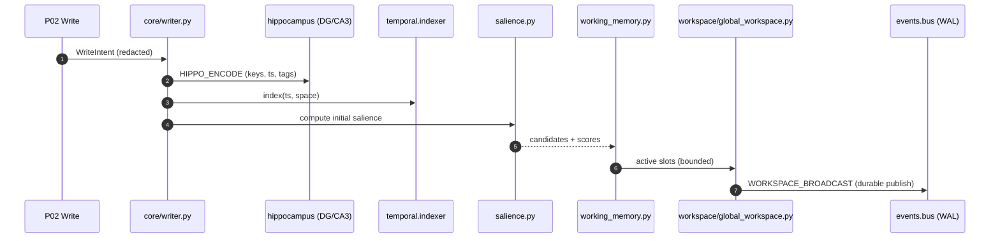
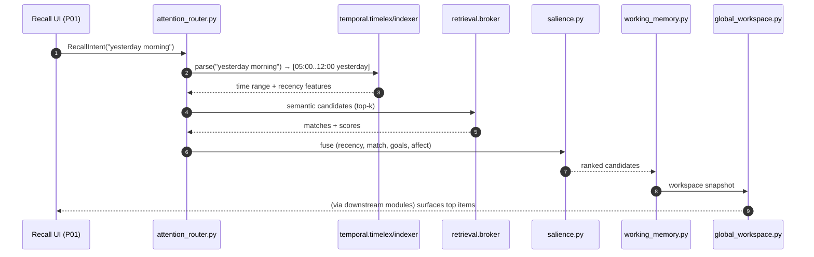

# core/ & workspace/ — Global Workspace, Salience & Working Memory

**Compiled:** 2025‑09‑06
**Philosophy:** *Production‑first, privacy‑first, explainable.*
**What this does:** The **Core** turns raw writes, recalls, and percepts into **coherent moments of cognition**. It scores what matters (salience), keeps a bounded **Working Memory (WM)**, and **broadcasts** a unified view to the rest of the system (the **Global Workspace**).

---

## 0) Where this sits (system map)

```mermaid
flowchart LR
  subgraph Ingestion & Recall
    P02[Write/Ingest P02]
    P01[Recall P01]
  end

  subgraph Core & Workspace
    SG[salience.py]
    SGW[salience_gateway.py]
    WM[working_memory.py]
    AR[workspace/attention_router.py]
    GW[workspace/global_workspace.py]
    WR[core/writer.py]
    CU[core/curator.py]
    GL[core/goals.py]
  end

  subgraph Memory & Indices
    HIPPO_DG[hippocampus/separator.py (DG)]
    HIPPO_CA3[hippocampus/completer.py (CA3)]
    TEMP[temporal/indexer.py]
  end

  subgraph Downstream
    RET[retrieval/ranker.py]
    ARB[arbitration/arbiter.py]
    AFX[affect/enhanced_classifier.py]
    PROS[prospective/engine.py]
    LRN[learning/learning_coordinator.py]
    POL[policy/space_policy.py]
  end

  P02 --> WR --> CU
  WR -- HIPPO_ENCODE --> HIPPO_DG
  P01 --> AR
  HIPPO_CA3 --> AR
  TEMP --> AR
  SG --> SGW --> WM --> GW
  GW --> RET & ARB & AFX & PROS & LRN & POL
```

* **Core** receives: new writes (P02), recall requests (P01), hippocampal candidates, **temporal** candidates & features, and affect/ToM/meta signals. It produces a **WORKSPACE\_BROADCAST** to the local event bus so every cognitive service sees the same “current moment.” The event bus & its durability/ack model are documented in `events/` (durable in‑process WAL, ack/nack, DLQ, durable groups) .
* **Temporal** features (recency, circadian) arrive from `temporal/` (e.g., `2^{-Δt/h}` recency, HOD/DOW sin/cos) and are used directly in salience and routing .

---

## 1) Files & Responsibilities

```
core/
├─ writer.py               # Applies policy/redaction, emits HIPPO_ENCODE, starts salience pass
├─ curator.py              # Normalizes content into canonical event records
├─ salience.py             # Salience scoring (bottom-up & top-down) + normalization & banding
├─ salience_gateway.py     # Fast path filter + freeze/boost rules + A/B hooks
├─ working_memory.py       # Bounded, decaying, multi-slot WM with rehearsal & merge rules
├─ goals.py                # Goal stack & activation model (top-down attention)
└─ __init__.py

workspace/
├─ attention_router.py     # Competes candidates into WM slots; schedule & time budgets
├─ global_workspace.py     # Broadcasts WORKSPACE_BROADCAST on the local Bus
└─ __init__.py
```

**Key invariants:**

* WM is **bounded** (default 8 slots) and **space‑scoped**.
* All outbound broadcasts are **at‑least‑once** and **durable** via the event bus (WAL JSONL, offsets, DLQ) .
* No raw PII leaves Core unless policy allows; redaction already applied in P02.

---

## 2) Data Contracts (Envelopes)

### 2.1 Inbound: `WriteIntent` (from P02 after redaction)

```json
{
  "event_id": "evt-2025-09-06-0012",
  "space_id": "shared:household",
  "person_id": "alice",
  "ts": "2025-09-06T13:24:05.121Z",
  "tz": "America/Chicago",
  "payload": {
    "type": "note",
    "text": "Send cupcakes to school Friday",
    "tags": ["school","reminder"]
  },
  "policy": {"band": "AMBER", "redacted": true},
  "trace_id": "trace-xyz"
}
```

### 2.2 Inbound: `RecallIntent` (from P01)

```json
{
  "space_id": "shared:household",
  "query": "school reminders from yesterday morning",
  "now": "2025-09-06T14:00:00Z",
  "k": 24,
  "trace_id": "trace-abc"
}
```

> During recall, Core cooperates with `temporal` to parse relative phrases and fetch time‑window candidates (e.g., “yesterday morning” → 05:00–12:00 yesterday) and recency features .

### 2.3 Outbound: `HIPPO_ENCODE` (writer → hippocampus)

```json
{
  "event_id": "evt-2025-09-06-0012",
  "space_id": "shared:household",
  "key_features": {"temporal_key":"2025-09-06", "tags":["school","reminder"]},
  "ts": "2025-09-06T13:24:05.121Z",
  "trace_id": "trace-xyz"
}
```

### 2.4 Outbound: `WORKSPACE_BROADCAST` (global workspace → bus)

```json
{
  "space_id": "shared:household",
  "wm": {
    "slots": [
      {
        "slot": 0,
        "event_id": "evt-2025-09-06-0012",
        "summary": "Send cupcakes to school Friday",
        "features": {
          "salience": 0.81,
          "recency": 0.78,
          "goal_alignment": 0.62,
          "affect": {"v": 0.1, "a": 0.4, "tags": ["urgent"]}
        },
        "expires_at": "2025-09-06T13:29:05.121Z"
      }
    ],
    "context": {
      "band": "AMBER",
      "time_budget_ms": 25,
      "now": "2025-09-06T13:24:05.121Z"
    }
  },
  "trace_id": "trace-xyz"
}
```

**Delivery model:** at‑least‑once via the `events` bus with per‑topic WAL and durable consumer offsets (e.g., `arbiter`, `retrieval`, `learning` subscribe with `group` names) .

---

## 3) Algorithms (Explainable & Edge‑safe)

### 3.1 Salience scoring (bottom‑up + top‑down)

For a candidate item *i*:

$$
S_i = \theta_r \,\underbrace{\text{recency}_i}_{\text{from temporal}} 
+ \theta_q \,\underbrace{\text{query\_match}_i}_{\text{retrieval}} 
+ \theta_g \,\underbrace{\text{goal\_align}_i}_{\text{goals}}
+ \theta_n \,\underbrace{\text{novelty}_i}_{\text{vs WM}}
+ \theta_t \,\underbrace{\text{timefit}_i}_{\text{circadian fit}}
+ \theta_a \,\underbrace{\text{affect\_nudge}_i}_{\text{arousal/valence}}
- \theta_c \,\underbrace{\text{cost}_i}_{\text{expected compute}}.
$$

**Defaults:**

* $\theta_r=0.9$, $\theta_q=1.2$, $\theta_g=0.8$, $\theta_n=0.6$, $\theta_t=0.5$, $\theta_a=0.2$, $\theta_c=0.3$.
* `recency` from `temporal`: $2^{-\Delta t/h}$ with $h=72$ hours (half‑life) .
* `timefit`: cosine similarity between item’s circadian vector and *now* (sin/cos HOD & DOW) .
* `novelty`: 1 − mean cosine similarity to active WM slot embeddings (bounded \[0,1]).
* `affect_nudge`: +0.1 if tag `urgent`, −0.1 if `a ≥ 0.85` and **sharing** risk present (policy gate).
* `cost`: estimated tokens / ms to expand item; helps stay within time budget.

**Normalization & banding:** Min‑max per batch → softmax with temperature `T=0.6` to make a small set stand out. A `band` from policy may **cap** or **boost** classes of items (e.g., RED caps at 0.5).

### 3.2 WM dynamics (decay & rehearsal)

* **Decay:** exponential with half‑life $h_\text{WM}=90s$. At each tick,

  $$
  w_t = (1-\alpha)w_{t-1} + \alpha S_i,\quad \alpha \in [0.15, 0.3]
  $$
* **Rehearsal:** interaction refresh: `w_t += 0.1` (bounded \[0,1]).
* **Merge:** near‑duplicates merge via near‑duplicate detector or title similarity; keep strongest.
* **Ejection:** if >N slots (default 8): evict min weight or expired.

### 3.3 Attention routing (WTA + fairness)

* **WTA (winner‑take‑all)**: pick top‑K by `S_i` but enforce:

  * **Diversity** constraint across sources (text vs. calendar vs. images).
  * **Goal fairness**: at least one slot for the highest active goal stack.
  * **Time budget aware**: sum of estimated costs ≤ `time_budget_ms`; else trim.

### 3.4 Global broadcast (at‑least‑once)

* Publish `WORKSPACE_BROADCAST` to `events` bus; subscribers receive via **durable groups** (“arbiter”, “retrieval”, “learning”), with WAL append, replay, ack/nack retry, DLQ on failure. See `events/` for WAL, offsets & backoff .

---

## 4) Temporal integration (why & how)

* **Why:** Humans think in time. The `temporal/` module gives us **recency**, **circadian** and **phrase parsing** (“yesterday morning”) which dramatically improves **what to surface now** and **when to propose actions**.
* **How:** Core calls `temporal.indexer` and `temporal.timelex` to (a) turn relative phrases into ranges; (b) retrieve candidates near those ranges with a **recency score** $2^{-\Delta t/h}$ and circadian vectors (HOD/DOW sin/cos). Core plugs these directly into salience and WM competition. Details live in the temporal README .
* **Where:** In `attention_router.select_candidates(...)` and `salience.compute(...)`.

---

## 5) Sequence Diagrams

### 5.1 Write → Encode → Workspace



*(The bus persists JSONL WAL, supports durable groups/offsets/ack+nack/backoff & DLQ.)*&#x20;

### 5.2 Recall with relative time phrase



*(Temporal phrase parsing, recency & circadian features supplied by `temporal/`.)*&#x20;

---

## 6) Public API (typical use from services)

```python
# services/retrieval_service.py or services/write_service.py (sketch)
from core.writer import CoreWriter
from workspace.attention_router import AttentionRouter
from workspace.global_workspace import GlobalWorkspace
from core.salience import SalienceModel
from core.working_memory import WorkingMemory
from core.goals import GoalStack

goals = GoalStack()
wm = WorkingMemory(max_slots=8)
sal = SalienceModel(goals=goals)
router = AttentionRouter(salience=sal, working_memory=wm)
gw = GlobalWorkspace(bus=...)  # events bus instance

# Write path
writer = CoreWriter(curator=..., bus=..., temporal=..., hippocampus=...)
writer.handle_write_intent(write_intent)  # emits HIPPO_ENCODE, seeds salience

# Recall path
cands = router.select_candidates(recall_intent, temporal=..., retrieval=..., affect=...)
wm.update(cands)
gw.broadcast(space_id=recall_intent["space_id"], wm_snapshot=wm.snapshot(), band=..., time_budget_ms=25)
```

---

## 7) Performance, Budgets & Reliability

* **Time budget:** default 25–40 ms for end‑to‑end **select → score → WM → broadcast** on mid‑range phones.
* **Complexity:** scoring O(M log M) for M candidates (typically ≤ 64 after pre‑filters).
* **Memory:** WM slots fixed (8 by default) + compact features; no raw media; embeddings from existing stores.
* **Reliability:** broadcast uses the **durable event bus** (append‑only JSONL WAL, consumer offsets, retries/backoff/DLQ) so downstream modules can **replay** and never miss a moment .

---

## 8) Privacy & Security

* **Space‑scoped** IDs for all items; **nothing** leaves the device unless user explicitly shares.
* **Redaction:** P02 redaction runs before Core; Core never reconstructs raw PII.
* **Event bus** payloads keep summaries/features; **no raw content** is required to broadcast state.
* **Policy band** influences what gets highlighted (e.g., RED items shown but not auto‑projected).
* **No network** calls inside Core; all sources are local modules/stores.
* **Temporal indices** store only timestamps and minimal hints; design documented in temporal README .

---

## 9) Observability & A/B

* **Tracing:** spans: `core.write`, `core.salience`, `wm.update`, `gw.broadcast`.
* **Metrics:** p50/p95 end‑to‑end latency; candidate counts; WM fill; evictions; diversity.
* **Logging:** structured JSON (no PII), include `trace_id`.
* **A/B hooks:** `salience_gateway.py` supports variant flags (e.g., adjust $\theta$ weights, temperature).
* **Events bus middlewares**: built‑in **Tracing**/**Metrics** middleware (pluggable) .

---

## 10) Edge Cases & Failure Modes

* **Empty candidate set:** keep prior WM snapshot (decay) and broadcast unchanged context.
* **Overfull candidates:** cap at 64 before salience to maintain latency.
* **High arousal + negative valence:** Core down‑weights share‑like actions; Arbiter may still prompt user (policy gate).
* **Long queries:** cost estimate can push out heavy candidates to satisfy `time_budget_ms`.
* **Bus backpressure:** broadcast retries automatically, with WAL ensuring no loss; subscribers must be **idempotent** (use `event_id` / `idem_key`) .

---

## 11) What you can build on top (today)

* **Context‑aware retrieval**: join semantic hits with **temporal** windows and WM focus for better answers.
* **Prospective nudges**: when circadian/timefit is high and goals align, propose reminders.
* **Affect‑aware UI**: highlight items differently when arousal is high but valence negative.
* **Planning**: Arbiter consumes `WORKSPACE_BROADCAST` and turns it into safe actions/plans.

---

## 12) Future (roadmap)

* **Hierarchical WM** (slots per modality + cross‑modal bindings).
* **Counterfactual rehearsal**: run small imagination rollouts before broadcasting risky items.
* **Personalized salience learning**: tiny int8 head that calibrates $\theta$ weights online (A/B).
* **Seasonality & holidays**: integrate temporal holiday/academic calendars (under user control).
* **Cross‑space focus**: when two spaces share a moment (e.g., “joint family dinner”), present a **co‑workspace** view.

---

## 13) Testing Checklist (unit & integration)

* **Salience math**: recency monotonicity; weight boundaries; softmax temperature effects.
* **WM policy**: decay half‑life; eviction order; merge thresholds; fairness & diversity.
* **Router**: time‑budget trimming; zero/overflow candidates.
* **Broadcast**: idempotent **WORKSPACE\_BROADCAST**; bus WAL file growth; offsets replay (subscribe/close/re‑open) .
* **Temporal interop**: parse “yesterday morning”, weekly circadian vectors shape & ranges .

---

## 14) Minimal Code Sketches

**Salience (core/salience.py)**

```python
from math import exp
def salience_score(x, w):
    # x: dict of features (recency, match, goal, novelty, timefit, affect, cost)
    # w: weights theta_*
    S = (
        w["r"] * x.get("recency", 0.0) +
        w["q"] * x.get("match", 0.0) +
        w["g"] * x.get("goal", 0.0) +
        w["n"] * x.get("novelty", 0.0) +
        w["t"] * x.get("timefit", 0.0) +
        w["a"] * x.get("affect", 0.0) -
        w["c"] * x.get("cost", 0.0)
    )
    return S

def softmax(scores, T=0.6):
    exps = [exp(s/T) for s in scores]
    Z = sum(exps) or 1.0
    return [e/Z for e in exps]
```

**Working Memory (core/working\_memory.py)**

```python
from dataclasses import dataclass
from time import time
@dataclass
class WMItem:
    event_id: str
    weight: float
    expires_at: float
    meta: dict

class WorkingMemory:
    def __init__(self, max_slots=8, half_life_s=90):
        self.max_slots = max_slots
        self.half_life_s = half_life_s
        self._items = []

    def _decay(self):
        now = time()
        factor = 0.5 ** (1.0 / self.half_life_s)  # per 1s tick approx
        for it in self._items:
            it.weight *= factor
            if it.expires_at and now > it.expires_at:
                it.weight *= 0.5

    def update(self, ranked_candidates):
        self._decay()
        # merge/insert
        for c in ranked_candidates:
            found = next((it for it in self._items if it.event_id == c["event_id"]), None)
            if found:
                found.weight = max(found.weight, c["score"])
            else:
                self._items.append(WMItem(c["event_id"], c["score"], c.get("expires_at", 0), c.get("meta", {})))
        # cap
        if len(self._items) > self.max_slots:
            self._items.sort(key=lambda it: it.weight, reverse=True)
            self._items = self._items[:self.max_slots]

    def snapshot(self):
        self._items.sort(key=lambda it: it.weight, reverse=True)
        return [{"event_id": it.event_id, "weight": it.weight, "meta": it.meta} for it in self._items]
```

**Global Workspace (workspace/global\_workspace.py)**

```python
from events import Event, EventMeta, EventType, Ack  # local events module
def broadcast(bus, space_id, wm_snapshot, band, time_budget_ms, trace_id):
    ev = Event(
        meta=EventMeta(topic="workspace", type=EventType.WORKSPACE_BROADCAST,
                       space_id=space_id, trace_id=trace_id),
        payload={"wm": wm_snapshot, "context": {"band": band, "time_budget_ms": time_budget_ms}}
    )
    # publish() is durable and acked with WAL & replay support
    return bus.publish(ev)
```

> **Note:** The bus provides async pub/sub, per‑topic WAL, durable groups, backoff+DLQ—see `events/` for details. Keep your subscribers **idempotent** by using `event_id`/`idem_key` in handlers.&#x20;

---

## 15) Glossary

* **WM (Working Memory):** Small, fast store of the *current* focus (8 slots by default).
* **Salience:** Numeric importance combining recency, match, goals, novelty, circadian, affect, cost.
* **Global Workspace:** The “blackboard” snapshot sent to all modules via the bus.
* **HIPPO\_ENCODE:** Event emitted to hippocampal indexers (DG/CA3) for later completion.
* **Temporal recency:** $2^{-\Delta t/h}$ from `temporal/` (explainable, cheap, tunable) .
* **Events bus:** Durable in‑process pub/sub with WAL, offsets, DLQ, middleware (tracing/metrics) .

---

### Final notes

This **Core + Workspace** is the **heart** of Family OS: a compact, explainable, on‑device *thinking loop*. It turns the day’s fragments into a single shared moment that your other modules—retrieval, arbitration, affect, prospective, learning—can all agree on and act upon. It’s fast, private, and built to **earn trust** over time.
