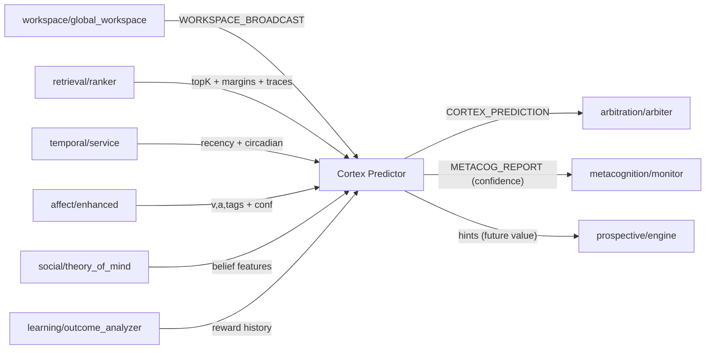
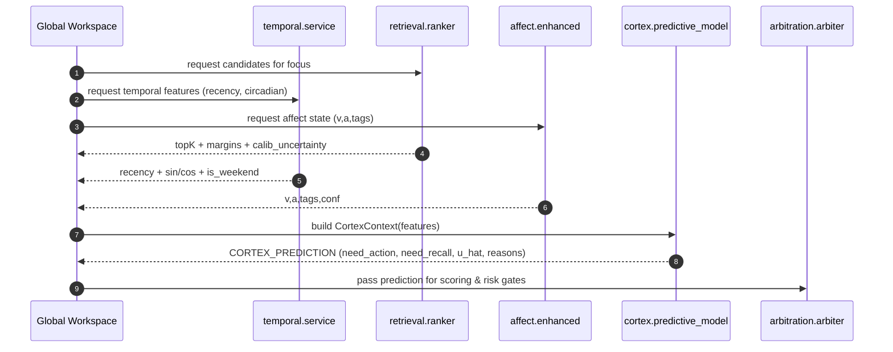

# cortex/ — Prediction & Contextual Foresight (P\*)

**Compiled:** 2025‑09‑06
**Philosophy:** *Production‑first, privacy‑first, explainable.* The **Cortex** estimates **what to do next** and **how much it’s worth** given the current workspace, memory context, and policy. It turns raw signals (retrieval quality, time, affect, social context) into compact **action/recall utilities** and **confidence** for Arbitration (P04) and Prospective (P05).

* Inputs: Working‑memory snapshot + retrieval/temporal/affect features + recent outcomes
* Outputs: `CORTEX_PREDICTION` → “need\_action”, “need\_recall”, “expected\_reward”, “uncertainty”, reasons
* Runtime: On‑device, quantized, explainable fallback when budgets are tight
* Security: No raw content leaves device; only scalars/flags.

> **Eventing & durability:** Cortex publishes `CORTEX_PREDICTION` on the **edge EventBus** (async, WAL, DLQ; at‑least‑once delivery). Handlers must be idempotent.&#x20;

> **Temporal priors:** Circadian and recency features come from the **temporal module** (recency half‑life, sin/cos hour‑of‑day, day‑of‑week, periodicity hints).&#x20;

---

## 0) Where Cortex sits (system view)



**Primary consumers**

* **Arbiter (P04)**: picks actions using Cortex utilities and risk gates.
* **Prospective (P05)**: uses future‑value hints for scheduling/deferral.
* **Metacognition**: logs uncertainty, calibration drift, and model confidence.

---

## 1) Files & layout

```
cortex/
├─ README.md               # This file
├─ predictive_model.py     # Main predictor (tiered: linear → tiny MLP)
├─ features.py             # Feature builders (retrieval, temporal, affect, WM, social)
├─ calibrator.py           # Platt scaling / temperature / per-user calibration
├─ config.py               # Tunables, thresholds, feature flags
├─ types.py                # Envelopes & dataclasses
├─ __init__.py             # Public API exports
└─ tests/                  # Unit tests (heads, fusion, calibration, envelopes)
```

> The module **publishes** predictions through the **events bus**; consumer groups (Arbiter, Prospective, Learning) replay from WAL on process restart.&#x20;

---

## 2) Envelopes (contracts)

### 2.1 Input — `CortexContext` (internal to cortex, assembled by the coordinator)

```json
{
  "space_id": "shared:household",
  "focus_event_id": "evt-2025-09-06-abc",
  "wm": {
    "slots": 7,
    "salience": 0.82,
    "goal_alignment": 0.64,
    "wm_load": 0.31
  },
  "retrieval": {
    "topk_scores": [0.91,0.88,0.83,0.74,0.60],
    "margin12": 0.03,
    "coverage": 0.74,
    "dup_rate": 0.12,
    "calib_uncertainty": 0.18
  },
  "temporal": {
    "recency": 0.71,
    "sin_tod": 0.26, "cos_tod": 0.96,
    "sin_dow": -0.78, "cos_dow": 0.62,
    "is_weekend": 0
  },
  "affect": {"v": 0.15, "a": 0.62, "tags": ["urgent"], "conf": 0.72},
  "tom": {"audience": 2, "sensitivity": 0.40, "conflict_risk": 0.10},
  "policy": {"band": "AMBER"},
  "recent_outcomes": {
    "success_rate_7d": 0.68,
    "regret_7d": 0.12,
    "action_cost_p50_ms": 180
  },
  "time_budget_ms": 10,
  "trace_id": "trace-123"
}
```

> `temporal` fields (recency, circadian) are computed upstream using the temporal module’s **half‑life and feature builders**.&#x20;

### 2.2 Output — `CORTEX_PREDICTION` (published on EventBus)

```json
{
  "meta": {
    "topic": "cortex",
    "type": "CORTEX_PREDICTION",
    "space_id": "shared:household",
    "trace_id": "trace-123"
  },
  "payload": {
    "need_action": 0.74,
    "need_recall": 0.28,
    "expected_reward": 0.57,
    "uncertainty": 0.22,
    "defer_value": 0.31,
    "reasons": [
      "retrieval_margin_low→ recall may help",
      "urgent tag → action prior +0.08",
      "temporal_recency=0.71 → opportunity window open"
    ],
    "head_confidence": {
      "action": 0.81,
      "recall": 0.77,
      "reward": 0.73
    },
    "model_version": "cortex:tier1:2025-09-06"
  }
}
```

> Delivery semantics: **at‑least‑once**, WAL‑backed with DLQ; subscribers should dedupe via `meta.event_id` or `idem_key`.&#x20;

---

## 3) Math & model design

Cortex contains **three heads** that share a compact feature backbone:

1. **Action‑need head** $h_a$: probability that taking an action **now** is valuable
2. **Recall‑need head** $h_r$: probability that **additional recall** will reduce uncertainty
3. **Reward head** $h_v$: **expected utility**/reward scalar for top plausible actions

### 3.1 Tiered modeling (edge budgets)

* **Tier‑0 (≤2–3 ms, always on)**: Linear‑logit + rules

  $$
  z_a = w_a^\top x + b_a,\quad p_a=\sigma(z_a);\quad
  z_r = w_r^\top x + b_r,\quad p_r=\sigma(z_r);\quad
  \hat{u}=w_v^\top x+b_v
  $$

  with explainable nudges:

  * `+η_u * 1[urgent]` on $z_a$ (default `η_u=0.08`)
  * `−η_b * 1[band∈{RED,BLACK}]` on $z_a$ (default `η_b=0.20`)
  * `+η_m * 1[margin12 < τ]` on $z_r$ (low retrieval margin suggests recall)

* **Tier‑1 (≤30–60 ms CPU, optional)**: Tiny MLP (≤50k params, int8) sharing backbone $f(x)$

  $$
  f(x)=\text{ReLU}(Qx);~~
  p_a=\sigma(u_a^\top f(x));~~
  p_r=\sigma(u_r^\top f(x));~~
  \hat{u}=u_v^\top f(x)
  $$

  Exported to ONNX; quantized, on‑device.

**Uncertainty** is computed per head as:

$$
\text{unc} = 1 - (1 - H(p_a)) \cdot (1 - H(p_r))
$$

where $H(p) = -p\log p -(1-p)\log(1-p)$ rescaled to $[0,1]$.

**Defer value** (value of waiting) uses a simple one‑step look‑ahead:

$$
\text{defer\_value} \approx \beta \cdot \text{unc} \cdot (1 - \text{recency})
$$

with $\beta$ from config (default 0.5). High uncertainty + low urgency ⇒ deferral is attractive (Prospective).

### 3.2 Feature set $x$ (all scalars/flags, explainable)

* **Retrieval**: top‑K score stats (mean, max), **margin12**, coverage, dup rate, calibration uncertainty
* **Temporal**: **recency** $2^{-\Delta t/h}$, circadian $\sin/\cos$ hour & DOW, is\_weekend &#x20;
* **Affect**: $v \in [-1,1]$, $a \in [0,1]$, tags (urgent/hedging/toxicity hints; capped)
* **ToM/Social**: audience size, sensitivity, conflict risk
* **WM/Goals**: salience, goal alignment, WM load
* **Outcomes**: recent success rate, regret, latency p50
* **Policy**: band → categorical to one‑hots

### 3.3 Calibration

After each head produces $p$ or $\hat{u}$, apply **per‑user** light calibration:

* **Platt for probabilities**: $p^\*=\sigma(\alpha\cdot \text{logit}(p) + \beta)$
* **Temperature for regression**: $u^\* = \tanh(\hat{u}/T)$ to map to $[-1,1]$

Calibrators update slowly from outcomes (`ACTION_EXECUTED`) and user corrections, respecting safety constraints.

---

## 4) How Cortex interacts (flows)

### 4.1 Sequence — from workspace to decision



### 4.2 Bus placement & durability

Cortex **publishes** `CORTEX_PREDICTION` to topic `"cortex"` with consumer groups (`arbiter`, `learning`, `prospective`). Bus persists a JSONL **WAL**, supports ack/nack, backoff retries, and DLQ. Subscribers can replay from last committed offset.&#x20;

---

## 5) Public API (Python)

```python
# cortex/__init__.py
from .predictive_model import CortexPredictor, CortexConfig
from .types import CortexContext, CortexPrediction
```

```python
# Example usage
from cortex import CortexPredictor, CortexConfig, CortexContext

cfg = CortexConfig(tier="T0", urgent_nudge=0.08, red_band_penalty=0.20)
cx = CortexPredictor(cfg)

ctx = CortexContext(  # build from workspace snapshot
  space_id="shared:household",
  wm={"slots":7,"salience":0.82,"goal_alignment":0.64,"wm_load":0.31},
  retrieval={"topk_scores":[0.91,0.88,0.83], "margin12":0.03, "coverage":0.74, "dup_rate":0.12, "calib_uncertainty":0.18},
  temporal={"recency":0.71,"sin_tod":0.26,"cos_tod":0.96,"sin_dow":-0.78,"cos_dow":0.62,"is_weekend":0},
  affect={"v":0.15,"a":0.62,"tags":["urgent"],"conf":0.72},
  tom={"audience":2,"sensitivity":0.40,"conflict_risk":0.10},
  policy={"band":"AMBER"},
  recent_outcomes={"success_rate_7d":0.68,"regret_7d":0.12,"action_cost_p50_ms":180},
  time_budget_ms=10, trace_id="trace-123"
)

pred = cx.predict(ctx)   # returns CortexPrediction dataclass
```

---

## 6) Safety, privacy, and policy

* **No raw text/media** needed — only derived scores and flags.
* **Space‑scoped**: predictions carry `space_id`; nothing leaves device without space policy.
* **Policy‑aware**: penalties applied for RED/BLACK bands; BLACK may force `need_action → 0`.
* **Idempotent**: Predictions include `trace_id`; consumers must dedupe.

> The EventBus ensures **at‑least‑once** with durable offsets and DLQ; do not rely on exactly‑once semantics.&#x20;

---

## 7) Evaluation & metrics

**Heads:**

* Action‑need / Recall‑need: AUC, Brier score, ECE (calibration)
* Reward head: Pearson $r$ with realized reward, MAE; reliability plot

**End‑to‑end decision uplift:**
Compare planner’s success rate and user satisfaction with/without Cortex signals (A/B via feature flags).

**Observability:**

* Emit per‑prediction **reasons** and **top contributing features** (SHAP‑like approximations via weight×feature for linear heads).
* Metrics: p50/p95 latency (T0 vs T1), head confidences, calibration drift, deferral ratios.

---

## 8) Configuration (high‑value knobs)

| Key                   | Default | Effect                                          |
| --------------------- | ------: | ----------------------------------------------- |
| `tier`                |  `"T0"` | `"T0"` linear + rules, `"T1"` tiny MLP          |
| `urgent_nudge`        |  `0.08` | Adds to action logit when `urgent` tag present  |
| `red_band_penalty`    |  `0.20` | Subtracted from action logit for RED/BLACK      |
| `low_margin_thresh`   |  `0.05` | If `margin12<thresh` → recall logit nudge       |
| `defer_beta`          |   `0.5` | Scale on `uncertainty*(1-recency)` for deferral |
| `calibration_slow_lr` |  `1e-3` | Slow per‑user calibration step size             |
| `time_budget_ms`      |    `10` | Budget for Tier‑0; Tier‑1 obeys 30–60 ms        |

---

## 9) Rationale: why these features & math?

* **Simple, explainable signals** make Arbitration’s safety storytelling easy.
* **Marginal gaps** in retrieval (e.g., `margin12`) predict whether **more recall** helps.
* **Temporal recency & circadian** capture “opportunity windows” (e.g., evenings are productive).&#x20;
* **Affect/urgent tag** pushes action **only a little**, preserving safety gates.
* **Calibrators** keep scores aligned to outcomes over time without heavy retraining.

---

## 10) Test plan (unit + property tests)

* **Feature builders**: circadian sin/cos periodicity, recency half‑life correctness. (Match temporal module math.)&#x20;
* **Tier‑0 logits**: monotonicity — `urgent` increases `need_action`; RED band reduces it.
* **Recall‑need**: lower `margin12` ⇒ higher `need_recall`.
* **Calibration**: Platt & temperature move probabilities toward observed frequencies.
* **Envelopes**: schema validation for `CortexContext` and `CORTEX_PREDICTION`.
* **Bus integration**: idempotent publish & durable subscriber replay (WAL/DLQ).&#x20;

---

## 11) Quickstart (with EventBus)

```python
import asyncio
from events import EventBus, Event, EventMeta, EventType, Ack
from cortex import CortexPredictor, CortexConfig, CortexContext

async def main():
    bus = EventBus()
    cx = CortexPredictor(CortexConfig())

    # Example subscriber (arbiter)
    async def on_pred(ev):
        print("CORTEX_PREDICTION:", ev.payload["need_action"], ev.payload["reasons"])
        return Ack()

    await bus.subscribe(topic="cortex", handler=on_pred, group="arbiter")

    # Build context (normally assembled by workspace/coordinator)
    ctx = CortexContext(space_id="shared:household", wm={"slots":5,"salience":0.5,"goal_alignment":0.4,"wm_load":0.2},
                        retrieval={"topk_scores":[0.9,0.82,0.79],"margin12":0.08,"coverage":0.6,"dup_rate":0.1,"calib_uncertainty":0.2},
                        temporal={"recency":0.7,"sin_tod":0.0,"cos_tod":1.0,"sin_dow":0.0,"cos_dow":1.0,"is_weekend":0},
                        affect={"v":0.1,"a":0.5,"tags":[],"conf":0.8},
                        tom={"audience":1,"sensitivity":0.2,"conflict_risk":0.1},
                        policy={"band":"GREEN"},
                        recent_outcomes={"success_rate_7d":0.6,"regret_7d":0.1,"action_cost_p50_ms":120},
                        time_budget_ms=5, trace_id="t-1")

    # Predict + publish
    pred = cx.predict(ctx)
    await bus.publish(Event(meta=EventMeta(topic="cortex", type=EventType.METACOG_REPORT,
                                           space_id=ctx.space_id),
                            payload={"confidence":1 - pred.uncertainty, "summary":"cortex_ok"}))
    await bus.publish(pred.to_event())

    await asyncio.sleep(0.2)
    await bus.close()

asyncio.run(main())
```

---

## 12) Future work

* **Counterfactual rollouts**: shallow simulation of top actions using the **imagination/simulation\_engine** before committing.
* **Personalized half‑life**: learn per‑user temporal decay for better recency fit (co‑training with temporal).&#x20;
* **Graph‑aware** features: use KG temporal edges to predict long‑range value.
* **Tiny attention head** over last N events for pattern‑of‑life detection (still on‑device, int8).

---

## 13) FAQ (for new contributors)

* **Is Cortex a planner?** No. Cortex **scores tendencies**; the **Arbiter** decides and executes.
* **Why a two‑tier model?** Tier‑0 ensures **always‑on** explainable decisions; Tier‑1 improves accuracy when CPU budget allows.
* **Where do we store raw inputs?** Nowhere. Only derived scalars and envelopes are persisted (EventBus WAL/offsets, metrics).&#x20;

---

### Appendix A — Feature glossary

* `margin12`: difference between top‑1 and top‑2 retrieval score; low margin ⇒ ambiguity.
* `coverage`: fraction of query facets matched across candidates.
* `dup_rate`: near‑duplication rate among top‑K (high ⇒ redundancy).
* `recency`: $2^{-\Delta t/h}$ with $h=72$ hours by default (half‑life).&#x20;
* `calib_uncertainty`: retrieval model’s calibration error estimate (0=confident).

### Appendix B — Event types used

* `CORTEX_PREDICTION`, `METACOG_REPORT`, plus downstream `ACTION_DECISION`, `ACTION_EXECUTED` for learning.
  Delivery is mediated by the **events bus** (durable, replayable).&#x20;

---

**TL;DR**: Cortex is the **foresight engine** — compact, explainable, and private. It reads the room (retrieval+time+affect), predicts whether to act or recall, and tells the planner *why*, with numbers you can trust.
