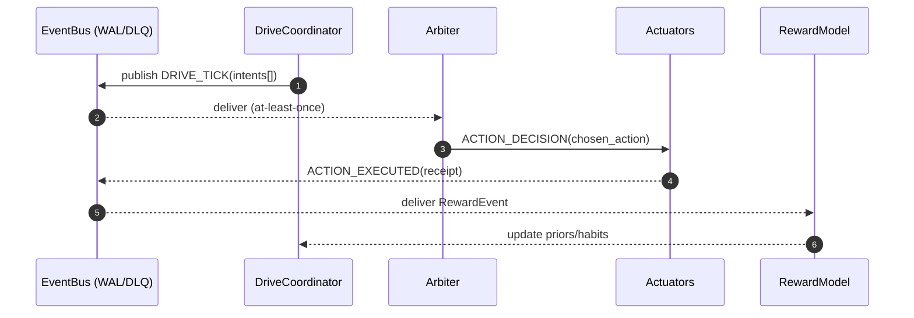
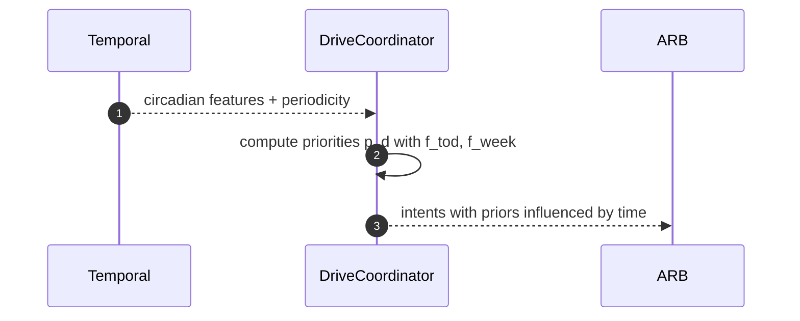

# drives/ — Homeostasis, Reward & Motivations (P06)

**Compiled:** 2025‑09‑06
**Philosophy:** *Production‑first, privacy‑first, explainable.*
The **Drives** module gives Family OS a steady “inner life”: it tracks essential needs (sleep, social connection, chores, planning debt), turns them into **motivations**, and converts those motivations into **safe, helpful action proposals** and **learning signals**.

It is the missing glue between *what matters right now* and *what we should actually do*, under device budgets and family policy.

---

## 0) Where **drives/** sits (system view)

```mermaid
flowchart LR
  subgraph WS[Workspace]
    GWS[Global Workspace]
  end

  subgraph AFX[Affect]
    AFFECT[Affect State (v,a,tags)]
  end

  subgraph TMP[Temporal]
    TEMP[temporal.indexer + patterns]
  end

  subgraph ARB[P04 Arbitration]
    ARBITER[Arbiter]
  end

  subgraph P05[Prospective]
    PROS[prospective.engine]
  end

  subgraph P06[Learning/Neuromod]
    DRV[drives.coordinator]
    RWD[reward.model]
    HOM[homeostasis]
  end

  subgraph ACT[Action]
    ACTOR[action/actuators.py]
  end

  GWS -- WORKSPACE_BROADCAST --> DRV
  AFFECT -- AFFECT_ANNOTATED --> DRV
  TEMP -- circadian features & patterns --> DRV
  DRV -- DRIVE_TICK (prioritized intents) --> ARBITER
  ARBITER -- ACTION_DECISION --> ACTOR
  ACTOR -- ACTION_EXECUTED (receipt) --> RWD
  RWD -- reward/update + habits --> DRV
  DRV -- PLAN_PROPOSED (multi‑step) --> PROS
```

* **Event bus:** all messages are published and consumed on the local durable event bus (JSONL WAL, ack/nack, retries). That is how we get *at‑least‑once* delivery and replay on edge devices.&#x20;
* **Temporal features:** circadian/weekly features and recency math are pulled from the temporal module to time‑align drives (e.g., bedtime pressure at night; chore drive peaks on weekends).&#x20;

---

## 1) Files (production layout)

```
drives/
├─ __init__.py
├─ drives.py              # DriveCoordinator: ticks + intent synthesis + gating
├─ homeostasis.py         # Need state, setpoints, errors, integrators
├─ reward_model.py        # Reward shaping, TD-style updates from receipts
├─ schedulers.py          # Light policy to space work across day/week
├─ types.py               # Dataclasses for envelopes (DriveTick, DriveIntent, RewardEvent, DriveState)
├─ config.yaml            # Defaults for setpoints, weights, thresholds (override per space/person)
└─ tests/
   ├─ test_homeostasis.py
   ├─ test_reward_model.py
   ├─ test_coordinator_intents.py
   └─ test_policy_gates.py
```

---

## 2) Envelopes (contracts)

> All envelopes are **space‑scoped** and safe for durable local storage. No raw media; only derived numbers/labels.

### 2.1 `DriveTick` (inputs → `drives.coordinator`)

```json
{
  "tick_id": "drv-2025-09-06T13:30:04Z-001",
  "space_id": "shared:household",
  "person_id": "alice",
  "ts": "2025-09-06T13:30:04Z",
  "affect": {"v": 0.10, "a": 0.62, "tags": ["urgent"], "c": 0.71},
  "temporal": {
    "sin_tod": 0.26, "cos_tod": 0.96,
    "sin_dow": -0.78, "cos_dow": 0.62,
    "is_weekend": 0
  },
  "usage": {"wm_load": 0.18, "battery_low": false},
  "cues": ["calendar:meeting@15:00", "chore:trash_day"],
  "policy_band": "AMBER"
}
```

* **temporal** features and weekly periodicity are provided by `temporal/features.py` and `temporal/patterns.py`.&#x20;
* The **tick** arrives via the **event bus** (`DRIVE_TICK` topic or a periodic scheduler on device).&#x20;

### 2.2 `DriveState` (persisted per person/space)

```json
{
  "person_id": "alice", "space_id": "shared:household",
  "needs": {
    "sleep_debt": {"x": 2.5, "setpoint": 0.5, "range": 8.0, "i_term": 2.1},
    "social":     {"x": 0.3, "setpoint": 0.6, "range": 1.0, "i_term": 0.1},
    "chores":     {"x": 0.7, "setpoint": 0.4, "range": 1.0, "i_term": 0.3},
    "planning":   {"x": 0.5, "setpoint": 0.2, "range": 1.0, "i_term": 0.2}
  },
  "last_update": "2025-09-06T13:30:04Z",
  "version": "drives:2025-09-06"
}
```

### 2.3 `DriveIntent` (outputs → Arbiter / Prospective)

```json
{
  "space_id": "shared:household",
  "person_id": "alice",
  "intents": [
    {
      "action": "set_bedtime_reminder",
      "args": {"when":"22:15","space_id":"shared:household"},
      "drive": "sleep",
      "prior": 0.78,
      "reasons": ["high sleep error","circadian night","low cost"],
      "policy_hint": "AMBER"
    },
    {
      "action": "start_chore_timer",
      "args": {"minutes":15, "chore":"kitchen"},
      "drive": "chores",
      "prior": 0.64,
      "reasons": ["weekly periodicity peak","short-task since arousal high"],
      "policy_hint": "GREEN"
    }
  ],
  "trace": {"features_used":{"sin_tod":0.26,"is_weekend":0}}
}
```

### 2.4 `RewardEvent` (inputs from Action receipts → `reward_model`)

```json
{
  "space_id": "shared:household",
  "person_id": "alice",
  "action_id": "a-001",
  "tool_id": "files.write_text",
  "status": "ok",
  "cost": {"cpu_ms":42,"energy_mwh":0.7,"latency_ms":180},
  "quality": 0.7,
  "safety": "ok",
  "drive": "chores",
  "delta_need": {"chores": -0.2},           // predicted or measured need reduction
  "ts": "2025-09-06T13:31:09Z"
}
```

> Receipts come over the **bus** from `action/outcome_capture.py` and are at‑least‑once delivered to the learner; the **idempotency** key and DLQ policy follow the bus rules.&#x20;

---

## 3) The science (math you can debug)

### 3.1 Homeostasis → “need” signals

For each drive $d$ with current level $x_d$, desired setpoint $s_d$, and feasible range $R_d>0$:

$$
e_d \;=\; \frac{s_d - x_d}{R_d} \quad\in[-1, 1]
$$

$$
n_d \;=\; \sigma\!\big(\kappa_d \,(e_d - \theta_d)\big) \quad\in[0,1]
$$

* $e_d$: normalized **error** (positive when we are below the setpoint—i.e., need more).
* $n_d$: **need activation** via a logistic with gain $\kappa_d$ and threshold $\theta_d$.

Add a small **integrator** to capture debt accumulation:

$$
i_d(t) \leftarrow \lambda\,i_d(t\!-\!1) + (1-\lambda)\,e_d(t)
$$

Use $i_d$ as a slow‑varying term for “we’ve been postponing this”.

### 3.2 Context & affect modulation

$$
p_d \;=\; n_d \cdot \big[\,1 + \alpha_a \cdot a + \alpha_u \cdot 1[\texttt{urgent}] \,\big] \cdot \big[\,1 + \beta_t \cdot f_\mathrm{tod}(t) + \beta_w \cdot f_\mathrm{week}(t)\,\big]
$$

* $a$: **arousal** from Affect (0..1); “urgent” tag bumps short tasks.
* $f_\mathrm{tod}(t)$, $f_\mathrm{week}(t)$: circadian/weekly terms from **Temporal** (sin/cos day‑cycle and day‑of‑week).&#x20;

### 3.3 From drive priority to **action prior**

For a candidate action $k$ that predominantly serves drive $d$, estimate a local utility:

$$
U_k \;=\; \gamma_d \Delta e_d \;-\; \lambda_c \,\mathrm{cost}_k \;-\; \lambda_r \,\mathrm{risk}_k \;+\; \eta\,\mathrm{habit}_k
$$

where:

* $\Delta e_d$: predicted reduction in error if we take the action (from heuristics, habits, or outcome models).
* `cost_k`: execution cost (latency/energy/tokens); `risk_k`: policy & safety penalty (RED/BLACK).
* `habit_k`: small boost for micro‑habits (e.g., “15‑min tidy” has high success rate).
* Finally **prior** sent to Arbiter:

$$
\text{prior}_k \;=\; \mathrm{clip}\big( \rho\,p_d + (1-\rho)\,\mathrm{sigmoid}(U_k),\,0,1\big)
$$

### 3.4 Reward shaping (from `RewardEvent`)

We keep a simple, explainable scalar reward:

$$
r \;=\; w_s\,1[\texttt{status=ok}] + w_q\,\text{quality} - w_c\,\mathrm{norm\_cost} - w_r\,\mathrm{risk\_penalty} + w_d\, \sum_d \gamma_d (-\Delta e_d)
$$

Update a per‑intent value estimate with TD(0):

$$
V(\phi) \leftarrow V(\phi) + \eta \big( r + \gamma V(\phi') - V(\phi)\big)
$$

* $\phi$: compact features (drive id, time‑of‑day bucket, action type).
* The reward model updates **habitibility** scores and **expected utility** priors sent to Arbiter next time.

---

## 4) Scheduling & habits

* **Schedulers** spread drive‑serving actions across day/week using temporal periodicity (e.g., chores cluster on **Saturday morning** if that’s the family pattern), taking stats from the **Temporal** module’s histograms and periodicity scores.&#x20;
* **Habits**: small cache of successful, low‑risk steps (e.g., “set 15‑min chore timer”, “capture idea to inbox”) that the Arbiter may pre‑approve in GREEN band.

---

## 5) Policy, safety & privacy

* **ABAC/RBAC** gates applied by Arbiter and Action layers; Drives only **propose**.
* **Band‑aware**: if space is AMBER/RED, Drives prefer **low‑risk, reversible** suggestions (e.g., local reminders).
* **No PII**: module stores **numbers** (errors, priors, rewards) and **labels** (drive ids).
* **Event bus durability**: proposals and rewards are delivered with WAL + DLQ; subscribers must be idempotent and may **replay** on reattach.&#x20;

---

## 6) Sequence diagrams

### 6.1 Drive tick → Arbiter



(Delivery semantics, offsets, and DLQ behavior are those of the local bus.)&#x20;

### 6.2 Temporal modulation



(Features and pattern summaries from the Temporal module.)&#x20;

---

## 7) Configuration (excerpt `drives/config.yaml`)

```yaml
drives:
  sleep:
    setpoint: 0.5       # ideal residual sleep debt [h]
    range: 8.0          # normalize error
    kappa: 4.0          # logistic gain
    theta: 0.1          # threshold
    circadian_weight: 0.6
  social:
    setpoint: 0.6
    range: 1.0
    kappa: 3.0
    theta: 0.2
  chores:
    setpoint: 0.4
    range: 1.0
    kappa: 3.5
    theta: 0.1
    weekly_weight: 0.5
  planning:
    setpoint: 0.2
    range: 1.0
    kappa: 3.5
    theta: 0.2

reward:
  weights:
    success: 0.6
    quality: 0.2
    cost: 0.1
    risk: 0.2
    need_reduction: 0.4
  td:
    lr: 0.1
    gamma: 0.9
```

---

## 8) How it wires to everything else

* **Global Workspace → Drives:** on each `WORKSPACE_BROADCAST`, we fold new cues (e.g., goals, summaries) into `DriveTick`.
* **Affect → Drives:** arousal and tags bias toward short, low‑friction steps when users are activated.
* **Temporal → Drives:** circadian & weekly features tune priorities and scheduling; patterns seed Prospective triggers.&#x20;
* **Drives → Arbiter:** we publish candidate **intents** with explainable **reasons**, band hints, and safe defaults.
* **Action receipts → RewardModel:** receipts flow over the event bus, shaping future priors and habits.&#x20;
* **Prospective:** multi‑step plans for repeated needs (e.g., weekly chore rotation) get handed to Prospective for durable triggers.

---

## 9) Quickstart (conceptual)

```python
from drives.drives import DriveCoordinator
from drives.types import DriveTick
from datetime import datetime, timezone

drv = DriveCoordinator.load_or_default(space_id="shared:household", person_id="alice")

tick = DriveTick(
  space_id="shared:household", person_id="alice",
  ts=datetime.now(timezone.utc),
  affect={"v":0.1,"a":0.62,"tags":["urgent"],"c":0.71},
  temporal={"sin_tod":0.26,"cos_tod":0.96,"sin_dow":-0.78,"cos_dow":0.62,"is_weekend":0},
  usage={"wm_load":0.18,"battery_low":False},
  cues=["chore:trash_day"], policy_band="AMBER"
)
intents = drv.tick(tick)       # → list of DriveIntent with priors & reasons
# hand to Arbiter P04; RewardModel updates automatically from receipts
```

---

## 10) Testing checklist

* **Homeostasis math**: error normalization, logistic activation, integrator decay.
* **Temporal modulation**: night vs. day and weekday vs. weekend priorities.&#x20;
* **Banding**: AMBER/RED lowers or blocks share‑y suggestions.
* **Event bus idempotency**: duplicate RewardEvents do not double‑learn.&#x20;
* **Reward shaping**: increases habitibility after successful low‑cost steps.
* **End‑to‑end**: DRIVE\_TICK → Arbiter → Actuators → ACTION\_EXECUTED → Reward → improved prior.

---

## 11) What we accomplish

* **Household serenity**: chores & planning don’t accumulate silently; the system nudges at the right times.
* **Personal wellbeing**: bedtime reminders respect your rhythm; social “check‑in” suggestions appear when you actually have time/energy.
* **Explainable agency**: every suggestion shows **why now**, **why this**, and **how safe**.

---

## 12) Roadmap

* **Personal calibration** of setpoints & gains from long‑run outcomes.
* **Counterfactual simulation** (with Imagination) for top intents before commit.
* **Multi‑actor coordination**: balance drives across family members (fairness budget).
* **Seasonality model**: lightweight Fourier basis regression for school/holiday seasons (hooks already exist via Temporal).&#x20;

---

### Appendix A — Envelope schemas (Python typing sketch)

```python
from dataclasses import dataclass
from typing import Dict, List, Optional
from datetime import datetime

@dataclass
class DriveTick:
    space_id: str
    person_id: str
    ts: datetime
    affect: Dict[str, float]              # v, a, c + tags
    temporal: Dict[str, float]            # sin/cos HOD/DOW, is_weekend
    usage: Dict[str, float]               # wm_load, battery_low
    cues: List[str]
    policy_band: str                      # GREEN/AMBER/RED/BLACK

@dataclass
class Need:
    x: float
    setpoint: float
    range: float
    i_term: float

@dataclass
class DriveState:
    person_id: str
    space_id: str
    needs: Dict[str, Need]
    last_update: datetime
    version: str

@dataclass
class DriveIntent:
    action: str
    args: Dict[str, object]
    drive: str
    prior: float
    reasons: List[str]
    policy_hint: str

@dataclass
class RewardEvent:
    space_id: str
    person_id: str
    action_id: str
    tool_id: str
    status: str
    cost: Dict[str, float]
    quality: float
    safety: str
    drive: Optional[str]
    delta_need: Dict[str, float]
    ts: datetime
```

---

**Notes on dependencies & security**

* Pure standard library; no network I/O; everything runs **on‑device**.
* Persistence uses space‑scoped stores governed by the space’s MLS keys when synced; event flow uses the local WAL with **DLQ** and **durable consumer groups**.&#x20;
* Temporal features are computed locally from timestamps and simple trig/recency math; no cloud calls.&#x20;

---

**This is how we make the AI feel like a considerate family member:** it knows *when* to nudge, *what* to propose, and *why* it’s safe—without your data leaving your device.
