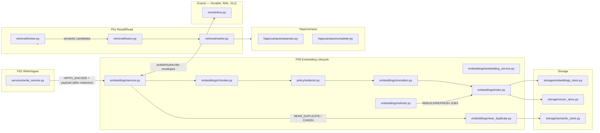
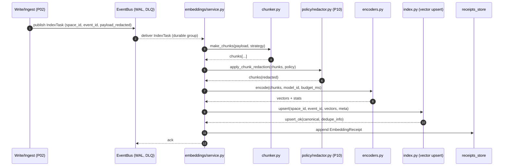
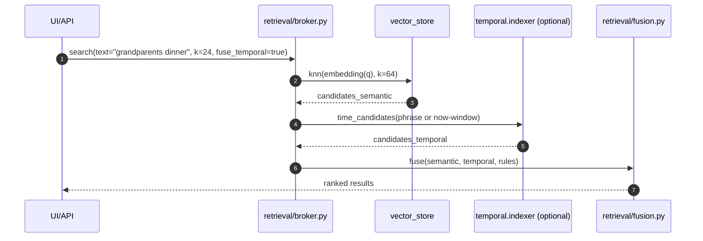

# embeddings/ — P08 Embedding Lifecycle (Edge‑First, Space‑Scoped)

**Compiled:** 2025‑09‑06
**Philosophy:** *Production‑first, privacy‑first, explainable.*
**Purpose:** Turn raw text/media payloads into **indexable vectors** that power recall, ranking, deduping, and planning—**without leaving the device**.
**Scope:** Chunking → Redaction → Encoding → Vector Upsert → Near‑Duplicate Canonicalization → Rebuild/Refresh → Feature Export to Retrieval.

---

## 0) Where P08 sits (system view)



* Embedding requests/receipts are **space‑scoped** and flow over the **durable in‑process event bus** with WAL and DLQ (at‑least‑once delivery, durable consumer groups).&#x20;
* Temporal ranges (e.g., “yesterday morning”) can be fused with semantic hits for better recall (P08 works alongside the temporal indexer & features).&#x20;

---

## 1) Contracts (Envelopes)

### 1.1 IndexTask — **input** (from Write/Ingest, after redaction P10)

```json
{
  "task_id": "idx-2025-09-06-0001",
  "event_id": "evt-2025-09-06-00042",
  "space_id": "shared:household",
  "person_id": "alice",
  "ts": "2025-09-06T13:12:02.300Z",
  "media": {
    "type": "text",
    "mime": "text/plain",
    "len": 1382
  },
  "payload": {
    "text": "Dinner plan with grandparents ...",
    "title": "Sunday dinner notes",
    "tags": ["note", "family"]
  },
  "qos": {
    "timeout_ms": 60,
    "budget_ms": 30
  },
  "chunking": {
    "strategy": "semantic+fixed",
    "max_tokens": 320,
    "overlap_tokens": 64
  },
  "redaction_policy": "default:v1",
  "encoder_pref": {
    "model_id": "minilm-22M-int8",
    "normalize": true
  },
  "idempotency_key": "evt-2025-09-06-00042|minilm-22M-int8|semantic+fixed",
  "trace_id": "trace-abc123"
}
```

**Notes**

* The **payload** is already **redacted** by P10 before it reaches P08 (no raw PII).
* `qos.budget_ms` guides encoder choice & chunking density for device safety.
* `idempotency_key` prevents double‑indexing of the same (event, model, scheme).

### 1.2 VectorUpsert — **internal** (encoder → index)

```json
{
  "space_id": "shared:household",
  "event_id": "evt-2025-09-06-00042",
  "chunks": [
    {
      "chunk_id": "evt-...#0",
      "pos": 0,
      "span": {"start": 0, "end": 294},
      "hash": "sha256:...",
      "embedding": [0.01, -0.14, ...],
      "normed": true,
      "meta": {"title": "Sunday dinner notes", "tags":["note","family"]}
    }
  ],
  "encoder": {"model_id":"minilm-22M-int8","dim":384,"normalize":true},
  "policy": {"redaction":"default:v1"},
  "trace_id": "trace-abc123"
}
```

### 1.3 EmbeddingReceipt — **output** (to Receipts store, Learning, Observability)

```json
{
  "receipt_id": "rcp-idx-0001",
  "task_id": "idx-2025-09-06-0001",
  "event_id": "evt-2025-09-06-00042",
  "space_id": "shared:household",
  "status": "ok",
  "chunks_indexed": 4,
  "dupe_status": "canonicalized|unique|linked",
  "encoder": {"model_id":"minilm-22M-int8","dim":384},
  "timing": {"chunk_ms":9, "encode_ms":18, "upsert_ms":6, "total_ms":35},
  "cost": {"cpu_ms":28, "energy_mwh":0.3},
  "trace_id": "trace-abc123"
}
```

### 1.4 SearchQuery → SearchResults (P01 Recall/Read)

```json
{
  "space_id": "shared:household",
  "query": {"text": "grandparents dinner list"},
  "k": 24,
  "filters": {"tags": ["note"]},
  "fuse": {"with_temporal": true, "now": "2025-09-06T14:30:00Z"}
}
```

Returns an ordered list of `(event_id, chunk_id, score, reason[])` with optional **temporal fusion** (recency & circadian features), cf. temporal module.&#x20;

---

## 2) What the module does (end‑to‑end)

1. **Chunk** incoming content (hierarchical, semantic + fixed window with overlap) to maintain semantics while controlling size.
2. **Redact** at the **chunk boundary** (respecting P10 policy)—never embed raw PII.
3. **Encode** with an **edge‑quantized** encoder (INT8 / FP16) chosen by budget.
4. **Upsert** into the **space‑scoped vector store** (`storage/vector_store.py`) with metadata for later filters.
5. **Near‑dup canonicalization** (shingling + LSH + centroid comparison) to suppress duplicates & form canonical entries.
6. **Refresh/Rebuild** periodically (e.g., model upgrade) using **WAL‑driven jobs** over the local bus (WAL, DLQ, durable groups).&#x20;
7. Expose **semantic search** with fusable **temporal** features for better recall & ranking.&#x20;

---

## 3) Math & heuristics

### 3.1 Chunking (semantic + fixed)

* **Sentence graph** (cheap): split by sentence → merge until token budget ≤ `max_tokens`.
* **Semantic cohesion** score, $\kappa \in [0,1]$, approximated by cosine of adjacent sentence embeddings using a **tiny local** sentence encoder (or fallback TF‑IDF overlap):

  $$
  \kappa = \cos(\mathbf{s}_i, \mathbf{s}_{i+1}) \quad\text{(fallback: Jaccard of content words)}
  $$
* Merge while $\kappa \ge \tau_\kappa$ (default 0.45) and tokens ≤ budget; otherwise **cut** and start new chunk.
* Overlap window (e.g., 64 tokens) to preserve cross‑boundary context.

### 3.2 Redaction (P10) at the chunk

* Replace emails, phones, IDs, faces, GPS with **placeholders** (e.g., `<email:hash>`) BEFORE embedding.
* Store placeholder → original mapping in **secure store** (space‑scoped) only if necessary for later de‑redaction on **device**.

### 3.3 Encoding

* Encoders normalized to unit norm by default. Cosine similarity used for search:

  $$
  \text{score}(\mathbf{q}, \mathbf{x}) = \frac{\mathbf{q}\cdot\mathbf{x}}{\lVert \mathbf{q}\rVert\lVert \mathbf{x}\rVert}
  $$
* Optional fusion with lightweight lexical signal (BM25‑lite) in the **retrieval fusion** step:

  $$
  s = \alpha\, s_\text{cos} + (1-\alpha)\, s_\text{lex}, \quad \alpha\in[0,1] \text{ (default 0.8)}
  $$

### 3.4 Near‑duplicate canonicalization

* **Shingling** over tokens (k=5) → **MinHash** signatures → **LSH buckets**.
* Within bucket, compare chunk vectors and content hashes:

  $$
  \text{dupe}(\mathbf{x}, \mathbf{y}) = \mathbb{1}\left[\cos(\mathbf{x}, \mathbf{y}) \ge \tau_c \ \lor\ \text{Jaccard}(\text{shingles}_x,\text{shingles}_y)\ge \tau_j\right]
  $$
* Canonical choose: shortest **non‑boilerplate** chunk with highest salience / lowest entropy; others **link** to canonical.

### 3.5 Temporal fusion (optional, at retrieval)

* From **temporal** module, use **recency** $s_\text{recency} = 2^{-\Delta t/h}$ and **circadian** sin/cos features for tie‑breaking and feature augmentation.&#x20;

---

## 4) Sequence diagrams

### 4.1 Ingest → Index → Receipt



*(Durable delivery, backoff, DLQ behavior per EventBus doc.)*&#x20;

### 4.2 Recall with temporal fusion



*Temporal range parsing & features from the temporal module.*&#x20;

---

## 5) Files (suggested structure)

```
embeddings/
├─ __init__.py
├─ service.py               # Facade: queue tasks, worker loop, receipts
├─ embedding_service.py     # Core orchestrator: chunk → redact → encode → upsert
├─ chunker.py               # Semantic+fixed windowing, overlap, sentence graph
├─ encoders.py              # Edge encoders (INT8/FP16), normalization, batching
├─ near_duplicate.py        # Shingling, MinHash, LSH, canonical selection
├─ index.py                 # VectorStore adapter, metadata, filters, deletes
├─ refresh.py               # Rebuild/refresh jobs (model upgrade, compaction)
├─ config.py                # Tunables: thresholds, budgets, model registry
└─ README.md                # This document
```

**Storage dependencies**

* `storage/vector_store.py` — space‑scoped ANN index (cosine)
* `storage/embeddings_store.py` — mapping: `event_id → [chunk_ids, hashes, encoder_version]`
* `storage/semantic_store.py` — dupe/canonical links, boilerplate filters

**Eventing**

* Uses `events/bus.py` for **durable** delivery, WAL, DLQ, consumer groups.&#x20;

---

## 6) Operational policy (privacy, safety, performance)

* **Privacy first:** Only **redacted** content reaches encoders. Placeholders are reversible **only on this device** and only with authorization.
* **Space‑scoped indices:** All vectors & metadata are keyed by `space_id` and replicate only to devices with the space’s **MLS keys** (SEC).
* **Budget aware:** `qos.budget_ms` chooses the encoder tier (e.g., `minilm‑int8` vs `mpnet‑fp16`) and chunk density.
* **Idempotent:** `idempotency_key` dedupes repeated tasks; re‑runs return prior receipts.
* **Quarantine path:** Any safety policy violation (e.g., unredacted field detected) **skips embedding** and logs a receipt with status `"quarantined"`.
* **Event durability:** If the worker crashes, WAL replay resumes and **at‑least‑once** delivery ensures no lost tasks.&#x20;

---

## 7) Tuning & thresholds (defaults)

* `chunking.max_tokens=320`, `overlap_tokens=64`, `τ_κ=0.45` (semantic cohesion)
* `encoder.normalize=true`, `cosine` metric, `α=0.8` in fusion (with lexical)
* Near‑dup: `k_shingle=5`, `τ_c=0.93` cosine, `τ_j=0.82` Jaccard (one pass; fall back to centroid diff)
* Refresh cadence: low‑priority background every 24h; on **model upgrade** or **policy change**, schedule **batch rebuild**.

---

## 8) Minimal code example

```python
from embeddings.service import EmbeddingService
from datetime import datetime, timezone

svc = EmbeddingService()
task = {
  "task_id":"idx-1",
  "event_id":"evt-42",
  "space_id":"shared:household",
  "person_id":"alice",
  "ts": datetime.now(timezone.utc).isoformat(),
  "media":{"type":"text","mime":"text/plain","len":56},
  "payload":{"text":"Groceries for grandparents: apples, milk, bread."},
  "qos":{"timeout_ms":50,"budget_ms":25},
  "chunking":{"strategy":"semantic+fixed","max_tokens":300,"overlap_tokens":48},
  "redaction_policy":"default:v1",
  "encoder_pref":{"model_id":"minilm-22M-int8","normalize":True},
  "idempotency_key":"evt-42|minilm-22M-int8|semantic+fixed",
  "trace_id":"trace-xyz"
}
rcp = svc.index(task)
print(rcp["status"], rcp["chunks_indexed"])
```

---

## 9) Observability & QA

* **Metrics:** encode p50/p95, chunks per doc, dupe ratio, rebuild rate, WAL lag, DLQ size (from EventBus).&#x20;
* **Tracing:** `embed.index` span with `space_id`, `encoder`, `budget_ms`, `chunks`, `dupe_status`.
* **Receipts:** Every task emits a **receipt** (ok/error/quarantined) with timing/cost.

**Test matrix**

* Chunking correctness on varied text (notes, lists, transcripts).
* Redaction: verify placeholders present; no raw PII in encoder input.
* Idempotency: second identical task returns prior receipt quickly.
* Near‑dup: inject near‑identical notes; ensure canonicalization & link.
* Rebuild: simulate encoder upgrade; verify re‑encode & upsert replace old vectors.

---

## 10) How other modules use P08 (and why)

* **P01 Recall/Read:** gets semantic candidates & metadata (tags, title) for **fusion**; can enable **temporal fusion** for better ranking and time‑scoped recall.&#x20;
* **Hippocampus:** receives **clean, deduped** semantic cues (chunk ids) to improve CA3 completion near remembered context.
* **Arbitration/Planning:** benefits from higher‑quality recall candidates → better action proposals.
* **Learning (P06):** consumes embedding receipts & search performance to tune **encoder choice**, **half‑life**, and **chunking thresholds**.
* **Policy (P10, P18):** redaction & safety gates enforced at the last mile; quarantines mis‑tagged inputs.

---

## 11) Failure modes & recovery

* **Encoder unavailable / OOM:** degrade to **lighter model** or lexical‑only index; emit `"skipped"` or `"degraded"` status with reason.
* **Vector store corruption:** re‑build from `embeddings_store` + content WAL; **idempotent** upserts.
* **Event handler crash:** WAL replay resumes; failed tasks go through **exponential backoff**, then **DLQ** for operator review.&#x20;

---

## 12) Security model (edge/E2EE)

* **All vectors & metadata are space‑scoped**; replication uses that space’s **MLS group keys** (device‑to‑device E2EE).
* No network calls in P08; all encoders run **on‑device**.
* Receipts & index entries carry **minimal metadata**; sensitive fields are **hashed** or **placeholdered**.
* Delete/DSAR flows (P11) trigger **vector deletion** and **canonical relinks** if needed.

---

## 13) Roadmap / Future work

* **Personalized encoders**: tiny LoRA/adapter on device for household domain.
* **Audio/image/light multimodal**: small CLIP‑like edge encoders with privacy‑preserving **feature hashing**.
* **Seasonality models**: Fourier basis to capture **monthly/holiday** cycles (ties to temporal & prospective).&#x20;
* **Index compaction**: age‑based down‑sampling; keep **canonical** + **recent**; rest **on‑demand**.
* **Signed receipts**: cryptographic provenance with device keys.

---

## 14) FAQ (short)

* **Why chunk at all?** Small, coherent chunks improve recall and let us dedupe precisely.
* **Will vectors leak PII?** We embed **redacted** text; placeholders + E2EE **minimize leakage**.
* **What if models change?** **Refresh jobs** re‑encode and overwrite vectors, leaving event ids stable.
* **How do we debug?** Check **receipts**, **metrics**, and **bus WAL/DLQ** (plain JSONL, easy to inspect).&#x20;

---

### TL;DR

P08 **converts redacted content into durable, space‑scoped vectors** with chunking, deduping, and rebuild—**entirely on device**. It **plugs into the EventBus** (WAL, DLQ) and **fuses with temporal** signals during recall to make search feel like memory.

---
