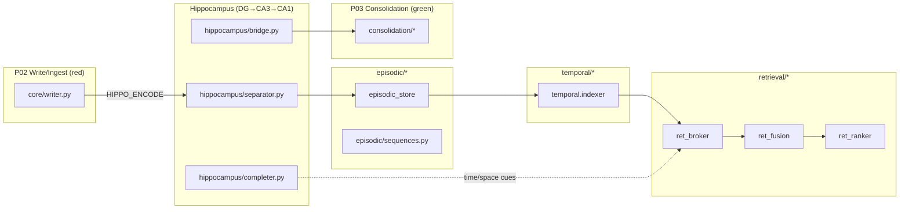
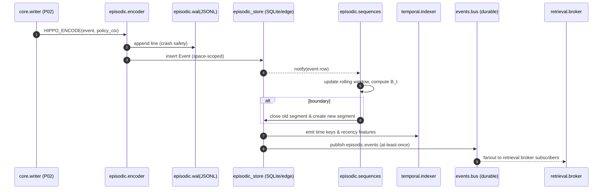

                        # episodic/ — Human‑Readable Memory for Lived Events (DG→CA3→CA1 bridge)

**Compiled:** 2025‑09‑06
**Philosophy:** *Production‑first, privacy‑first, explainable.* **Episodic memory** stores your family’s *lived moments*—as linked events and segments—so they can be recalled, replayed, and consolidated into long‑term knowledge.

> **Think of it as the family’s diary—kept on your devices, encrypted, searchable, and smart.**

---

## 0) Where episodic sits (system view)



* **Inputs:** HIPPO\_ENCODE (event framed & redacted), writer metadata, device & policy context, time signals.
* **Outputs:** durable **Event** rows, **EpisodeSegment** rows (sequences), **link edges**, and temporal keys that power recall and planning via the **event bus** and retrieval broker. The bus provides durable, at‑least‑once delivery with replay and DLQ for edge devices.&#x20;
* **Temporal integration:** episodic emits & consumes **time indices**, recency scores, and circadian features (e.g., “yesterday morning”), using the temporal module’s deterministic math.&#x20;

---

## 1) What this module guarantees

* **Append‑only, space‑scoped** ledger of events and short **segments** (“episodes”): no destructive edits except policy tombstones.
* **On‑device first**, P2P‑sync via CRDT logs at the storage layer; E2EE under MLS keys of each memory space.
* **Explainable** segmentation & linking (no black boxes required): a small set of simple formulas drive boundaries and salience.
* **Interoperable envelopes**: the same event format is used across modules (writer, hippocampus, retrieval, and consolidation).
* **Privacy by design**: raw media and sensitive fields can be redacted upstream (P10), and only *derived* or *consented* views may be projected to shared spaces.

---

## 2) Files in this module

```
episodic/
├─ __init__.py
├─ events.py              # Event dataclass + helpers (hash/id, redaction marks)
├─ sequences.py           # Episode segmentation, linking & re-linking (CPD + heuristics)
├─ encoder.py             # Hippocampus bridge: normalize, decorate, emit episodic writes
├─ schema.sql             # SQLite schema (edge) for events, segments, links, indices
├─ api.py                 # Facade: append_event, segment_flush, get_episode, replay, etc.
├─ wal.py                 # JSONL WAL for “last write wins” & crash resilience (edge)
├─ retention.py           # Forgetting rules: TTL, band-aware retention, roll-up hooks
├─ ids.py                 # IDs: event_id, episode_id, link_id (space-scoped, ULIDs)
└─ README.md              # This file
```

> **Note:** the durable event bus (events/) and temporal/ integration are separate modules, but we reference them here for wiring and envelopes.

---

## 3) Data model & envelopes

### 3.1 Event envelope (writer/hippocampus → episodic)

**Canonical JSON**

```json
{
  "event_id": "evt_01HZX...ULID",
  "space_id": "shared:household",
  "person_id": "alice",
  "ts": "2025-09-06T13:22:04.120Z",
  "band": "AMBER",
  "title": "Grocery list",
  "summary": "Apples, milk, cereal",
  "tags": ["note", "shopping"],
  "salience": 0.46,
  "affect": {"v": 0.12, "a": 0.31, "tags": ["neutral"], "c": 0.73},
  "origin": {"device": "phone1", "app": "notes", "version": "1.4.2"},
  "links": [
    {"ref_event_id": "evt_previous", "rel": "follows"},
    {"ref_event_id": "evt_planner",  "rel": "refers_to"}
  ],
  "attachments": [
    {"kind": "text/plain", "bytes": 32, "digest": "sha256:..."}
  ],
  "redaction": {"applied": true, "rules": ["emails","numbers"]},
  "trace_id": "trace-abc123"
}
```

**Invariants**

* ids are **space‑scoped ULIDs** to preserve sortability by time.
* `summary/title` are **post‑redaction** strings (P10).
* `band` is the projection risk classification (GREEN/AMBER/RED/BLACK).
* `affect` is fused scalar state; details live under affect/.

**Event bus publication**
Every ingested event is appended to the **WAL** and then published on topic `episodic.events` with at‑least‑once delivery to downstream consumers (learning, consolidation).&#x20;

---

### 3.2 Episode segment (internal)

We maintain a rolling window to create **segments**—small, meaningful chunks of consecutive events.

```json
{
  "episode_id": "ep_01HZ...",
  "space_id": "shared:household",
  "start_ts": "2025-09-06T13:15:00Z",
  "end_ts":   "2025-09-06T14:00:00Z",
  "event_ids": ["evt_...12", "evt_...13", "evt_...18"],
  "topic_hint": "shopping",
  "boundary_reason": ["gap", "topic_shift"],
  "salience": 0.58,
  "affect_span": {"v_min": -0.2, "v_max": 0.4, "a_mean": 0.35},
  "links": [{"rel":"follows","ref_episode_id":"ep_01HY..."}]
}
```

---

### 3.3 Query envelope (recall → episodic)

```json
{
  "space_id": "shared:household",
  "filters": {
    "ts_range": ["2025-09-01T00:00:00Z","2025-09-07T23:59:59Z"],
    "tags": ["shopping"],
    "band_at_most": "AMBER"
  },
  "order": "recency",
  "k": 50,
  "with_segments": true
}
```

---

## 4) Math & heuristics (explainable)

### 4.1 Boundary score (identify episode cuts)

We compute a boundary score at each event `t` from four cues:

* **Time gap** $G_t = \sigma(\log(\frac{\Delta t}{\tau_t}))$, where $\Delta t$ is the time since the previous event, $\tau_t$ is a learned/heuristic scale (default 10 min).
* **Topic shift** $S_t = 1 - \cos(\mathbf{e}_t, \bar{\mathbf{e}}_{t-w:t-1})$, with $\mathbf{e}_t$ = text embedding (on‑device or cached) and window average $\bar{\mathbf{e}}$.
* **Affect change** $A_t = \frac{|v_t - v_{t-1}| + |a_t - a_{t-1}|}{2}$.
* **Goal shift** $H_t = \mathbb{1}[\text{core_goals changed}]$ (sticky goal label from workspace).

Then:

$$
B_t = \sigma\left(\alpha G_t + \beta S_t + \gamma A_t + \delta H_t - \eta \cdot \text{micro\_session}(t)\right)
$$

with defaults $\alpha=0.7,\beta=0.9,\gamma=0.4,\delta=0.3,\eta=0.2$. A new **segment starts** when $B_t \ge 0.6$ or hard gap (≥ 2h).
**Rationale:** small, transparent features explain *why* a boundary was cut.

### 4.2 Segment salience

Segment salience aggregates:

$$
\text{sal} = \lambda_1 \cdot \text{max\_event\_sal} + \lambda_2 \cdot \text{density} + \lambda_3 \cdot \text{affect\_peak} - \lambda_4 \cdot \text{redundancy}
$$

with $\lambda = [0.5,0.2,0.2,0.1]$. “Density” is events per minute; “redundancy” is LSH near‑duplicate penalty.

### 4.3 Recency score (for ordering)

Episodic exposes **temporal recency** to the broker using the **half‑life** function:

$$
s_\text{recency} = 2^{-\Delta t / h},\quad h=72\ \text{hours (default)}
$$

(Mirrors the temporal module’s deterministic scoring for consistency.)&#x20;

---

## 5) Control flow (ingest → segment → index → publish)



The **event bus** provides WAL, replay, consumer groups, and DLQ with at‑least‑once delivery on device—a perfect match for edge cognition pipelines.&#x20;

---

## 6) Storage layout (SQLite edge + JSONL WAL)

**Tables (schema.sql)**

* `events(space_id, event_id PRIMARY KEY, ts, band, title, summary, tags_json, affect_json, attachments_json, salience, redaction_json, origin_json, trace_id)`
* `segments(space_id, episode_id PRIMARY KEY, start_ts, end_ts, topic_hint, salience, affect_span_json, boundary_reason_json)`
* `segment_events(space_id, episode_id, event_id, ord)` — **junction** table.
* `links(space_id, link_id PRIMARY KEY, src_id, src_kind, dst_id, dst_kind, rel)` — episode↔episode, event↔event.
* `temporal_index(space_id, key, event_id)` — day/hour/week keys for recall joins.

**Indices**

* `events(space_id, ts)`; `events(space_id, band, ts)`; `segment_events(space_id, episode_id, ord)`.
* `temporal_index(space_id, key)` for fast time ranges.

**WAL**

* `workspace/.episodic/wal/events.jsonl` (append), truncated after `fsync` into SQLite.

---

## 7) API (episodic/api.py)

```python
from episodic.api import EpisodicService, EventIn, Query, EpisodeId
from datetime import datetime, timezone

svc = EpisodicService()
evt = EventIn(
    space_id="shared:household",
    person_id="alice",
    ts=datetime.now(timezone.utc),
    title="Tennis with dad",
    summary="Courts at 5pm; bring water",
    tags=["sports","family"],
    band="GREEN",
    affect={"v": 0.5, "a": 0.6}
)
row = svc.append_event(evt)           # returns stored row + segment info
seg = svc.get_episode(EpisodeId(row.episode_id))
hits = svc.query(Query(space_id="shared:household", filters={"tags":["sports"]}, k=20))
```

**Key calls**

* `append_event(EventIn)` — validates, WAL appends, inserts, triggers segmentation & temporal indexing.
* `get_event(event_id)` / `get_episode(episode_id)` — read API.
* `query(Query)` — filter by time range/tags/band; order by recency or salience.
* `replay(episode_id)` — returns ordered events with summaries.
* `relate(src, dst, rel)` — create link edges (e.g., “follows”, “refers\_to”).
* `segment_flush(space_id)` — force close an open segment (e.g., on app background).

---

## 8) Wiring with other modules

* **Temporal**: episodic writes **temporal keys** (hour/day/week) and exposes **recency features** used by retrieval & ranking. Recency formula and phrase parsing (“yesterday morning”) are implemented in the temporal module for consistent behavior across recall and planning.&#x20;
* **Event Bus**: episodic publishes `episodic.events` and subscribes to `ACTION_EXECUTED` (to link outcomes back to events). The bus guarantees durable, replayable fan‑out with Ack/Nack and DLQ.&#x20;
* **Hippocampus**: separator (DG) normalizes and emits HIPPO\_ENCODE; completer (CA3) supplies **time/space cues** to retrieval; bridge (CA1) forwards curated content to consolidation.
* **Retrieval**: episodic candidates join semantic/vector hits; calibration merges **recency** & **salience** into final ranks.
* **Consolidation**: segments are the **unit of roll‑up**; compactor can summarize a segment into a “capsule” note while retaining event provenance for DSAR compliance.
* **Policy (P10/P18)**: upstream redaction occurs before storage; banding (RED/BLACK) can shorten retention or disable projection. Tombstone events are respected during replay & sync.

---

## 9) Privacy, security, DSAR

* **Space‑scoped**: All `event_id` & `episode_id` are scoped to the **space** (personal, selective, shared…). No cross‑space joins by default.
* **MLS/E2EE**: persisted rows replicate only under the **space MLS keys**; each device keeps its own SQLite with CRDT logs for conflict resolution.
* **Redaction**: inputs arrive **already redacted**; sensitive artifacts live in blob store with band‑aware controls; `links` never contain raw text.
* **DSAR**: `api.export_space(space_id, person_id?)` streams **your events and segments**, filtered by actor; **undo** (AMBER) is honored by tombstones in the log.

---

## 10) Observability & SLOs

* **Metrics** (Prom‑style): ingest p50/p95, WAL fsync time, segment boundary rate, segment length histogram, recency join latency.
* **Tracing**: spans—`episodic.append_event`, `episodic.segment_update`, `episodic.temporal_index`.
* **Logs**: structured JSON; hashes over summaries; no raw secrets.
* **SLO**: p95 ingest < 15ms per event (edge, warm cache), segmentation < 1.5ms/event.

---

## 11) Testing strategy

* **Unit**

  * Boundary math (G, S, A, H → B\_t) across edge cases: long gaps, heavy topic shift, affect spikes.
  * Segmentation state machine: start/close segments, rolling window invariants.
  * Temporal index keys & recency function parity with temporal module.&#x20;
* **Property**

  * Idempotency: same event id twice → no duplicate rows; links remain unique.
  * WAL crash test: simulate crash after WAL append, before DB insert → replay recovers once.
* **Policy**

  * Band‑aware retention & export (BLACK never projects; AMBER supports undo).
* **Integration**

  * Bus replay from offset zero → subscribers catch up in order with Ack/Nack and DLQ on repeated failures.&#x20;

---

## 12) Failure modes & resilience

* **Crash during ingest**: WAL guarantees recovery on restart; a background task drains WAL to SQLite.
* **Subscriber failure**: bus retries with backoff and shunts to **DLQ** after N tries; operator can quarantine or re‑inject.&#x20;
* **Clock skew**: ULID monotonicity handles local skew; recency is computed from stored `ts` in UTC.
* **Embedding unavailable**: topic shift falls back to `tags` + shingled word overlap (Jaccard); boundary thresholds auto‑adjust.

---

## 13) What you can build with it (today)

* **“What did we do last Sunday afternoon?”** — Phrase → temporal → episodic segments → replay with photos (redacted).&#x20;
* **“Find the note before we left for tennis.”** — Links + sequence join.
* **Weekly roll‑ups** — Consolidation reads segments with `topic_hint="school"` and compacts into a family newsletter.
* **Undo‑aware journal** — AMBER events are visible with a 15‑min undo buffer; episodic honors tombstones in projections.

---

## 14) What to add next

* **Personalized boundary calibration** (learn $\alpha,\beta,\gamma,\delta$ per user) using outcomes/edits as supervision.
* **Event thumbnails** (tiny hash‑blur media pointers) with strict banding gates.
* **Seasonality** and holiday anchors (hooks exist in temporal) for “during summer break” queries.&#x20;
* **Counterfactual links** (what almost happened) from imagination/simulation traces.

---

## 15) Appendix A — DB schemas (excerpt)

```sql
-- events
CREATE TABLE IF NOT EXISTS events(
  space_id TEXT NOT NULL,
  event_id TEXT PRIMARY KEY,
  ts TEXT NOT NULL,
  band TEXT NOT NULL,
  title TEXT,
  summary TEXT,
  tags_json TEXT,
  affect_json TEXT,
  attachments_json TEXT,
  salience REAL DEFAULT 0.0,
  redaction_json TEXT,
  origin_json TEXT,
  trace_id TEXT
);
CREATE INDEX IF NOT EXISTS idx_events_space_ts ON events(space_id, ts);

-- segments
CREATE TABLE IF NOT EXISTS segments(
  space_id TEXT NOT NULL,
  episode_id TEXT PRIMARY KEY,
  start_ts TEXT NOT NULL,
  end_ts TEXT NOT NULL,
  topic_hint TEXT,
  salience REAL DEFAULT 0.0,
  affect_span_json TEXT,
  boundary_reason_json TEXT
);

-- segment_events (junction)
CREATE TABLE IF NOT EXISTS segment_events(
  space_id TEXT NOT NULL,
  episode_id TEXT NOT NULL,
  event_id TEXT NOT NULL,
  ord INTEGER NOT NULL,
  PRIMARY KEY(space_id, episode_id, ord)
);

-- links
CREATE TABLE IF NOT EXISTS links(
  space_id TEXT NOT NULL,
  link_id TEXT PRIMARY KEY,
  src_kind TEXT NOT NULL,  -- "event"|"episode"
  src_id TEXT NOT NULL,
  dst_kind TEXT NOT NULL,
  dst_id TEXT NOT NULL,
  rel TEXT NOT NULL
);
```

---

## 16) Appendix B — Boundary examples

* **Hard boundary**: $\Delta t$ ≥ 2h → force cut (meeting → dinner).
* **Soft boundary**: 12 min gap + topic shift 0.35 + small affect change → B\_t ≈ 0.63 (cut).
* **No boundary**: small gaps, same topic, smooth affect → B\_t ≈ 0.2 (continue).

---

## 17) Appendix C — End‑to‑end developer checklist

* [ ] Maintain **space‑scoped** ids and never cross‑join across spaces.
* [ ] Append to **WAL** first; confirm fsync before DB insert.
* [ ] Publish `episodic.events` with **idempotency keys** (event\_id).&#x20;
* [ ] Keep segmentation state per space (rolling window).
* [ ] Emit **temporal keys** and validate recency parity with temporal module.&#x20;
* [ ] Do not store raw PII or unrestricted blobs; rely on blob store + policy gates.
* [ ] Respect banding (RED/BLACK) during export, projection, and retention.

---

## 18) Quick demo (pseudo)

```python
from episodic.api import EpisodicService, EventIn
from datetime import datetime, timezone, timedelta

svc = EpisodicService()

t0 = datetime.now(timezone.utc)
svc.append_event(EventIn(space_id="shared:household", person_id="alice", ts=t0,
                         title="Breakfast", summary="Pancakes", tags=["food"], band="GREEN"))
svc.append_event(EventIn(space_id="shared:household", person_id="alice", ts=t0+timedelta(minutes=8),
                         title="List", summary="Buy milk", tags=["shopping"], band="GREEN"))
svc.append_event(EventIn(space_id="shared:household", person_id="alice", ts=t0+timedelta(hours=2, minutes=1),
                         title="Tennis", summary="Court at 5", tags=["sports"], band="GREEN"))

# Expect one boundary cut at the 2h gap -> two segments.
for seg in svc.list_segments("shared:household"):
    print(seg.episode_id, seg.start_ts, seg.end_ts, seg.topic_hint)
```

---

### Cross‑references

* **Event Bus (edge durable, Ack/Nack, DLQ, WAL & replay):** powering publication & consumption of episodic events.&#x20;
* **Temporal (time indexing, phrase parsing, recency math):** supplies “yesterday morning,” circadian features, and explicit recency function used by episodic/retrieval.&#x20;

---

**Episodic is your family’s trustworthy memory of lived moments—explainable, on‑device, and ready to power recall, planning, and story‑making.**
