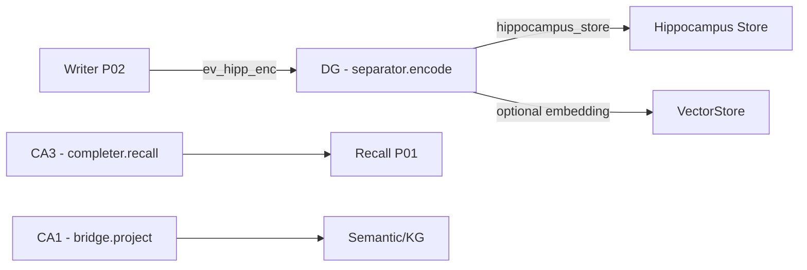
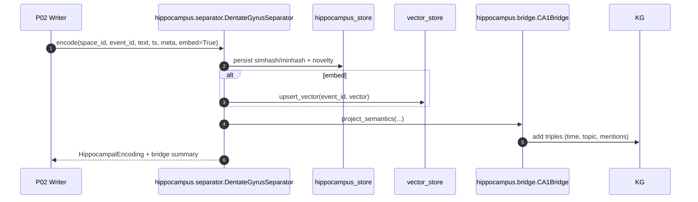

# hippocampus/ — DG/CA3/CA1 on-device memory coding
**Compiled:** 2025-09-06T05:26:43Z

> Production-first, privacy-first. This module implements **brain-inspired** memory processing:
> - **DG (Dentate Gyrus)** — pattern separation & sparse codes
> - **CA3** — content-addressable completion (cue → candidates)
> - **CA1** — bridge to cortex/semantics/temporal indexes

It runs **on-device** (SQLite, no heavy deps), integrates with your **storage/** layer if available, and gracefully falls back to local stores otherwise.

---

## 0) Why hippocampus?
- **Pattern separation**: prevent near-duplicates from flooding episodic memory.
- **Content addressability**: partial cue retrieves the right episode quickly.
- **Bridge to understanding**: extract coarse time/agent/topic signals and publish to semantic/temporal stores.

**Biological inspiration (informal):** DG produces sparse, decorrelated codes; CA3’s recurrent attractor network supports completion; CA1 acts as the comparator/bridge to cortex.

---

## 1) Files

```
hippocampus/
├─ __init__.py
├─ types.py               # dataclasses for codes, cues, candidates
├─ sdr.py                 # tokenization, shingles, SimHash, MinHash, distances
├─ separator.py           # DG: encode + novelty/near-duplicate detection
├─ completer.py           # CA3: cue → candidates (vector/SDR fallback)
├─ bridge.py              # CA1: write semantic triples + temporal hints
├─ api.py                 # high-level encode/recall API
├─ storage_fallback.py    # minimal stores if storage/* not present
├─ demo.py                # end-to-end demo
└─ README.md              # this file
```

Tests:
```
tests/unit/hippocampus/
  ├─ test_separator_and_store.py
  ├─ test_completer_cue_recall.py
  └─ test_bridge_semantic_projection.py
```

---

## 2) Event envelopes

### 2.1 Input (from Writer P02 → DG)
```json
{
  "space_id": "shared:household",
  "event_id": "evt-2025-09-06-abcd",
  "text": "Luca’s birthday plan: buy balloons & cake tomorrow at 6pm",
  "ts": "2025-09-06T14:03:20Z",
  "meta": {"author":"alice","mentions":["luca"]},
  "embed": true,         // optional; will call embeddings if available
  "store_vectors": true  // optional; save embedding to VectorStore
}
```

### 2.2 DG output (persisted in hippocampus_store)
```json
{
  "space_id":"shared:household",
  "event_id":"evt-...",
  "simhash_hex":"3a41...",
  "bits":512,
  "minhash32":[123,456,...],
  "novelty":0.82,
  "near_duplicates":[["evt-older-1",0.12],["evt-older-2",0.18]],
  "length":68,
  "ts":"..."
}
```

### 2.3 CA3 completion output
```json
{
  "space_id":"shared:household",
  "cue":"birthday... tomorrow 6pm",
  "candidates":[
    {"event_id":"evt-...", "score":0.86, "why":["vector:cos=0.92","sdr:hamm=0.08"]},
    {"event_id":"evt-older-1","score":0.61,"why":["sdr:hamm=0.12"]}
  ]
}
```

### 2.4 CA1 bridge (semantic projection)
```json
{
  "facts":[
    ["event:evt-...","has_time","2025-09-06T18:00:00Z"],
    ["event:evt-...","has_topic","birthday"],
    ["event:evt-...","mentions","luca"]
  ],
  "temporal_hints":{"bucket":"2025-09-06-evening"}
}
```

---

## 3) Algorithms (practical, explainable)

### 3.1 Tokenization → shingles
- Lowercase, strip punctuation, keep unicode letters & digits.
- **k-grams (k=3)** shingles improve robustness to minor edits.

### 3.2 SimHash (binary SDR, 512 bits)
For tokens \(t\) with weight \(w_t\):
1. For each bit position \(b\in[0,B)\), accumulate \(s_b += \pm w_t\) using a hash of \(t\).
2. Set bit \(b=1\) if \(s_b \ge 0\) else \(0\).  
This yields a **binary code**; Hamming distance approximates cosine similarity.

### 3.3 MinHash (Jaccard sketch, 64 perms by default)
For shingles set \(S\) and permutations \(h_i\), record \(\min h_i(S)\). Close sets → close sketches. We store 32‑bit values for speed.

### 3.4 Novelty & near-duplicates
Let \(d_H\) be Hamming distance between the new code and previous codes in the same space. Define:
\[
\text{{novelty}} = \sigma\!\left(\alpha \cdot (d_H/B) - \beta\cdot \text{{dup\_rate}}\right),\quad B=512
\]
with \(\alpha=6, \beta=1\). We also return the **K** closest previous events (near‑dupes).

### 3.5 Completion (CA3)
We fuse **vector cosine** (if embeddings available) and **SDR Hamming**:
\[
\text{{score}} = \lambda \cdot \cos(\vec q, \vec v) + (1-\lambda)\cdot (1-d_H/B)
\]
Default \(\lambda=0.7\) when vectors exist else \(\lambda=0.0\).

### 3.6 Bridge (CA1)
Extract coarse **time**, **mentions**, and **topic keywords**; project as triples `(subject, predicate, object)` to `SemanticStore`. This enables recall and planning hooks downstream.

---

## 4) Mermaid (flow & sequence)

### 4.1 Placement


### 4.2 End-to-end encode


---

## 5) Privacy & security
- **On-device only**, SQLite WAL, no external calls.
- We never store raw faces/audio; just text and derived codes.
- **Space‑scoped** tables: every row has `space_id`.
- **Tombstones** (from policy) are respected by returning nulls for deleted rows if you integrate with `privacy_store` (optional).

---

## 6) Quickstart

```bash
# demo
python -m hippocampus.demo
```

Programmatic:
```python
from hippocampus.api import Hippocampus

hip = Hippocampus(db_path="family_hippocampus.db")
hip.encode_event(
  space_id="shared:household",
  event_id="evt-1",
  text="Luca’s birthday plan tomorrow 6pm",
  ts="2025-09-06T12:00:00Z",
  meta={"author":"alice","mentions":["luca"]},
  embed=True,
)
cands = hip.recall_by_cue("shared:household", cue="birthday 6pm", k=5)
print(cands)
```

---

## 7) Integration notes
- If your full **storage/** package exists, this module auto‑uses it (EpisodicStore, VectorStore, SemanticStore, HippocampusStore).
- If not, it falls back to a **local hippocampus.db** with minimal tables.
- Embeddings: imports `embeddings.service.EmbeddingService` if present; else uses a light **hash embedding** (256‑D).

---

## 8) Future work
- Replace SimHash with **learned SDR** under a flag (while retaining explainability).
- Add place recognition hooks and cross‑modal cues (images/audio descriptors).
- Temporal Kg: write normalized intervals and uncertainty ranges.

---

*Built for production. Simple ingredients, strong guarantees, explainable signals.*
