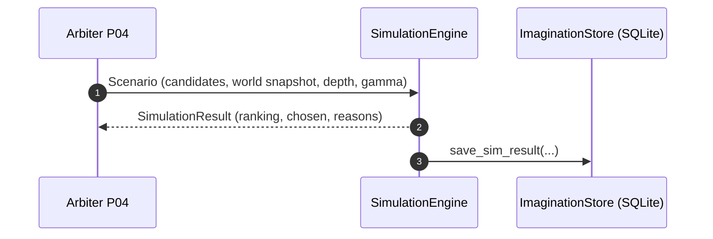
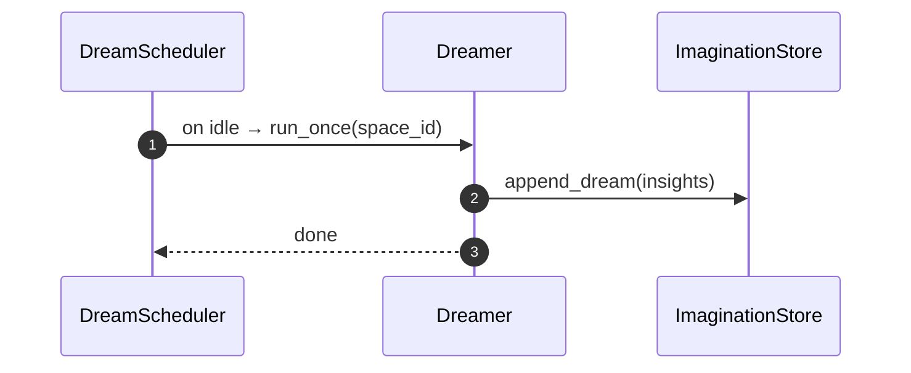

# imagination/ — Simulation Engine & Dreaming (Plausible Futures)

**Compiled:** 2025‑09‑06  
**Philosophy:** *On‑device, explainable, safe.* The imagination module lets Family OS **simulate small action sequences** (what-if) and **dream offline** (replay + counterfactuals) to learn better habits—**without** touching the network or actuators.

---

## Where it sits

```mermaid
flowchart LR
  subgraph WS[Global Workspace]
    BCAST[WORKSPACE_BROADCAST]
  end
  ARB[Arbiter P04] -- SIMULATION_REQUEST --> SIM[Simulation Engine]
  SIM -- SIMULATION_RESULT --> ARB
  DREAM[Dreamer (offline)] -- nightly insights --> LRN[Learning P06]
  DREAM -- triples/timehints --> CONS[Consolidation P03]
  SIM -. no side effects .- ACT[Actuators]
```

- **Inputs**: candidate actions from Arbiter, world snapshot from Workspace (or simple facts).  
- **Outputs**: ranked candidates w/ reasons to Arbiter; nightly “insights” to Learning & Consolidation.  
- **Never executes effects** — it only **simulates**. Actuators are not called here.

---

## Envelopes

### 1) SIMULATION_REQUEST → Scenario (internal)
```json
{
  "scenario_id":"sc-2025-09-06-1",
  "space_id":"shared:household",
  "goal":"improve_daily_state",
  "initial": {"facts": {"pending_items":7, "tasks":[...], "stress_level":0.4}},
  "candidates": [
    {"action":{"name":"declutter_inbox","estimated_cost":0.2},"prior":0.7},
    {"action":{"name":"check_todo","estimated_cost":0.1},"prior":0.6}
  ],
  "depth":2,
  "gamma":0.9
}
```

### 2) SIMULATION_RESULT (bus/public)
```json
{
  "type":"SIMULATION_RESULT",
  "space_id":"shared:household",
  "scenario_id":"sc-2025-09-06-1",
  "trace_id":"trace-...",
  "chosen":{"action":"declutter_inbox","score":0.41},
  "ranking_len":4,
  "model_version":"imagination:2025-09-06"
}
```

### 3) DREAM_RESULT (offline)
```json
{
  "type":"DREAM_RESULT",
  "space_id":"shared:household",
  "insights":[{"scenario":"dream-...","best_action":"check_todo","score":0.33}],
  "model_version":"imagination:2025-09-06"
}
```

All records are **space-scoped** and go to a local SQLite/WAL store (`imagination_demo.db`).

---

## Math (simple, explainable)

- **Transition** (T): interpretable effects (add todo, check todo, declutter, send photo, take break).  
- **Reward** (R): linear, clipped:
\[
U = 0.8\,\Delta task - 0.6\,\Delta clutter + 0.4\,\Delta social + 0.5\,\Delta(-stress) - 0.3\,cost
\]

- **Rollout value** for a candidate action \(a\):
\[
\hat{V}(a)= \\frac{1}{N}\\sum_{i=1}^N \\sum_{t=0}^{d-1} \\gamma^t r_t^{(i)} \quad \\text{ then blend with prior: } 0.7\\,\\hat{V}+0.3\\,prior
\]

- **Policy gate**: only LOW/MEDIUM risk actions are **simulated** (never executed).

---

## Files

```
imagination/
  api.py            # top-level helpers → simulate_scenario(), start_dream_cycle()
  engine.py         # SimulationEngine: evaluates candidate actions via rollouts
  models.py         # TransitionModel, RewardModel (interchangeable with learned ones)
  world.py          # WorldState; apply_effect(); derive_metrics()
  dreaming.py       # Dreamer: offline replay + counterfactuals; stores insights
  scheduler.py      # Optional idle/interval scheduler for dreams
  policy_bridge.py  # Risk gate (offline-only simulation)
  store_fallback.py # SQLite/WAL store for sim results + dream traces
  types.py          # Dataclasses for Scenario, Action, WorldState, etc.
  demo.py           # Quick end-to-end demo
  README.md         # This file
```

---

## Sequence



**Dreaming (offline):**



---

## Safety & privacy

- **On-device only**. No network calls. No actuators.  
- **Space-scoped** data. Results encrypted at rest if your platform wraps SQLite.  
- **Transparent math** and logs: every decision returns **reasons**.

---

## Integrating with Arbiter (P04)

- Arbiter gathers candidates (tools/plans), builds a **Scenario**, and calls `simulate_scenario()` with a `trace_id`.
- Use the returned `SIMULATION_RESULT` to **nudge the utility** before final selection.
- Keep the time budget small (20–30ms) to stay under frame.

---

## Quickstart

```bash
python -m imagination.demo
```

Programmatic:

```python
from imagination.api import scenario_from_simple, simulate_scenario

sc = scenario_from_simple("shared:household", "sc-1", "pending=5,stress=0.4,social=0.2,tasks=2done0")
simulate_scenario("imagination_demo.db", sc, trace_id="trace-123")
```

---

## Future work

- Swap **TransitionModel** for per-household learned models with neuromod signals.  
- Add **counterfactual evaluation** of top‑2 actions using richer world state.  
- Dreamer to pull episodes from **episodic_store** and **hippocampus CA1** time hints.

*Everything here is designed so you can replace each piece without breaking envelopes.*
