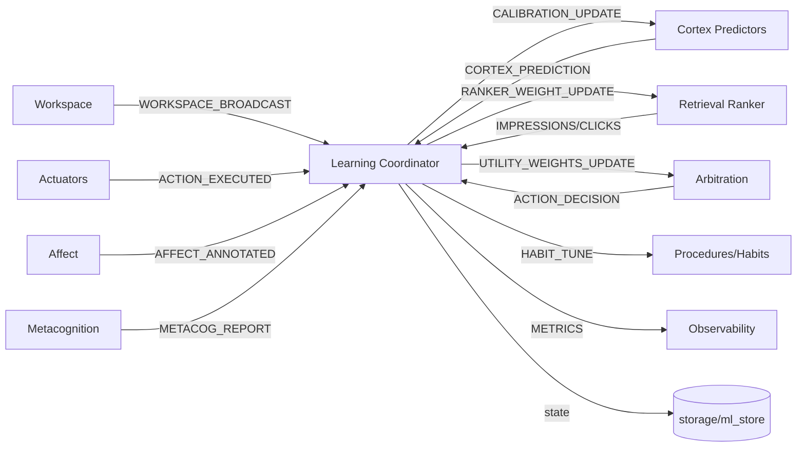
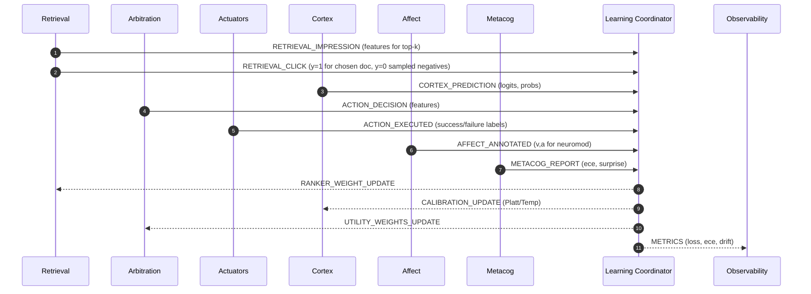
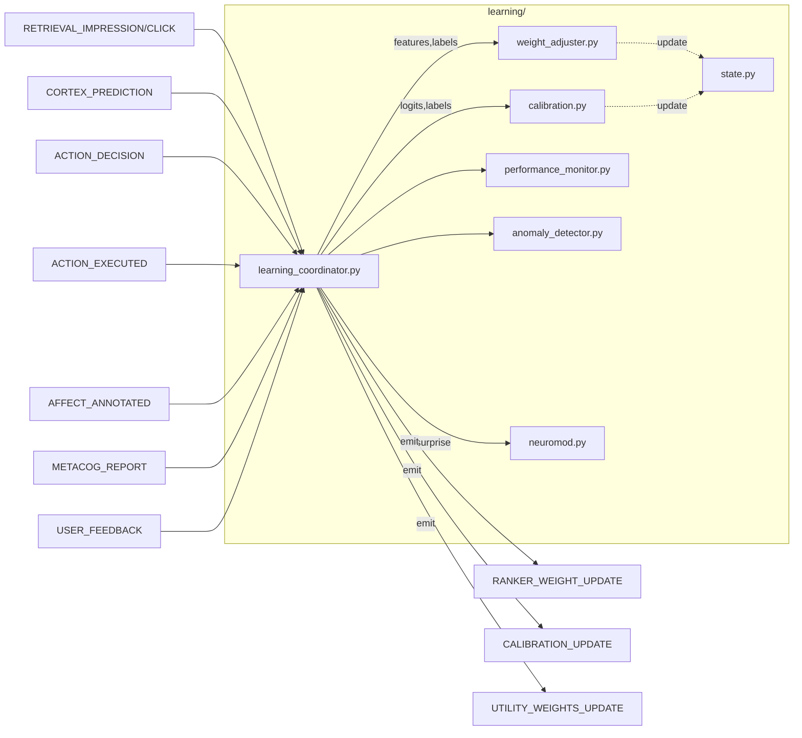

# learning/ — P06 Learning & Adaptation
**Compiled:** 2025-09-05T04:39:57Z  
**Philosophy:** *Production‑first, on‑device, explainable.* P06 turns **interactions** (predictions, exposures, actions, outcomes, user feedback) into **calibrated models** and **knobs** that improve Family‑OS over time—without leaving the device or violating space policies.

---

## 0) Where P06 sits (system view)

**Inbound streams:** exposure/clicks from Retrieval, decisions & outcomes from Arbitration/Actuators, predictions from Cortex, affect & metacog summaries, explicit user corrections.  
**Outbound knobs:** ranker weights, cortex temperatures/thresholds, arbiter utility weights, procedure priors, and calibration parameters. All **space‑scoped** and persisted to `storage/ml_store.py` (or a compatible adapter).

---

## 1) Contracts (event envelopes)

### 1.1 Exposure / Click (Retrieval)
```json
{
  "type": "RETRIEVAL_IMPRESSION",             
  "space_id": "shared:household",
  "query_id": "q-abc",
  "ranked": [
    {"doc_id":"evt-1","score":0.81,"features":{"bm25":0.9,"recency":0.4}},
    {"doc_id":"evt-2","score":0.74,"features":{"bm25":0.7,"recency":0.7}}
  ],
  "top_k": 10,
  "ts": "2025-09-05T04:39:57Z"
}
```
If the user selects an item:
```json
{
  "type": "RETRIEVAL_CLICK",
  "space_id": "shared:household",
  "query_id": "q-abc",
  "doc_id": "evt-2",
  "position": 2,
  "ts": "2025-09-05T04:39:57Z"
}
```

### 1.2 Cortex Prediction & Outcome
```json
{
  "type": "CORTEX_PREDICTION",
  "space_id": "shared:household",
  "heads": {
    "need_action": {"value": 0.72, "z": 1.3},
    "need_recall": {"value": 0.31, "z": -0.5}
  },
  "features": {"relevance":0.84,"wm_load":0.2},
  "ts": "2025-09-05T04:39:57Z"
}
```
```json
{
  "type": "ACTION_EXECUTED",
  "space_id": "shared:household",
  "action": "set_reminder",
  "args": {"who":"alice","when":"18:00"},
  "success": 1,                   
  "latency_ms": 3800,
  "error": null,
  "ts": "2025-09-05T04:39:57Z"
}
```

### 1.3 Affect & Metacog (for learning‑rate & calibration)
```json
{
  "type": "AFFECT_ANNOTATED",
  "space_id": "shared:household",
  "valence": 0.2,
  "arousal": 0.65,
  "confidence": 0.7,
  "ts": "2025-09-05T04:39:57Z"
}
```
```json
{
  "type": "METACOG_REPORT",
  "space_id": "shared:household",
  "brier": 0.06,
  "ece": 0.04,
  "surprise": 0.10,
  "recommendations": ["raise temperature for arousal>0.8"],
  "ts": "2025-09-05T04:39:57Z"
}
```

### 1.4 Explicit Feedback (user corrections)
```json
{
  "type":"USER_FEEDBACK",
  "space_id":"shared:household",
  "kind":"thumbs_down",         
  "target":"retrieval_result",
  "context":{"doc_id":"evt-2","query_id":"q-abc"},
  "ts":"2025-09-05T04:39:57Z"
}
```

### 1.5 Outbound Knobs
- **RANKER_WEIGHT_UPDATE**
```json
{
  "space_id":"shared:household",
  "component":"retrieval/linear_ranker",
  "weights":{"bm25": 0.98, "recency": 0.52, "source_prior:calendar":0.12},
  "regularization": 0.001,
  "ts":"2025-09-05T04:39:57Z"
}
```
- **CALIBRATION_UPDATE** (Cortex or ranker calibration)
```json
{
  "space_id":"shared:household",
  "component":"cortex/need_action",
  "platt":{"A":-1.13,"B":0.82},            
  "temperature": 1.08,
  "ts":"2025-09-05T04:39:57Z"
}
```
- **UTILITY_WEIGHTS_UPDATE** (Arbiter)
```json
{
  "space_id":"shared:household",
  "component":"arbitration/utility",
  "weights":{"relevance":1.0,"goal":0.9,"expected_reward":0.8,"cost":-0.7},
  "ts":"2025-09-05T04:39:57Z"
}
```

---

## 2) Algorithms (succinct but complete)

### 2.1 Online logistic regression for clicks / actions
We fit a **logistic** model per component with feature vector \(x\), label \(y\in\{0,1\}\):  
\[ \ell = -y\log \sigma(w^\top x) - (1-y)\log(1-\sigma(w^\top x)) + \lambda \|w\|_2^2 \]
Update with SGD/AdaGrad:  
\[ w \leftarrow w - \eta \cdot (\sigma(w^\top x)-y) x - 2\eta\lambda w \]

### 2.2 Platt / Tanh calibration
Convert uncalibrated score \(s\) to probability \(p\):  
**Platt:** \( p=\sigma(As + B) \), update \(A,B\) by SGD on logloss (small rate).  
**Tanh (valence‑style):** \( \hat v = \tanh(\theta v + b) \).

### 2.3 Temperature scaling (softmax/logits)
For a probability head with logit \(z\): new probs use \(z' = z/T\). We learn \(T>0\) by minimizing NLL on a window, updating \(T\) via SGD on \( \partial \text{NLL}/\partial T \).

### 2.4 Neuromodulated learning rate
Arousal ↑ → faster learning; negative valence → caution:  
\[ \eta' = \eta \cdot (1 + \alpha_a(a-0.5)) \cdot (1 - \alpha_v\max(0, -v)) \]
with \( \alpha_a \approx 0.6, \alpha_v \approx 0.3 \). Metacog surprise spikes also raise \( \eta' \).

### 2.5 Drift & anomaly
We track rolling mean/var for key features and loss. Z‑scores or simple PSI bins detect drift; if drift>τ, freeze weight growth (clip \(\eta'\)) and emit a warning metric.

---

## 3) Files (overview)
- `learning_coordinator.py` — subscribes to events, routes to analyzers & updaters, publishes knobs; keeps per‑space state
- `state.py` — durable state (weights, calibrations, moving windows)
- `optimizers.py` — OnlineSGD and AdaGrad helpers
- `calibration.py` — PlattScaler & TemperatureScaler
- `weight_adjuster.py` — component‑specific online updates for **retrieval ranker** and **arbiter utility**
- `outcome_analyzer.py` — rolling metrics (Brier, ECE, CTR)
- `anomaly_detector.py` — simple drift & anomaly detection
- `neuromod.py` — learning‑rate modulation from affect & metacog
- `feedback_processor.py` — map user feedback into pseudo‑labels / priors
- `performance_monitor.py` — aggregates module health & emits METRICS
- `demo.py` — runnable end‑to‑end example

---

## 4) Sequence (learning loop)


---

## 5) Privacy, policy, and performance
- All updates are **on‑device**, **space‑scoped** (MLS).  
- No raw inputs beyond counters/probabilities/feature vectors; envelopes exclude PII.  
- Default budgets: ≤ 10ms per update; ≤ 50KB total state per space.  
- All outputs are **advisory knobs**; final safety gates live in **Policy** and **Arbitration**.

---

## 6) Quickstart (demo)
```bash
python -m learning.demo
```
You’ll see retrieval click‑through learning, a ranker weight update, a cortex calibration tweak, and a utility weight adjustment simulated from a few events.

---

## 7) Future work
- Replace linear rankers with quantized shallow MLPs behind the same interface.
- Per‑user personalization vectors; meta‑learning to cold‑start new spaces.
- Confidence‑aware negative sampling for more stable retrieval training.

---

## 8) Module architecture (internal)

The **Coordinator** receives events, builds training examples, calls **WeightAdjuster** and **Calibration**, applies **Neuromod** scaling to learning rates, persists updates in **state**, and emits knobs for other modules.
