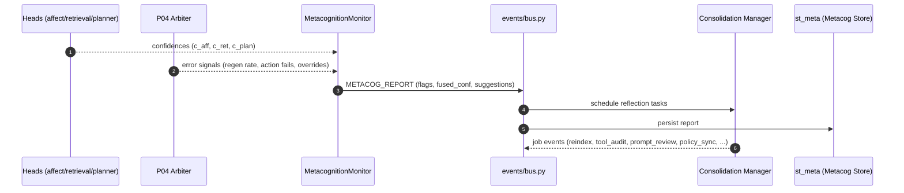
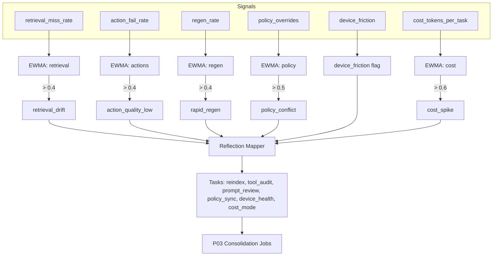

# Metacognition Module — Confidence, Errors, Reflection, Envelopes
**Status:** production-ready • **Last updated:** 2025-09-04T22:40:35

The `metacognition/` package monitors **system confidence**, detects **issues**, and proposes **self‑improvement tasks**. It emits `METACOG_REPORT` events used by Arbitration (P04) and Consolidation (P03).

---

## 0) Purpose in Family OS
- Fuse confidences from modules (retrieval, planner, affect) into a conservative signal.  
- Detect early signs of drift or friction (retrieval misses, tool failures, regen loops, policy overrides, device friction, cost spikes).  
- Suggest targeted reflection tasks (reindex, tool audit, prompt fixes, policy sync, device health, cost mode).

**Pipelines / Stores / Events**  
- **Input**: module confidences + error metrics.  
- **Output**: **METACOG_REPORT** to event bus; persist in **st_meta**.  
- Feeds **P04** (risk adjustments) and **P03** (scheduling of maintenance).

---

## 1) Envelopes

### 1.1 Input — MetacogInputs
```json
{
  "person_id": "alice",
  "space_id": "shared:household",
  "affect_conf": 0.72,
  "retrieval_conf": 0.65,
  "planner_conf": 0.70,
  "error_signals": {
    "retrieval_miss_rate": 0.30,
    "action_fail_rate": 0.10,
    "regen_rate": 0.40,
    "policy_overrides": 1,
    "device_friction": false,
    "cost_tokens_per_task": 0.25
  }
}
```

### 1.2 Output — METACOG_REPORT
```json
{
  "type": "METACOG_REPORT",
  "space_id": "shared:household",
  "person_id": "alice",
  "ts": "2025-09-04T12:00:00Z",
  "payload": {
    "flags": ["retrieval_drift","rapid_regen"],
    "fused_confidence": 0.66,
    "confidences": {"affect":0.72,"retrieval":0.65,"planner":0.70},
    "suggestions": [{"type":"reindex","description":"Rebuild index partitions; review near-duplicate purge and calibration."}],
    "model_version": "metacog:2025-09-04"
  }
}
```

---

## 2) Algorithms & Math

### 2.1 Confidence fusion
Weighted mean with caps (keeps values conservative):
c_fused = (Σ w_k c_k) / (Σ w_k)
Default priors: retrieval 1.2, planner 1.0, affect 0.8.

### 2.2 Error detection (EWMAs + thresholds)
We maintain leaky integrators for:
- `retrieval_miss_rate` → flag `retrieval_drift` if EWMA > 0.4  
- `action_fail_rate` → `action_quality_low` if > 0.4  
- `regen_rate` → `rapid_regen` if > 0.4  
- `policy_overrides` → `policy_conflict` if EWMA > 0.5  
- `cost_tokens_per_task` → `cost_spike` if EWMA > 0.6  
- `device_friction` → pass-through boolean

### 2.3 Reflection mapping
Flags → tasks (examples):
- `retrieval_drift` → **reindex** (near-duplicate purge; calibration review).  
- `action_quality_low` → **tool_audit** (guardrails, better prompts).  
- `rapid_regen` → **prompt_review** (improve disambiguation).  
- `policy_conflict` → **policy_sync** (space policy, consent).  
- `device_friction` → **device_health** (lower on-device load; advise charging).  
- `cost_spike` → **cost_review** (enable low-cost mode).

---

## 3) Integration
- Post `METACOG_REPORT` to `events/bus.py`.  
- P04 **Arbiter** consumes flags to adjust risk and plan selection (e.g., avoid expensive tools on `cost_spike`).  
- P03 **Consolidation Manager** consumes `suggestions` to enqueue maintenance tasks.

---

## 4) Privacy & Storage
- Only **module confidences, flags, and small counts** are stored; no raw content.  
- Reports live in `st_meta` and replicate **per space** under MLS.

---

## 5) References (selected)
- **NN calibration** — Guo et al. (2017). *On Calibration of Modern Neural Networks*.  
- **EWMA detectors** — Statistical process control literature (Shewhart/EWMA charts).  
- **Meta‑reasoning** — Cox (2005) *Metacognition for AI* (foundational ideas).  
- **CRDTs/MLS** — Shapiro et al. (2011); IETF MLS drafts (Barnes et al.).

---

## 6) Example (code)
```python
from metacognition.monitor import MetacognitionMonitor, MetacogInputs
from metacognition.error_detector import ErrorSignals

mon = MetacognitionMonitor()
rep = mon.tick(MetacogInputs(
  person_id="alice", space_id="shared:household",
  affect_conf=0.72, retrieval_conf=0.65, planner_conf=0.70,
  error_signals=ErrorSignals(retrieval_miss_rate=0.3, regen_rate=0.4, policy_overrides=1)
))
event = mon.make_event(rep)
print(event)
```

---

## 7) Design Rationale
- Keep a **single fused confidence** for the system to reason about uncertainty.  
- Provide **diagnosable flags** (not just a score), so humans and agents can act.  
- Keep it **edge‑local and explainable**—no cloud reliance, no hidden states.


---

## 7) Mermaid Diagrams

### 7.1 Metacog Tick & Report (sequence)



### 7.2 Error Integrators → Flags → Reflections (flow)


