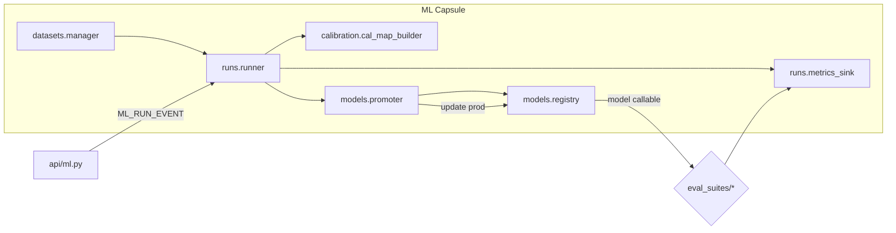
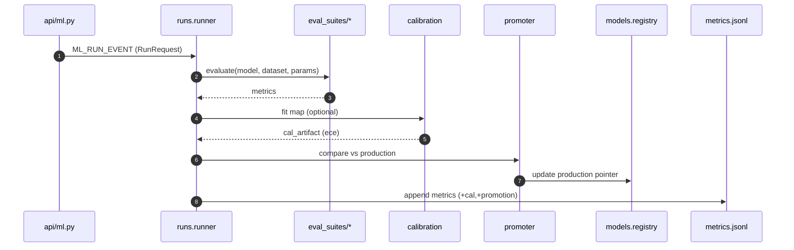

# ml_capsule/ — On‑Device Model Lifecycle (Datasets → Eval → Calibrate → Promote)
**Compiled:** now  
**Philosophy:** *Production‑first, privacy‑first, edge‑first.* No network. Small, explainable math. Durable artifacts.

This module owns the **full lifecycle** of compact models used by Family OS: dataset management, evaluation suites,
calibration (temperature & isotonic), stress testing, and **promotion** to production. All artifacts are stored in the
device workspace to preserve privacy and reproducibility.

---

## 0) Where it sits



- **Inputs:** Run requests from `api/ml.py` or internal schedulers (stress, nightly eval).
- **Outputs:** Metrics JSONL, calibration maps (`.cal.json`), and a **production pointer** (`production.json`).

---

## 1) Contracts (envelopes)

### 1.1 RunRequest (`runs/runner.py`)
```json
{
  "run_id":"run-2025-09-06-001",
  "suite":"recall",
  "dataset_id":"toy_recall",
  "model_id":"rule_based_v1",
  "params":{"seed":7,"calibration":"isotonic"},
  "eval_only":true,
  "space_id":"shared:household",
  "trace_id":"trace-abc"
}
```

### 1.2 Metrics record (`runs/metrics_sink.py` → JSONL)
```json
{
  "ts":"2025-09-06T00:00:00Z",
  "run_id":"run-...",
  "suite":"recall",
  "dataset_id":"toy_recall",
  "model_id":"rule_based_v1",
  "metrics":{"accuracy":0.82,"mrr":0.71,"ndcg@10":0.74},
  "calibration":{"ece":0.06,"bins":10},
  "artifacts":{"cal_map":"workspace/ml/cal/rule_based_v1.recall.isotonic.cal.json"},
  "promotion":{"promoted":true,"reason":"accuracy↑ & ece↓"},
  "trace_id":"trace-abc"
}
```

---

## 2) Evaluation suites
Small, dependency‑free suites provide deterministic metrics:

- **recall**: binary/multi‑class accuracy, **MRR**, **nDCG@k**.  
- **metacog**: calibration (ECE), confidence‑weighted accuracy.  
- **tom** (theory of mind proxy): label match + belief‑consistency checks.  
- **planning**: step success rate, average plan depth.

**Formulas** (sketch):  
- Mean Reciprocal Rank: \(\text{MRR} = \frac1N \sum_i \frac1{\text{rank}_i}\).  
- nDCG@k: \(\text{nDCG}@k = \frac{\sum_{j=1}^k \frac{2^{rel_j}-1}{\log_2(j+1)}}{\text{IDCG}@k}\).  
- Expected Calibration Error (ECE) over B bins: \(\sum_b \frac{n_b}N |\text{acc}_b-\text{conf}_b|\).

---

## 3) Calibration
Two options:

1. **Temperature scaling** (single scalar \(T>0\)) on logit \(z\):  
   \(p' = \sigma(z/T)\). We fit `T` by minimizing negative log‑likelihood on a held‑out split.

2. **Isotonic regression** (monotone, non‑parametric) using **Pool Adjacent Violators (PAV)** to build a
   piecewise‑constant mapping \(p \mapsto \hat p\). This reduces **ECE** with no overfitting to shape assumptions.

Artifacts are stored under `workspace/ml/cal/*.cal.json` and can be applied at inference time on‑device.

---

## 4) Promotion
`models/promoter.py` compares the candidate run against **production** for the same suite/dataset using a dominance rule:

> Promote if **primary metric up** (e.g., accuracy) by \(\ge \epsilon\) and **ECE not worse** by more than \(\delta\).

On success, `models/registry.py` updates `workspace/ml/production.json`:

```json
{ "recall|toy_recall": "rule_based_v1@2025-09-06T12:00:00Z" }
```

---

## 5) Files
```
ml_capsule/
├─ __init__.py
├─ README.md
├─ memory_formula_pack_loader.py
├─ datasets/
│  ├─ manager.py
│  ├─ sampler.py
│  └─ catalog.json
├─ eval_suites/
│  ├─ recall.py
│  ├─ metacog.py
│  ├─ tom.py
│  └─ planning.py
├─ runs/
│  ├─ runner.py
│  ├─ metrics_sink.py
│  └─ cli.py
├─ models/
│  ├─ registry.py
│  └─ promoter.py
├─ calibration/
│  └─ cal_map_builder.py
└─ stress/
   ├─ harness.py
   └─ scenarios.yaml
```

---

## 6) Wiring (bus + storage)



**Storage paths (local):**
- `workspace/ml/metrics.jsonl` — append‑only metrics.
- `workspace/ml/cal/*.cal.json` — calibration maps.
- `workspace/ml/production.json` — active model pointers.
- `workspace/ml/datasets/*` — optional cached datasets.

---

## 7) Privacy & security
- No network or cloud writes. All artifacts are **on‑device**.
- Dataset records are **redacted** upstream; we store only minimal features needed for offline evaluation.
- Metrics contain **no raw PII**; text is hashed if present.

---

## 8) Quickstart

```bash
python -m ml_capsule.runs.cli eval --suite recall --dataset toy_recall --model rule_based_v1 --calibration isotonic
```

---

## 9) Integration guide (short)
- Add your model to `models/registry.py` as a callable (`predict_proba` interface).
- Register a dataset in `datasets/catalog.json`.
- Run evaluation and check `workspace/ml/metrics.jsonl`.
- If the candidate wins, it will be promoted automatically (rules configurable).

---

## 10) Future work
- Per‑space calibration (personalization) with privacy budgets.
- Replay‑aware evaluation using the event bus to **reconstruct** historical contexts.
- Tiny NN **distillation** utilities and int8 export helpers.

---

**See also**: Events bus and temporal indexing modules for how runs are triggered and time‑bucketed.
