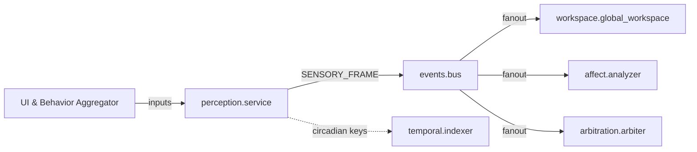
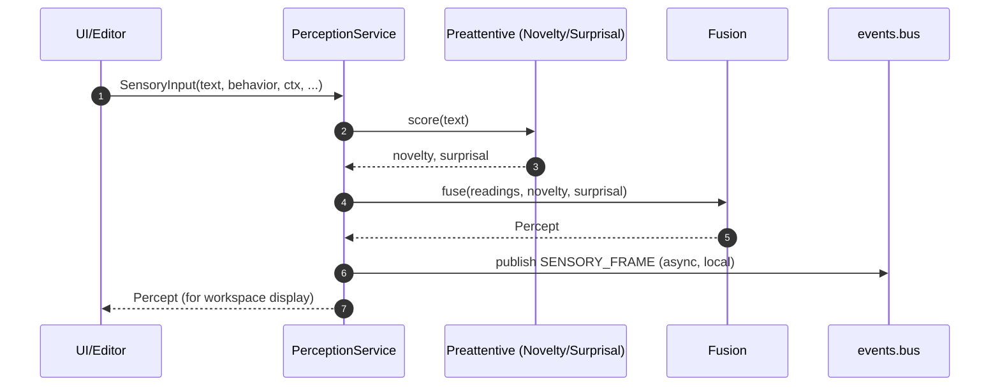

# perception/ — Sensors → Preattentive → Fusion (SENSORY_FRAME)

**Compiled:** 2025-09-06T21:27:07.289437Z  
**Philosophy:** *Production-first, privacy-first, explainable.* The **perception** module turns raw UI inputs + device context into a compact **Percept**: a salience‑scored, tags‑annotated snapshot that the **Global Workspace** can broadcast and downstream modules can act on.

---

## 0) Where it sits



- Publishes **SENSORY_FRAME** on the local **EventBus** (durable, replayable).
- Exposes circadian hints (time‑of‑day) that **temporal/** can use for indexing/recency.
- Produces **explainable** scalar features; no raw media leaves the device.

---

## 1) Envelopes

### 1.1 Input (SensoryInput)
```json
{
  "space_id":"shared:household",
  "person_id":"alice",
  "event_id":"evt-...",
  "ts":"2025-09-06T12:34:56Z",
  "text":"ASAP! book tickets!!",
  "behavior":{"inter_request_deltas":[0.5,1.0,0.4,0.6], "keystrokes_total":80, "backspaces":20, "retries":3, "session_seconds":700, "active_seconds":90},
  "ctx":{"battery_low":false,"cpu_throttled":false,"intent_urgent":true,"time_of_day_hours":21.5},
  "prosody_feats":[0.7,0.3,0.4],
  "face_aus_z":[0.2,-0.1,0.4],
  "hrv_z":-0.8
}
```

### 1.2 Output (Percept)
```json
{
  "salience": 0.87,
  "novelty": 0.62,
  "urgency": 0.71,
  "entropy": 0.43,
  "arousal_proxy": 0.58,
  "ctx_bump": 0.10,
  "tags": ["emphatic","urgent"],
  "confidence": 0.67,
  "detail": {
    "weights_used": {"novelty":1.2,"urgency":1.1,"entropy":0.8,"burst":0.9,"arousal":0.7,"ctx":0.5},
    "readings": {"text":{"len":5,"caps":4,"excl":2,"qmarks":0,"entropy":0.6,"urgency":0.4},"behavior":{"burst":0.52,"backspace_ratio":0.25,"retry":0.6,"keystroke_rate":0.89},"prosody":{"a":0.66},"hrv":{"a":0.69},"ctx":{"batt":0,"cpu":0,"urgent":1,"tod":0.9}},
    "tags":["emphatic","urgent"]
  }
}
```

---

## 2) Math & heuristics (explainable)

**Novelty** — simhash over tokens vs a recent window; novelty = (1 - max_j sim(h(x), h_j)).  
**Surprisal** — token frequency table, S = 1 - exp(-mean_neglogp/k).  
**Arousal proxy** — behavior burstiness (CV of inter‑request deltas), prosody sigma(0.5 z_pitch + 0.3 z_energy + 0.4 z_rate), and wearable HRV sigma(-0.8 z_hrv).  
**Salience** — logistic of a linear form:  
s = sigma(1.2 n + 1.1 u + 0.8 H + 0.9 B + 0.7 A + 0.5 C) + ctx_bump, clipped to [0,1].

**Context bump** — +0.15 if urgent intent; −0.05 at late night (unless urgent).

All constants are in `fusion.FusionConfig` and can be tuned per device.

---

## 3) Privacy & security

- No raw audio/video/keystrokes stored; only derived scalars and tags.
- Fully space‑scoped: every Percept carries `space_id` and is governed by policy.
- Event publishing is local only; the EventBus writes a JSONL WAL readable for audits.
- Works fully offline; no network calls.

---

## 4) API

```python
from datetime import datetime, timezone
from family_perception import PerceptionService, SensoryInput, BehaviorWindow, ContextInfo

svc = PerceptionService()
si = SensoryInput(
    space_id="shared:household", person_id="alice", event_id="evt-1", ts=datetime.now(timezone.utc),
    text="ASAP! book tickets!!",
    behavior=BehaviorWindow(inter_request_deltas=[0.5,1.0,0.4,0.6], keystrokes_total=80, backspaces=20, retries=3, session_seconds=700, active_seconds=90),
    ctx=ContextInfo(intent_urgent=True, time_of_day_hours=21.5),
    prosody_feats=(0.7,0.3,0.4), hrv_z=-0.8
)
p = svc.perceive(si)
print(p.salience, p.tags)
```

---

## 5) Files

```
family_perception/
├─ __init__.py
├─ api.py             # PerceptionService facade
├─ sensors.py         # Text, Behavior, Prosody, Face, HRV, Context sensors
├─ preattentive.py    # Novelty + Surprisal estimators
├─ fusion.py          # Late fusion to produce Percept
├─ types.py           # Dataclasses for envelopes
├─ utils.py           # Tokenization, math helpers
├─ calibration.py     # RunningStats, ZScoreCalibrator (reserved)
├─ demo.py            # Example run
└─ README.md          # This file
```

---

## 6) Sequence (UI → Perception → Bus)



---

## 7) Integration notes

- EventBus (durable, replayable) delivers SENSORY_FRAME to workspace, affect, arbitration, learning.
- Temporal: time‑of‑day (`ctx.tod`) and circadian hints complement temporal indexing.
- Affect: provides arousal proxy inputs; affect can also enrich tags based on thresholds.
- Arbitration: reads `Percept.salience` and `tags` to decide whether to act or schedule.

---

## 8) Unit ideas (not exhaustive)

- Text only → urgency and entropy respond to punctuation and vocabulary.
- Behavior burstiness: spiky session lifts arousal proxy.
- Prosody/HRV optional: if missing, salience remains stable (confidence lower).
- Night vs urgent bump interplay.

---

## 9) Future work

- Device‑specific calibration per user (save/restore RunningStats).
- Add lightweight acoustic VAD features (no raw audio), and gesture proxies.
- Cross‑session novelty: persist SimHash ring across reboots.
- Tooling: golden tests for novelty/urgency edge cases.
