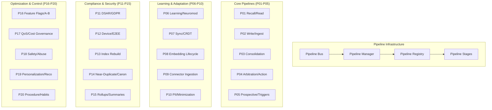

# MemoryOS Pipeline System

## Overview

The MemoryOS pipeline system implements 20 specialized processing workflows (P01-P20) that handle different aspects of cognitive processing. Each pipeline is designed to be independently scalable, testable, and maintainable while working together to create a coherent cognitive architecture.

## 🚦 Pipeline Architecture

## 📋 Pipeline Catalog

### Core Operations (P01-P05)

#### P01: Recall/Read Pipeline
- **File**: `pipelines/p01.py`
- **Purpose**: Memory retrieval and reading operations
- **Components**: Retrieval services, ranking, QoS gating
- **Triggers**: Query requests, similarity searches
- **Output**: Ranked memories with relevance scores

#### P02: Write/Ingest Pipeline  
- **File**: `pipelines/p02.py`
- **Purpose**: Memory encoding and storage
- **Components**: Write services, validation, indexing
- **Triggers**: New information, user inputs
- **Output**: Stored memories with receipt confirmations

#### P03: Consolidation/Forgetting Pipeline
- **File**: `pipelines/p03.py`
- **Purpose**: Memory consolidation and cleanup
- **Components**: Compaction, rollups, forgetting policies
- **Triggers**: Background schedules, storage pressure
- **Output**: Consolidated memories, freed storage

#### P04: Arbitration/Action Pipeline
- **File**: `pipelines/p04.py`
- **Purpose**: Decision making and action execution
- **Components**: Arbitration engine, action runner, planning
- **Triggers**: Action requests, planning needs
- **Output**: Executed actions with outcomes

#### P05: Prospective/Triggers Pipeline
- **File**: `pipelines/p05.py`
- **Purpose**: Future-oriented planning and reminders
- **Components**: Prospective memory, scheduling, triggers
- **Triggers**: Time events, context changes
- **Output**: Triggered reminders, scheduled actions

### Learning & Adaptation (P06-P10)

#### P06: Learning/Neuromodulation Pipeline
- **File**: `pipelines/p06.py`
- **Purpose**: Adaptive learning and neural plasticity
- **Components**: Learning coordinator, neuromodulation
- **Triggers**: Feedback, performance metrics
- **Output**: Updated models, weight adjustments

#### P07: Sync/CRDT Pipeline
- **File**: `pipelines/p07.py`
- **Purpose**: Peer-to-peer synchronization
- **Components**: CRDT operations, conflict resolution
- **Triggers**: Network events, data changes
- **Output**: Synchronized state, resolved conflicts

#### P08: Embedding Lifecycle Pipeline
- **File**: `pipelines/p08.py`
- **Purpose**: Embedding generation and management
- **Components**: Embedding services, indexing, caching
- **Triggers**: New content, model updates
- **Output**: Fresh embeddings, updated indexes

#### P09: Connector Ingestion Pipeline
- **File**: `pipelines/p09.py`
- **Purpose**: External data source integration
- **Components**: Perception sensors, data fusion
- **Triggers**: Sensor data, external APIs
- **Output**: Normalized data streams

#### P10: PII/Minimization Pipeline
- **File**: `pipelines/p10.py`
- **Purpose**: Privacy protection and data minimization
- **Components**: PII detection, redaction, policies
- **Triggers**: Data writes, privacy policies
- **Output**: Sanitized data, privacy compliance

### Compliance & Security (P11-P15)

#### P11: DSAR/GDPR Pipeline
- **File**: `pipelines/p11.py`
- **Purpose**: Data subject access rights and GDPR compliance
- **Components**: Privacy APIs, data export, deletion
- **Triggers**: User requests, regulatory requirements
- **Output**: Compliance reports, data exports

#### P12: Device/E2EE Pipeline
- **File**: `pipelines/p12.py`
- **Purpose**: End-to-end encryption and device security
- **Components**: Key management, encryption, MLS groups
- **Triggers**: Security events, key rotation
- **Output**: Encrypted data, security attestations

#### P13: Index Rebuild Pipeline
- **File**: `pipelines/p13.py`
- **Purpose**: Search index maintenance and optimization
- **Components**: Indexing services, optimization
- **Triggers**: Index corruption, optimization schedules
- **Output**: Rebuilt indexes, improved performance

#### P14: Near-Duplicate/Canonicalization Pipeline
- **File**: `pipelines/p14.py`
- **Purpose**: Duplicate detection and content canonicalization
- **Components**: Similarity detection, deduplication
- **Triggers**: Content ingestion, cleanup schedules
- **Output**: Canonical content, space savings

#### P15: Rollups/Summaries Pipeline
- **File**: `pipelines/p15.py`
- **Purpose**: Data aggregation and summarization
- **Components**: Rollup engines, summary generation
- **Triggers**: Time periods, data volume thresholds
- **Output**: Compressed summaries, aggregated metrics

### Optimization & Control (P16-P20)

#### P16: Feature Flags/A-B Pipeline
- **File**: `pipelines/p16.py`
- **Purpose**: Experimental features and A/B testing
- **Components**: Feature flags, model promotion
- **Triggers**: Experiment schedules, model performance
- **Output**: Feature activations, experiment results

#### P17: QoS/Cost Governance Pipeline
- **File**: `pipelines/p17.py`
- **Purpose**: Quality of service and resource management
- **Components**: QoS gates, cost monitoring
- **Triggers**: Resource usage, performance metrics
- **Output**: Resource allocations, throttling decisions

#### P18: Safety/Abuse Pipeline
- **File**: `pipelines/p18.py`
- **Purpose**: Content safety and abuse prevention
- **Components**: Safety filters, abuse detection
- **Triggers**: Content analysis, policy violations
- **Output**: Safety verdicts, blocked content

#### P19: Personalization/Recommendations Pipeline
- **File**: `pipelines/p19.py`
- **Purpose**: Personalized experiences and recommendations
- **Components**: Ranking models, personalization
- **Triggers**: User interactions, preference updates
- **Output**: Personalized rankings, recommendations

#### P20: Procedure/Habits Pipeline
- **File**: `pipelines/p20.py`
- **Purpose**: Routine behaviors and habit formation
- **Components**: Habit tracking, procedure execution
- **Triggers**: Behavioral patterns, routine schedules
- **Output**: Habit reinforcement, procedure execution

## 🔧 Infrastructure Components

### Pipeline Bus (`bus.py`)
- **Purpose**: Message routing and coordination between pipelines
- **Features**: Async messaging, error handling, backpressure
- **Integration**: Event-driven architecture with cognitive events

### Pipeline Manager (`manager.py`)
- **Purpose**: Lifecycle management and orchestration
- **Features**: Pipeline registration, execution, monitoring
- **Responsibilities**: Resource allocation, dependency management

### Pipeline Registry (`registry.py`)
- **Purpose**: Pipeline discovery and metadata management
- **Features**: Dynamic registration, capability discovery
- **Metadata**: Pipeline specifications, dependencies, SLAs

### Pipeline Stages (`stages.py`)
- **Purpose**: Common processing stages and utilities
- **Features**: Reusable components, stage composition
- **Examples**: Validation, transformation, routing stages

### Events Shim (`events_shim.py`)
- **Purpose**: Integration with the cognitive event system
- **Features**: Event bridging, format conversion
- **Integration**: Seamless event flow between pipelines and core systems

## 🔄 Execution Model

### Pipeline Lifecycle
1. **Registration**: Pipelines register with the manager
2. **Activation**: Triggered by events or schedules
3. **Execution**: Multi-stage processing with error handling
4. **Completion**: Results published to event bus
5. **Monitoring**: Performance metrics and health checks

### Concurrency Model
- **Async/Await**: Non-blocking pipeline execution
- **Worker Pools**: Configurable parallelism per pipeline
- **Backpressure**: Flow control to prevent overload
- **Circuit Breakers**: Failure isolation and recovery

### Error Handling
- **Retry Logic**: Exponential backoff with jitter
- **Dead Letter Queues**: Failed message handling
- **Circuit Breakers**: Cascade failure prevention
- **Monitoring**: Error rates and recovery metrics

## 📊 Monitoring & Observability

### Pipeline Metrics
- **Throughput**: Messages processed per second
- **Latency**: End-to-end processing time
- **Error Rates**: Success/failure ratios
- **Resource Usage**: CPU, memory, storage consumption

### Health Checks
- **Liveness**: Pipeline process health
- **Readiness**: Ability to accept new work
- **Dependencies**: External service availability
- **Performance**: SLA compliance monitoring

### Alerting
- **Threshold Alerts**: Metric-based notifications
- **Anomaly Detection**: ML-based outlier detection
- **Dependency Failures**: Upstream service issues
- **Resource Exhaustion**: Capacity planning alerts

## 🧪 Testing Strategy

### Unit Tests
- **Pipeline Logic**: Individual pipeline functionality
- **Stage Testing**: Isolated stage verification
- **Mock Dependencies**: External service simulation
- **Edge Cases**: Error conditions and boundaries

### Integration Tests
- **End-to-End**: Full pipeline execution flows
- **Cross-Pipeline**: Inter-pipeline communication
- **Event Flows**: Cognitive event processing
- **Performance**: Load and stress testing

### Contract Tests
- **Interface Validation**: Pipeline API compliance
- **Event Schemas**: Message format verification
- **SLA Validation**: Performance contract testing
- **Backward Compatibility**: Version compatibility

## 🚀 Deployment & Operations

### Configuration Management
- **Pipeline Config**: Per-pipeline settings and tuning
- **Environment Variables**: Runtime configuration
- **Feature Flags**: Dynamic behavior control
- **Policy Configuration**: Business rule management

### Scaling Strategies
- **Horizontal Scaling**: Multiple pipeline instances
- **Vertical Scaling**: Resource allocation tuning
- **Load Balancing**: Work distribution strategies
- **Auto-scaling**: Dynamic capacity management

### Maintenance Operations
- **Rolling Updates**: Zero-downtime deployments
- **Pipeline Draining**: Graceful shutdown procedures
- **State Migration**: Pipeline version upgrades
- **Disaster Recovery**: Backup and restore procedures

## 🔗 Integration Points

### Cognitive Architecture
- **Working Memory**: Integration with cognitive core
- **Attention Gate**: Smart-path processing integration
- **Global Workspace**: Broadcast integration
- **Arbitration**: Decision-making coordination

### Storage Layer
- **Unit of Work**: Transactional consistency
- **CRDT Store**: Conflict-free replication
- **Receipt Store**: Audit trail integration
- **Privacy Store**: Data protection compliance

### External Systems
- **API Gateway**: REST endpoint integration
- **Event Bus**: Cognitive event system
- **Monitoring**: Observability platform integration
- **Security**: Authentication and authorization
