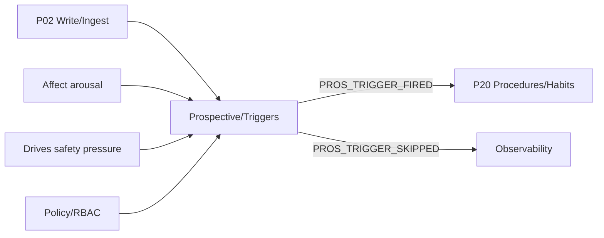
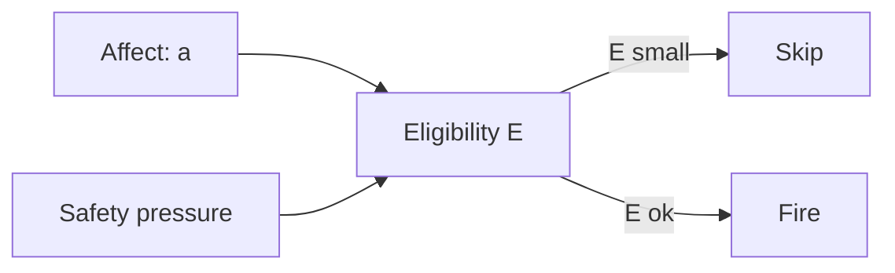
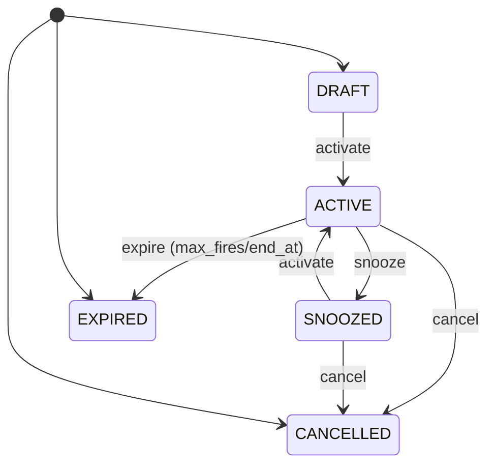
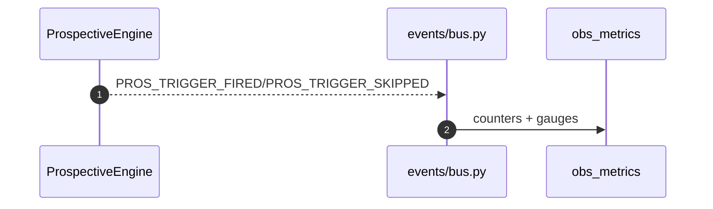

# prospective/ — P05 Prospective & Triggers 
**Compiled:** 2025-09-05T00:09:54Z  
**Audience:** Engineers, product, policy, and curious builders (readable by a 12th‑grade graduate).  
**One‑line:** Turn intent into *future actions* safely, on‑device, under family policy.

---

## 0) TL;DR in Plain English

- You can ask Family OS to **do something later** (e.g., *“Remind us at 8 pm to read a story”*).
- Those *“do it later”* promises are called **triggers**.  
- Each trigger has a **schedule** (when) and an **action** (what).  
- When the time comes, the system **checks if it’s a good moment** (calm enough, safe enough, allowed by policy).  
- If yes → it **fires** an **action envelope** (e.g., a notification, run a procedure). If not → it **skips** and reschedules.  
- **Everything is on-device**, encrypted per family **space**, and **explainable**.

---

## 1) Where Prospective Fits in Family OS

Prospective is **P05** in the Pipeline Bus. It sits beside:
- **P02 Write/Ingest**: creates and updates triggers from UI/API.
- **P04 Arbitration/Action**: decides final execution band and tool calling.
- **P20 Procedure/Habits**: actually runs routines when Prospective says “go”.
- **Affect & Drives**: provide **arousal** and **safety pressure** to gate firing.
- **Policy & RBAC (P18, roles)**: ensure only allowed people can create/modify triggers per space.



**Spaces (privacy):** Triggers live inside **spaces**: `personal:*`, `selective:*` (e.g., `father_son`), `shared:household`, `extended:*`, and `interfamily:*`. Replication uses the space’s **MLS** keys → only authorized devices see and execute.

---

## 2) Core Concepts (Glossary)

- **Trigger**: A future commitment. Has an `id`, `schedule`, `action`, optional `conditions`, and `status`.
- **Schedule**: When we should attempt to fire. Supported: `once`, `interval`, `daily_time`.
- **Action**: What to do. Supported: `notify`, `project` (share), `run_procedure` (call a named routine).
- **Conditions (gating)**: *Safety checks* at fire-time (e.g., arousal must be ≤ 0.65).
- **Eligibility**: A 0–1 score summarizing how suitable the moment is (lower if arousal/safety high).
- **Fire**: Emit an **action envelope**; Prospective never executes tools itself.
- **Skip**: Don’t fire now; compute the **next time** and record the reason.
- **State machine**: `DRAFT → ACTIVE ↔ SNOOZED → CANCELLED/EXPIRED`. Only ACTIVE/SNOOZED may fire.

---

## 3) Real‑Life Examples

1) **Bedtime routine**: *Daily at 20:00, notify both parents to read a story.*  
2) **Medication**: *Every 8 hours starting at 07:00 for 10 days; skip if arousal is high (family conflict).*  
3) **Chore rotation**: *Saturdays at 10:00, run a procedure that assigns chores fairly.*  
4) **Inter‑family plan**: *Project a shared calendar reminder between two families for a picnic, with opt‑in consent.*

---

## 4) Envelopes (What goes in/out)

### 4.1 Create/Update Trigger (ingest via P02)
```json
{
  "type": "PROS_TRIGGER_UPSERT",
  "space_id": "shared:household",
  "person_id": "alice",
  "payload": {
    "id": "trig-001",
    "title": "Read bedtime story",
    "schedule": {"type":"daily_time", "time_of_day":"20:00", "days_of_week":[0,1,2,3,4,5,6]},
    "action": {"type":"notify", "title":"Story time", "body":"Choose a book together"},
    "conditions": {"require_arousal_max": 0.65, "disallow_safety_pressure_min": 0.7, "cooldown_seconds": 600}
  }
}
```
**Ack event (from Prospective):**
```json
{"type":"PROS_TRIGGER_UPSERTED","payload":{"trigger_id":"trig-001","next_fire_at":"2025-09-05T20:00:00Z"}}
```

### 4.2 Fire (when due and eligible)
```json
{
  "type": "PROS_TRIGGER_FIRED",
  "space_id": "shared:household",
  "person_id": "alice",
  "payload": {
    "trigger_id":"trig-001",
    "action":{"type":"notify","title":"Story time","body":"Choose a book together"},
    "eligibility": 0.82,
    "next_fire_at": "2025-09-06T20:00:00Z"
  }
}
```

### 4.3 Skip (due but gated)
```json
{
  "type":"PROS_TRIGGER_SKIPPED",
  "space_id":"shared:household",
  "person_id":"alice",
  "payload":{"trigger_id":"trig-001","reason":"arousal_too_high","eligibility":0.12,"next_fire_at":"2025-09-06T20:00:00Z"}
}
```

### 4.4 Control (snooze, cancel)
```json
{"type":"PROS_TRIGGER_SNOOZED","payload":{"trigger_id":"trig-001","snooze_seconds":3600}}
{"type":"PROS_TRIGGER_CANCELLED","payload":{"trigger_id":"trig-001"}}
```

**Field invariants:**
- `id` must be **stable and unique** within the space.
- All timestamps are **ISO‑8601 UTC** with `"Z"` suffix.
- Prospective is **idempotent** on `id` (upsert overwrites).

---

## 5) Data model (simple & inspectable)

### 5.1 Dataclasses (edge code)
- `Schedule{type, fire_at | every_seconds,start_at,end_at,max_fires | time_of_day,days_of_week}`
- `Action{type,title,body,link_group_id,procedure_name,procedure_args}`
- `Condition{require_arousal_max,disallow_safety_pressure_min,tag_present,cooldown_seconds}`
- `Trigger{id,person_id,space_id,title,schedule,action,conditions,status,created_at,updated_at,last_fired_at,next_fire_at,fires_count}`

### 5.2 Storage
Reference JSON store (swap for SQLite/CRDT in prod). Schema sketch (SQLite) is documented in `schema.sql`:
```sql
CREATE TABLE prospective_triggers (...);
CREATE TABLE prospective_outcomes (...);
```

**Replication:** done per **space** using the space’s MLS keys. Triggers stay on-device; when syncing between family devices, they travel **encrypted**.

---

## 6) Schedules (How time works)

We support three **edge‑friendly** types that cover most home routines:

### 6.1 `once`
- Fire at a specific UTC time: `"fire_at":"2025-09-07T17:00:00Z"`
- If that time is **past**, Prospective does **not backfill**; it returns `None` for `next_fire_at`.

### 6.2 `interval`
- Repeat every `every_seconds` (e.g., `3600` for hourly).  
- Optional window: `start_at`, `end_at`, and `max_fires` to stop after N times.  
- **Anchor & catch‑up**: we compute the **first future slot** ≥ `now` without replaying missed slots.  
- **Drift**: interval is stable; if device sleeps past one slot, we roll forward to the next future boundary.

### 6.3 `daily_time`
- Fire at local‑day time `"time_of_day":"HH:MM"` on selected `days_of_week` (`0..6`, Monday=0).  
- **Time zones**: The engine stores and computes in **UTC**, but the `daily_time` is **defined by local clock** of the device owning the trigger at creation time. When devices with different time zones sync, each device computes next fire for its local zone; we recommend tagging triggers with `tz` in your API if heterogeneous zones are common.  
- **DST**: If DST shifts, that day may be +/−1 hour relative to UTC; we **fire at the next valid local time** after the shift.

### 6.4 Edge cases & policy
- If a device was off, we **do not backfire** missed events; we aim for **next** valid slot.  
- If a trigger is **past end** or **max_fires reached**, it transitions to **EXPIRED**.  
- **Fairness**: On multi‑actor households, you can add a procedure that rotates who receives the `notify` action.

---

## 7) Gating & Eligibility (Safety first)

At fire‑time we evaluate **conditions** and compute an **eligibility** score \\(E\\) to decide fire vs skip.

### 7.1 Conditions
- `require_arousal_max`: require that **Affect.arousal ≤ threshold** (e.g., calm households).  
- `disallow_safety_pressure_min`: **skip** if **Drives.safety ≥ threshold** (e.g., ongoing risky context).  
- `cooldown_seconds`: avoid repeated fires too close together.  
- `tag_present`: (optional) require that a recent event carried a named tag (e.g., `#at_home`).

### 7.2 Eligibility formula (simple, explainable)
Let **a** = arousal in [0,1] and **p_safety** in [0,1].
\[
E \;=\; \mathrm{clip}\big( (1 - 0.5a)\cdot(1 - 0.7p\_{safety}),\; 0,\; 1\big)
\]
- High arousal → lower E.  
- High safety pressure → lower E.  
- `eligibility` is included in fired/skip events for audit.



---

## 8) State Machine

Only **ACTIVE** and **SNOOZED** can fire; others are inert.



**Transitions:**
- **activate**: DRAFT/SNOOZED → ACTIVE  
- **snooze**: ACTIVE → SNOOZED (and push `next_fire_at`)  
- **cancel**: any → CANCELLED  
- **expire**: due to `end_at` or `max_fires`

---

## 9) Engine: How a Tick Works

A **tick** means “check all triggers now.” Ticks happen:
- Periodically (e.g., every 60 s).  
- After major actions (writes, recalls, tool executions).  
- On app resume or after device idle.

### 9.1 Pseudocode

```python
for trig in store.all():
    if not trig.next_fire_at or not can_fire(trig.status): continue
    if trig.next_fire_at <= now:
        ok, reason, E = check_conditions(trig, gating_ctx)
        if not ok:
            trig.next_fire_at = compute_next(trig.schedule, now)
            emit("PROS_TRIGGER_SKIPPED", reason, E, next_fire_at)
        else:
            emit("PROS_TRIGGER_FIRED", action_envelope, E, next_fire_at)
            store.mark_fired(trig.id, now)
            trig.next_fire_at = compute_next(trig.schedule, now)
```

**Complexity:** O(N) over triggers per tick (fast enough for hundreds). Scale‑up option: maintain a **min‑heap** keyed by `next_fire_at` per space.

---

## 10) Actions (What gets emitted)

- `notify`: UI/OS notification; body/title; optional `link_group_id` to point at shared memory items.  
- `project`: create a **PROJECT** share (per your REFER/PROJECT semantics) with `link_group_id`.  
- `run_procedure`: enqueue a named routine in **P20 Procedure/Habits** with `procedure_args` (e.g., `assign_chores`).

**Note:** Prospective only emits **envelopes**; **P04** and **policy** decide actual execution band.

---

## 11) Policy, RBAC, Consent

- **Who can create triggers**: governed by `policy/rbac.py` → roles (e.g., guardians can create for minors).  
- **Cross‑space effects** (`project` actions): checked by `pol_space` and `pol_consent` (e.g., interfamily share requires both sides opt‑in).  
- **Banding defaults** (GREEN/AMBER/RED/BLACK): high arousal or safety → downshift (may cause a skip or a soft notify only).  
- **Undo window** (AMBER undo): actions can be reversed within 15 minutes, recorded as a `tombstone` in **P18**.

---

## 12) Privacy & Security

- **On‑device**: no cloud timers. All data keyed by **space_id** and protected with the space’s **MLS** group keys.  
- **Minimization**: Triggers store only what’s needed (title, schedule, action). No raw media or PII beyond names you supply.  
- **DSAR/GDPR**: `api/privacy.py` can export/delete triggers and outcomes; Prospective attaches to that flow.  
- **Auditability**: Fired/skipped events carry `eligibility` and reasons for later inspection.

---

## 13) Time, Timezones, and DST

- Internally we compute in **UTC**.  
- For `daily_time`, we assume “local clock” semantics. Store a `tz` next to triggers if devices in the same space use different zones frequently.  
- DST “gap/overlap” days: we **fire at the next valid local time** after shift. We never **backfill** missing hours.

**Accuracy:** This is a soft real‑time system. Expect accuracy on the order of several seconds; exact timing depends on device sleep states and OS scheduling.

---

## 14) Errors & Validation

- **Invalid schedule** → reject at upsert with a clear error (type + message).  
- **Past `fire_at`** for `once` → accept but `next_fire_at = null` and status can be left ACTIVE until user updates.  
- **Max fires reached** or `end_at` in `interval` → transition to EXPIRED.  
- **Tick clock skew** across devices → safe: firing is idempotent at the action layer; we include `trigger_id` for dedup.

**Error events:** `PROS_TRIGGER_ERROR` with `trigger_id`, `code`, `message` (optional, if you wire it).

---

## 15) Observability

- **Events**: `UPserted`, `Fired`, `Skipped`, `Snoozed`, `Cancelled`.  
- **Metrics** (suggested): `prospective.triggers.total`, `prospective.fire.success`, `prospective.fire.skip`, `prospective.eligibility.mean`.  
- **Traces**: include `trigger_id`, `eligibility`, `reason`, and `next_fire_at`.



---

## 16) API Examples

### 16.1 Python (edge)
```python
from prospective.db import ProspectiveStore
from prospective.scheduler import Scheduler
from prospective.engine import ProspectiveEngine
from prospective.integration import BusEmitter
from prospective.types import Trigger, Schedule, Action, Condition

events = []
engine = ProspectiveEngine(
  ProspectiveStore("/path/st_pros.json"),
  Scheduler(),
  BusEmitter(publish=lambda e: events.append(e))
)

t = Trigger(
  id="trig-chores",
  person_id="alice", space_id="shared:household",
  title="Weekly chores",
  schedule=Schedule(type="daily_time", time_of_day="10:00", days_of_week=[5]),  # Saturday
  action=Action(type="run_procedure", title="Assign chores", procedure_name="assign_chores", procedure_args={"fair":"1"}),
  conditions=Condition(require_arousal_max=0.7, cooldown_seconds=1800),
)
engine.upsert_trigger(t)
engine.tick(gating_ctx={"arousal":0.2, "safety_pressure":0.1})
```

### 16.2 REST (suggested)
`POST /prospective/triggers` with the **Create/Update** envelope above (RBAC‑guarded).  
`POST /prospective/triggers/:id/snooze` → `{ "seconds": 3600 }`  
`DELETE /prospective/triggers/:id` → cancel.

---

## 17) Testing Plan

- **Unit**:  
  - Scheduler: `once|interval|daily_time` (DST boundaries, end_at, max_fires).  
  - Engine: fire vs skip; cooldown; eligibility math; state transitions.  
  - Idempotence: repeated ticks near boundary.  
- **Property**: randomly generate valid schedules and assert monotonic `next_fire_at`.  
- **Integration**: bus wiring to P20; policy gates; space replication.  
- **Time travel**: run ticks with synthetic `now` to simulate sleep/idle.  

Tip: keep fixtures per **space** and per **person** to mimic MLS scoping.

---

## 18) Performance & Limits

- O(N) over triggers per tick; N in hundreds is fine on mobile/desktop.  
- For thousands, keep a **min‑heap** of `(next_fire_at, trigger_id)` and tick only the front.  
- Memory: each trigger is a small JSON record (<1 KB typically).  
- **No backfilling** avoids bursty work after long idle periods.

---

## 19) Extensibility

- Add **cron** parser behind `Scheduler` adapter.  
- Add **ICS calendar** import to produce `daily_time`/`once` triggers.  
- Geo‑triggers (arrive at school) by integrating Perception sensors as `conditions.tag_present`.  
- Add **priority** and **fairness** fields for multi‑user balancing (procedure decides recipient).

---

## 20) Security Reviews (What to check)

- RBAC: who can create triggers for minors? Who can project cross‑space?  
- Banding: does high arousal or safety always downshift?  
- Consent: inter‑family `project` requires both sides’ opt‑in.  
- DSAR: export/delete covers triggers and outcomes.  
- Do not leak space topology in error events.

---

## 21) File Map (this repo)

- `prospective/types.py` — dataclasses.  
- `prospective/scheduler.py` — next‑time logic.  
- `prospective/db.py` — reference JSON store.  
- `prospective/engine.py` — tick, fire/skip, events.  
- `prospective/state_machine.py` — statuses & transitions.  
- `prospective/integration.py` — bus emitter adapter.  
- `prospective/schema.sql` — SQLite sketch.  
- `prospective/README.md` — this document.

---

## 22) Frequently Asked Questions

**Q: Why not backfill missed fires?**  
A: Because it can cause noisy bursts (e.g., dozens of notifications after a long sleep). Families prefer the *next* sensible time.

**Q: Can two devices both fire the same trigger?**  
A: They could try, but the **action layer** should deduplicate by `trigger_id` (idempotent). In practice, MLS replication + one device doing the active tick minimizes dupes.

**Q: What if people are in different time zones?**  
A: Store a `tz` hint at creation and recompute `daily_time` locally; or centralize tick on the device that “owns” the trigger.

**Q: Can I run code when a trigger fires?**  
A: Prospective emits an *envelope* only. **P20** runs the actual routine under policy.

---

## 23) Appendix — Validation Rules (suggested)

- `id`: `[a-z0-9-_]{1,64}`; reject otherwise.  
- `time_of_day`: `^\d{2}:\d{2}$`; `00:00..23:59`.  
- `every_seconds`: `>= 30` (avoid busy loops).  
- `max_fires`: `<= 10000`.  
- `days_of_week`: subset of `[0..6]`

---

## 24) Appendix — Example Library of Triggers (YAML)

```yaml
# bedtime.yaml
id: trig-bedtime-story
title: Read bedtime story
person_id: alice
space_id: shared:household
schedule: {type: daily_time, time_of_day: "20:00", days_of_week: [0,1,2,3,4,5,6]}
action: {type: notify, title: "Story time", body: "Choose a book together"}
conditions: {require_arousal_max: 0.65, cooldown_seconds: 900}

# meds.yaml
id: trig-meds-8h
title: Take medication
schedule: {type: interval, every_seconds: 28800, start_at: "2025-09-05T07:00:00Z", end_at: "2025-09-15T07:00:00Z"}
action: {type: notify, title: "Medication", body: "Take dose now"}
conditions: {disallow_safety_pressure_min: 0.7}
```

---

## 25) Design Principles Recap
- **Edge‑first** (works offline, on your devices).
- **Policy‑aware** (safer by default; respect roles and consent).
- **Explainable** (why fired / why skipped is logged).
- **Small surface** (few schedule types; easy mental model).
- **Composable** (emits envelopes for P20/P04 to act).

---

**You’ve reached the end!**  
If you only remember one thing: **Prospective makes *do‑it‑later* reliable, safe, and private**.
