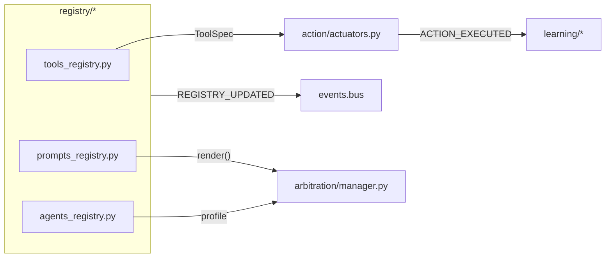

# registry/ — Tools, Prompts, and Agents Registry

**Compiled:** 2025-09-06  
**Philosophy:** *Production-first, privacy-first, explainable.* This module provides **authoritative registries** for:
- **Tools** (actuators) – what the system is allowed to do
- **Prompts** – reusable prompt templates with tags and locales
- **Agents** – profiles that bundle capabilities and defaults

It persists locally (edge), publishes change notifications, and degrades gracefully when optional subsystems are missing.

---

## 0) Where it sits



- Change notifications flow through the **event bus** (durable, ack/nack, DLQ), so learners and services can react to updates. fileciteturn1file8

---

## 1) Data contracts (envelopes)

### 1.1 ToolSpec
```json
{
  "spec_id": "files.write_text",
  "version": "1.0.0",
  "caps_required": ["files.write","workspace:shared:write"],
  "params_schema": {"type":"object","required":["path","text"],"properties":{"path":{"type":"string"},"text":{"type":"string"}}},
  "side_effects": ["filesystem_write"],
  "safety_class": "LOW",
  "timeout_ms": 4000,
  "idempotency_key_fields": ["path","sha256(text)"],
  "adapter_path": "action.tools.files_write_text:run",
  "meta": {"owner":"core","notes":"writes small text files under workspace"}
}
```

### 1.2 PromptSpec
```json
{
  "spec_id":"reply.drafts.default",
  "template":"Please write a friendly reply to {name} about {topic}.",
  "variables":["name","topic"],
  "locale":"en",
  "tags":["draft","friendly"],
  "safety_class":"LOW",
  "desc":"General polite reply template"
}
```

### 1.3 AgentSpec
```json
{
  "spec_id":"agent://planner@deviceA",
  "display_name":"Planner",
  "desc":"Plans actions and drafts using available tools",
  "allowed_tools":["files.write_text","prospective.create_reminder"],
  "default_prompt_id":"reply.drafts.default",
  "memory_spaces":["personal:*","shared:household"],
  "caps":["workspace:shared:write"],
  "policy_overrides":{"band_floor":"AMBER"}
}
```

---

## 2) Persistence

- File‑backed JSON under `./workspace/registries/{tools|prompts|agents}.json` with atomic writes.
- No network calls. Designed for **edge** and **offline‑first**.
- Offsets/notifications reuse the event bus WAL/offset model if you hook the registry changes into it. fileciteturn1file8

---

## 3) API (Python)

```python
from registry import ToolsRegistry, ToolSpec, PromptsRegistry, PromptSpec, AgentsRegistry, AgentSpec

tools = ToolsRegistry(workspace_dir=".")
tools.register_tool(ToolSpec(
    spec_id="files.write_text",
    caps_required=["files.write","workspace:shared:write"],
    params_schema={"type":"object","required":["path","text"]},
    side_effects=["filesystem_write"],
    safety_class="LOW",
    timeout_ms=4000,
    idempotency_key_fields=["path","sha256(text)"],
    adapter_path="action.tools.files_write_text:run",
))

prompts = PromptsRegistry(".")
prompts.register_prompt(PromptSpec(
    spec_id="reply.drafts.default",
    template="Please write a friendly reply to {name} about {topic}.",
    variables=["name","topic"],
    locale="en",
))

agents = AgentsRegistry(".")
agents.register_agent(AgentSpec(
    spec_id="agent://planner@deviceA",
    display_name="Planner",
    allowed_tools=["files.write_text"],
    default_prompt_id="reply.drafts.default",
    memory_spaces=["personal:*","shared:household"],
))
```

---

## 4) Validation & safety

- **ToolSpec** validates `safety_class`, requires `caps_required` list.
- **Prompts** render with a **safe formatter** – missing variables remain **visible** (`{missing}`).
- **Agents** list allowed tool IDs and caps. Use together with **policy** (RBAC/ABAC) before executing tools.

---

## 5) Notifications

When wired to the event bus, each `upsert/disable/delete` emits:

```json
{
  "type":"REGISTRY_UPDATED",
  "space_id":"shared:household",
  "subject":"tools",
  "event":"upsert|disable|delete",
  "item_id":"files.write_text",
  "ts":"..."
}
```

Durable subscribers (e.g., learning, services) can update caches or pre‑warm adapters. fileciteturn1file8

---

## 6) Why this helps Temporal & Prospective

- Prompts can include **time‑aware** phrasings (“yesterday morning”, “this Friday 6pm”), parsed by the **temporal module** to ranges for recall or scheduling, making agents more precise without leaking raw content. fileciteturn1file9

---

## 7) Future work

- Optional JSON‑Schema validation for ToolSpec.params (behind a feature flag)
- Signed registry snapshots and provenance logs
- Hot‑reload adapters with sandboxed import and health checks

---

## 8) Tests

- CRUD + persistence round‑trip
- Adapter resolve and import errors
- Prompt render with missing vars
- Agent allowed tools and defaults

---

**This registry is small by design**—transparent, file‑backed, and easy to audit. It is the single source of truth that other modules (action, arbitration, prospective) rely on.
