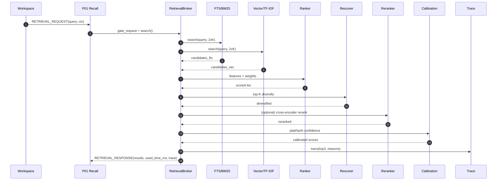

# retrieval/ — P01 Recall & P17 QoS — Hybrid Memory Retrieval & Ranking
**Compiled:** 2025-09-05T04:17:40Z
**Philosophy:** *Find the right memory, fast, on-device.* This module implements the **recall pipeline** (P01) and **QoS/cost governance** hooks (P17) for Family OS. It hybridizes **lexical (BM25)** + **vector (TF‑IDF cosine placeholder for on‑device)** + **fusion**, then **ranks**, **diversifies**, optionally **re‑ranks**, **calibrates**, and emits a **trace**. All results are **space‑scoped** and policy‑aware.

---

## 0) Placement (system view)
```mermaid
flowchart LR
  subgraph Inputs
    WSB[Workspace Broadcast]
    QRY[Query Text + Focus]
    POL[Policy Bands]
  end
  QOS[qos_gate] --> BRO[Retrieval Broker]
  WSB --> BRO
  QRY --> BRO
  subgraph Stores
    FTS[FTS/BM25]
    VEC[Vector/TF-IDF]
    KG[KG Search]
  end
  BRO --> FTS
  BRO --> VEC
  BRO --> KG
  FTS -. candidates .-> BRO
  VEC -. candidates .-> BRO
  KG  -. candidates .-> BRO
  BRO --> FEAT[features]
  FEAT --> RANK[ranker]
  RANK --> MMR[rescorer: MMR]
  MMR --> RER[cross-encoder (opt)]
  RER --> CAL[calibration]
  CAL --> TRACE[trace_builder]
  CAL --> OUT((RetrievalResponse))
```
P01 calls the broker; P17 enforces time/size budgets. Outputs flow to **Workspace**, **Arbitration**, and **Observability**.

---

## 1) Contracts (envelopes)

### 1.1 RETRIEVAL_REQUEST
```json
{
  "query_text": "birthday party balloons and candles",
  "ctx": {
    "person_id": "alice",
    "space_id": "shared:household",
    "focus_event_id": "evt-...",
    "time_budget_ms": 40,
    "top_k": 12,
    "allow_cross_encoder": false,
    "mmr_lambda": 0.35,
    "filters": {}
  }
}
```

### 1.2 RETRIEVAL_RESPONSE
```json
{
  "results": [
    {
      "doc_id": "d3",
      "score": 1.42,
      "source": "fts",
      "features": {"bm25": 0.81, "tfidf_cosine": 0.21, "recency": 0.66, "...": 0},
      "reasons": ["bm25*1.00=0.810", "tfidf_cosine*1.10=0.231", "rrf=+0.008", "conf≈0.72"]
    }
  ],
  "used_time_ms": 17,
  "trace": {"stage":"final","top3":[...] }
}
```
All fields are returned via Python objects; JSON shown for clarity.

---

## 2) Algorithms (explainable)

### 2.1 Lexical (BM25)
We implement Robertson–Sparck Jones **BM25** with k1=1.2, b=0.75:
```
score(q,d) = Σ_{t∈q} IDF(t) * ( tf(t,d)*(k1+1) / ( tf(t,d) + k1*(1-b + b*|d|/avgdl) ) )
```

### 2.2 Vector (TF‑IDF cosine, on-device)
For edge‑safety without external libs we build sparse TF‑IDF vectors and use cosine similarity.

### 2.3 Fusion
We use **Reciprocal Rank Fusion** (RRF) and include the fused value as a bump feature in the linear ranker.

### 2.4 Features → Ranker
Features include: `bm25`, `tfidf_cosine`, `recency` (exp decay with tau=14d), `personalization`, `affect_compat`, `tom_alignment`, `length_penalty`, `source_prior`.
The default **linear ranker** uses weights defined in `ranker.py` and returns **reasons** (term-by-term contributions).

### 2.5 Diversity
Apply **MMR** with lambda=0.35: maximize lambda*relevance - (1-lambda)*redundancy.

### 2.6 Optional re‑ranking
If device budget allows, a tiny **cross‑encoder** (ONNX) can refine scores; in this MVP we provide a safe placeholder bump.

### 2.7 Calibration → Confidence
Platt/tanh scaling maps raw score to [0,1]ish **confidence**.

### 2.8 Traceability
`trace_builder` records the top items and reasons for observability.

---

## 3) Files
- `types.py` — dataclasses for requests, candidates, features, responses.
- `qos_gate.py` — clamps budgets (P17).
- `broker.py` — orchestrates hybrid search, fusion, ranking, MMR, reranking, calibration, trace.
- `stores/base.py` — store interface & `IndexedDoc`.
- `stores/fts_store_adapter.py` — pure‑python BM25 FTS.
- `stores/vector_store_adapter.py` — pure‑python TF‑IDF cosine.
- `features.py` — feature engineering (recency, priors, penalties).
- `fusion.py` — reciprocal rank fusion.
- `ranker.py` — linear ranker with explainability.
- `rescorer.py` — MMR diversity.
- `reranker.py` — cross‑encoder hook (placeholder).
- `calibration.py` — Platt/tanh.
- `trace_builder.py` — compact traces.
- `demo_index.py` — runnable example.

---

## 4) Sequence (recall path)


---

## 5) Policy & privacy
- **Space‑scoped** results only; respect ABAC filters passed via `ctx.filters` (e.g., `{"allow_shared": false}`).
- No network I/O; pure Python edge implementation.
- No raw media stored; only text chunks already permitted by policy.

---

## 6) Performance
- Designed for **≤40–60ms** typical on modest devices for K≤12 and small local indexes.
- All structures are in‑memory; indexes rebuild quickly (see `FTSStoreAdapter.rebuild`).

---

## 7) Quickstart
```python
from retrieval.demo_index import quick_demo
quick_demo()
```

---

## 8) Future work
- Swap TF‑IDF placeholder for quantized embedding service (`embeddings/service.py`, P08).
- Add **near-duplicate** filtering via MinHash/SimHash (`retrieval/lsh.py`).
- Personalized priors from **Affect** and **ToM**; band‑aware filtering.
- Online learning of ranker weights with user clicks/accepts (safe on-device).
