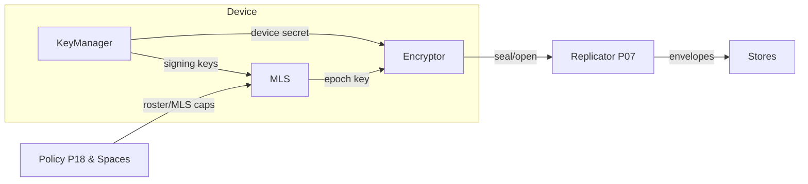
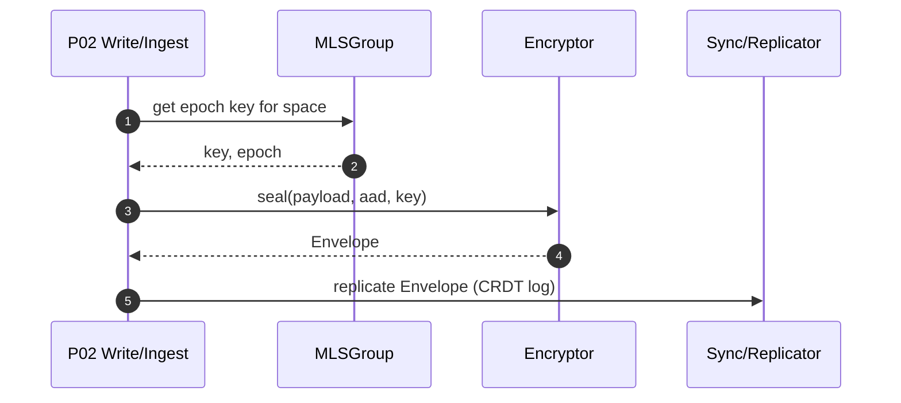

# security/ — World‑Class On‑Device Security (P12 + P07 helpers)
**Compiled:** 2025‑09‑06
**Philosophy:** *Privacy‑first. Local‑first. Explainable. Replaceable cryptography.*

This module is the **security heart** of Family OS. It turns a device into a **sovereign member** of a private,
encrypted network of family spaces. It ships production‑ready interfaces, a safe default implementation,
and explicit seams to plug in hardware or audited crypto stacks.

> ⚠️ **Important**
> This package includes a `BestAvailable` crypto provider that uses `cryptography` (AES‑GCM, Ed25519, X25519) **if installed**.
> If not available, it falls back to **dev‑only** primitives (HKDF + XOR‑AEAD) so unit tests can run on any machine.
> **Never ship DevHMACCrypto/XOR‑AEAD to production.**

---

## 0) Where P12 sits (system view)



- **KeyManager**: encrypted local keystore (scrypt‑derived) holding device signing key.
- **MLSGroup**: space roster → per‑epoch symmetric key.
- **Encryptor**: AEAD sealing/unsealing of event payloads (E2EE).
- **RatchetSession**: optional pairwise ratchet (agent↔device chat, debug links).

---

## 1) Data Contracts (Envelopes)

### 1.1 Device public identity (export)
```json
{
  "device_id": "device:phone1",
  "signing_pk": "base64(Ed25519 public key bytes)"
}
```

### 1.2 Space roster (concept)
```json
{
  "space_id": "shared:household",
  "members": [
    {"device_id":"device:phone1","signing_pk_b64":"..."},
    {"device_id":"device:laptop","signing_pk_b64":"..."}
  ]
}
```

### 1.3 Encrypted Envelope (AEAD)
```json
{
  "version": "1",
  "space_id": "shared:household",
  "epoch": 7,
  "sender": "device:phone1",
  "nonce_b64": "base64(nonce)",
  "aad_b64": "base64(canonical json: {type,event_id,...})",
  "ct_b64": "base64(ciphertext||tag)",
  "created_at": 1736200000.1
}
```

**AAD** binds policy‑relevant metadata (event type, ids) without exposing content.

### 1.4 Keystore file (`keystore.json.enc`)
```json
{"salt":"...","nonce":"...","ct":"..."}
```
Where `ct = AEAD_Encrypt(scrypt(passphrase, salt), nonce, aad="keystore", json(device keys))`.

---

## 2) Cryptographic Design (clear & replaceable)

### 2.1 Group epoch (MLS‑like)
A real MLS group uses TreeKEM. Here we implement a deterministic **per‑epoch secret** for the space:

\[ D = H(\text{roster}) = H((d_1, pk_1) \| ... \| (d_n, pk_n)) \]
\[ s_{t+1} = \mathrm{HKDF}(\text{IKM}=s_t,\ \text{salt}=D,\ \text{info}="fos-mls/"+space+"/epoch/"+t,\ \text{len}=32) \]

- Any roster change → new digest `D` → automatic epoch rotation.
- The derived 32‑byte value is used as the AEAD key for the space in epoch `t`.

### 2.2 AEAD
- **Preferred:** AES‑GCM with 96‑bit random nonce, via `cryptography`.
- **Dev fallback:** XOR stream + HMAC(SHA‑256) (NOT secure; tests only).

### 2.3 Pairwise ratchet (optional)
- Root key from a shared secret (X25519 if available, else random).
- Each message advances a chain: `(mk, ck') = HKDF(ck, info=("msg","ck"))`.
- We demonstrate **forward secrecy** behavior and clean decryption API.

> Replace ratchet with an audited **Noise** or **LibOlm** session for production chat.

---

## 3) Files & Responsibilities

```
security/
├─ interfaces.py   # Protocols for AEAD and CryptoProvider
├─ keys.py         # Crypto providers: BestAvailable (AES‑GCM/Ed25519/X25519) and DevHMACCrypto (dev)
├─ key_manager.py  # Encrypted keystore (scrypt) with device identity
├─ encryptor.py    # AEAD envelope seal/open helpers
├─ mls_group.py    # Roster → epoch key; helpers for sealing to a space
├─ ratchet.py      # Tiny pairwise ratchet (dev/demo)
├─ errors.py       # Typed exceptions
└─ README.md       # You are here
tests/unit/security/… # Round‑trip, epoch rotation, keystore persistence, ratchet
```

---

## 4) API Cheatsheet

```python
from pathlib import Path
from security import KeyManager, MLSGroup, Encryptor

# Device identity (encrypted at rest)
km = KeyManager(Path("./.fos_sec"), passphrase="choose-a-strong-pass")
ident = km.get_or_create_device_identity("device:phone1")
pub = km.export_public_identity()

# Space group (roster → epoch key)
g = MLSGroup("shared:household")
g.add_member(pub["device_id"], pub["signing_pk"])   # add yourself
key = g.export_epoch_key()                          # 32 bytes

# Seal an event payload
enc = Encryptor()
env = enc.seal(key=key, space_id=g.space_id, epoch=g.epoch, sender=ident.device_id,
               aad={"type":"event.write","event_id":"e1"}, plaintext=b"...")
wire = enc.to_json(env)

# Open it later
env2 = enc.from_json(wire)
pt = enc.open(env2, key=key)
```

---

## 5) Sequences

### 5.1 Member joins → epoch rotates
```mermaid
sequenceDiagram
  autonumber
  participant Space as Space (roster)
  participant MLS as MLSGroup
  participant ENC as Encryptor
  Space->>MLS: add_member(deviceB, pkB)
  MLS->>MLS: recompute roster_digest()
  MLS->>MLS: epoch = epoch + 1; epoch_secret = HKDF(prev, digest, info)
  MLS-->>ENC: export_epoch_key()
```

### 5.2 Write path with E2EE


---

## 6) Operational Guidance

- **Passphrase**: set env `FOS_DEVICE_PASSPHRASE` or pass `KeyManager(..., passphrase="...")`.
- **Backup**: copy the encrypted `keystore.json.enc` and the passphrase to a **separate** safe location.
- **Rotation**: call `KeyManager.rotate_signing_key()` after device transfer/repair.
- **Join a space**: collect each device’s `export_public_identity()` → build the roster → `MLSGroup.add_member()` for all.
- **Audit**: log roster digests and epochs into your `sync/crdt_log` for transparency.

---

## 7) Hardening Checklist (production)

- [ ] Install `cryptography` and verify AES‑GCM/Ed25519/X25519 are active (no dev fallback).
- [ ] Prefer **hardware‑backed** secrets (Secure Enclave / StrongBox / TPM).
- [ ] Replace `MLSGroup` with audited **OpenMLS** (TreeKEM) or platform MLS.
- [ ] Replace `RatchetSession` with **Noise** or **Olm/Matrix** session.
- [ ] Pin AEAD nonces to a per‑device counter (monotonic) to prevent reuse.
- [ ] Add **key transparency** (gossip log of device public keys).
- [ ] Implement **welcome secrets** for late joiners without history replay.
- [ ] Continuous **fuzzing** & negative tests for envelope parsing.

---

## 8) Unit Tests

Run with **WARD** (works even without `cryptography` using dev fallback):
```bash
python -m ward test --path tests/unit/security/
```

Tests include:
- Encryptor round‑trip with AEAD
- Keystore persist → reload
- MLS epoch rotates when roster changes
- Ratchet send/receive forward progress

---

## 9) Integration Points

- **Sync (P07)**: replicate opaque `Envelope` blobs; no server‑side decryption.
- **Policy (P18)**: controls who may **join** a space roster; enforces consent.
- **Spaces**: each memory space maps to **one** MLSGroup. Epoch bumps are **append‑only** events.
- **Storage (ST)**: store envelopes as blobs; decrypt only on authorized devices.

---

## 10) Limitations & Ethics

- Dev fallbacks are intentionally simple and **not** cryptographically safe.
- Never upload raw keys; only distribute **public** identities.
- Family OS is a **home member**, not ad tech. **No cloud scraping.**

---

*Be proud: your memories stay yours.*
