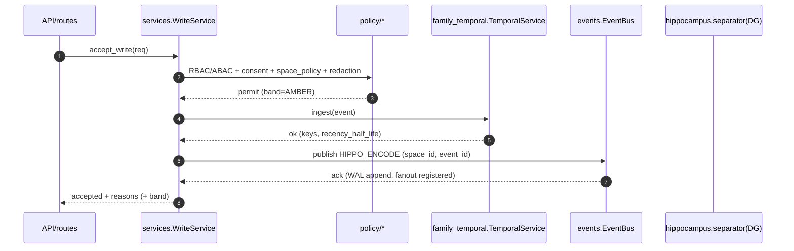
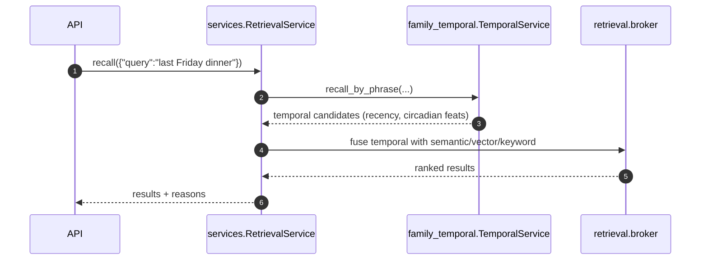

# services/README.md

> **Compiled:** 2025‑09‑06
> **Philosophy:** *Production‑first, privacy‑first, explainable.*
> The **services** layer is the “operating system API” for cognitive pipelines. It exposes safe entry points for **write**, **recall**, **indexing**, **consolidation**, and **identity** while speaking on the local **Event Bus** for robust, auditable orchestration.

---

## 0) Where `services/` sits

```mermaid
flowchart LR
  subgraph API[API Layer]
    RT[api/routes.py]
    PR[api/prospective.py]
    ML[api/ml.py]
  end

  subgraph SVC[services/*]
    WS[write_service.py]
    RS[retrieval_service.py]
    IS[indexing_service.py]
    CS[consolidation_service.py]
    PID[personal_identity_service.py]
    SBM[service_manager.py]
  end

  subgraph BUS[events/ (WAL, DLQ, durable)]
    EB[EventBus]
  end

  subgraph TMP[family_temporal/]
    TAPI[TemporalService]
  end

  subgraph HIP[hippocampus/*]
    DG[separator(DG)]
    CA3[completer(CA3)]
  end

  RT --> WS
  RT --> RS
  PR --> CS
  ML --> IS

  WS -- HIPPO_ENCODE --> EB
  EB -- replay/fanout --> CS
  WS -- Temporal.ingest --> TAPI
  RS -- Temporal.query --> TAPI
  RS -- time candidates --> HIP
  IS -- indexing jobs --> EB
```

* The Event Bus provides durable fan‑out (per‑topic WAL, durable consumer groups, DLQ, backoff). *At‑least‑once* delivery demands idempotent handlers.&#x20;
* Temporal is used as: `WS.ingest → TemporalService.ingest`, `RS.query → TemporalService.recall_by_phrase/slice` to turn time into actionable cognition.&#x20;

---

## 1) What this layer guarantees (non‑negotiables)

* **Policy‑first:** Every ingress call runs **RBAC/ABAC**, consent, space policy, and **P10 redaction** before touching stores or publishing events.
* **Privacy by architecture:** Only **derived** artifacts leave a service boundary (no raw media); *space‑scoped* access enforced end‑to‑end.
* **Explainability:** Every decision includes **reasons**; every event and store write leaves an **auditable trace** (bus WAL + receipt).
* **Device‑safe:** No network by default; bounded CPU time; cooperative async; idempotent handlers.
* **Observability:** Spans, counters, histograms (latency, error classes, backoff); WAL + DLQ visibility via workspace files (human‑readable JSONL).

---

## 2) Envelopes (canonical)

### 2.1 Write (P02) — Request → Accept → Emit

**Request** (after API redaction & policy pre‑check):

```json
{
  "space_id": "shared:household",
  "person_id": "alice",
  "event_id": "evt-2025-09-06-001",
  "ts": "2025-09-06T14:22:03.120Z",
  "tz": "America/Chicago",
  "content": {"type":"text","text":"Dinner at 6 with grandparents."},
  "tags": ["note","family"],
  "affect_hint": {"urgent": false},
  "trace_id": "trace-abc"
}
```

**Accept → Outputs**

```json
{
  "status":"accepted",
  "stored": {"episodic_rowid":"e_9a12","bytes":87},
  "temporal": {"indexed": true, "keys":["2025/36/6/18"], "recency_half_life_h":72},
  "hippo": {"emitted": true, "op":"HIPPO_ENCODE"},
  "band":"AMBER",
  "reasons":["policy: ok","redaction: ok","temporal: ok","hippocampus: encode enqueued"],
  "trace_id":"trace-abc"
}
```

> The write flow **publishes** a `HIPPO_ENCODE` event; the bus persists to WAL and fans out to durable consumers (e.g., consolidation).&#x20;
> Write also **ingests** to the temporal indexer (multi‑resolution keys) to enable recency and relative‑phrase recall.&#x20;

---

### 2.2 Recall (P01) — Queries

**Free‑form**

```json
{"space_id":"shared:household", "query":"last Friday dinner", "k":30, "trace_id":"tr-2"}
```

**Temporal slice**

```json
{"space_id":"shared:household", "from":"2025-09-05T00:00:00Z", "to":"2025-09-06T00:00:00Z", "k":50}
```

**Response**

```json
{
  "status":"ok",
  "candidates":[
    {"event_id":"evt-...","ts":"2025-09-05T18:06:00Z","recency":0.79,"reason":["phrase:yesterday evening→18–23","half_life_h=72"]},
    {"event_id":"evt-...","ts":"2025-09-05T19:10:00Z","recency":0.77,"reason":["range match"]}
  ],
  "trace_id":"tr-2"
}
```

---

### 2.3 Indexing (P08) — Embedding lifecycle

**Job**

```json
{"event_id":"evt-...","space_id":"shared:household","priority":"normal","trace_id":"tr-i1"}
```

**Ack**

```json
{"status":"queued","qsize":3,"eta_ms":250,"trace_id":"tr-i1"}
```

---

### 2.4 Consolidation (P03) — Jobs

**Kickoff**

```json
{"space_id":"shared:household","job":"rollup","horizon_days":30,"trace_id":"tr-c1"}
```

**Result**

```json
{"status":"started","job_id":"rollup-2025-36","trace_id":"tr-c1"}
```

---

## 3) Algorithms & Safety Math

### 3.1 Idempotency keys

* **Write:** `idem = sha256(space_id|person_id|event_id)`
* **Indexing job:** `idem = sha256(space_id|event_id|model_ver)`
* **Consolidation job:** `idem = sha256(space_id|job|horizon_days|window_start)`

### 3.2 Backoff with jitter (for bus handler retries)

$$
\text{delay}_n = \min(B_{\max}, B_0 \cdot 2^n) \times (1 + \mathcal{U}(-\delta, \delta)),\quad n=0,1,2\dots
$$

Defaults: $B_0=0.25$s, $B_{\max}=10$s, $\delta=0.2$. Handler **nacks** cause requeue with backoff; max‑retry → DLQ.&#x20;

### 3.3 Recency (temporal ranking)

$$
s_\text{recency} = 2^{-\Delta t/h},\quad h=72\,\text{h (default)}
$$

Used by Temporal when returning candidates; we surface the **reason** with half‑life to keep it explainable.&#x20;

---

## 4) Sequences (Mermaid)

### 4.1 Write (P02): **policy → temporal → hippocampus → bus**



### 4.2 Recall (P01): **phrase → timelex → candidates**



---

## 5) Integration contracts (what we expect from neighbors)

* **events/**: `EventBus.publish/subscribe`, WAL paths, durable groups, DLQ conventions (JSONL). Handlers MUST be **idempotent**.&#x20;
* **family\_temporal/**: `TemporalService.ingest`, `recall_by_phrase`, `summarize`. No raw content needed; timestamps + space/person are enough.&#x20;
* **policy/**: `rbac.permit`, `abac.permit`, `consent.permit`, `space_policy.apply`, `redactor.scrub`.
* **hippocampus/**: `separator.encode(event)` (DG) via bus `HIPPO_ENCODE`; CA3 consumes temporal candidates during recall.
* **storage/**: `episodic_store.append`, `workspace_store`, `receipts_store`, **atomic** writes only.
* **retrieval/**: `broker.search` (expects optional temporal priors for fusion).
* **observability/**: `metrics.emit`, `trace.start/end`.

---

## 6) Security & Privacy

* All calls carry `space_id` and actor context; **ABAC** gates are checked on every ingress.
* Temporal/Indexing store **only derived** keys and minimal metadata; **no PII**.
* Event payloads stay **space‑scoped**; WAL files are local and **E2EE** when replicated.
* Redaction (P10) is enforced **before** writing/encoding.
* Services run **without network** by default; sandboxing profiles can tighten FS paths.

---

## 7) Testing & Ops

* Unit tests: idempotency, policy denial branches, temporal integration stubs, bus retry & DLQ.
* Load: p50/p95 latency budget per call; backpressure via bounded queues.
* SRE: WAL size alerts, DLQ growth alerts, consolidation backlog alerts.

---

## 8) Future roadmap

* **Batch** ingestion (micro‑batch HIPPO\_ENCODE to reduce WAL pressure).
* **Adaptive half‑life** per person/space (Learning P06).
* **Plan‑aware write** (planner hints adjust band + projection target).
* **Backfill** tools (reindex temporal/embeddings with compaction windows).

---
