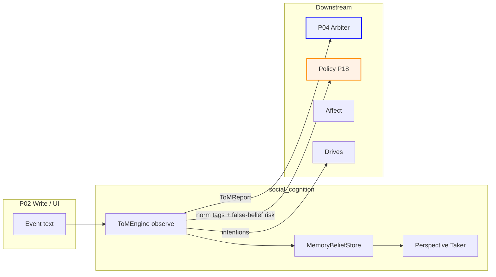
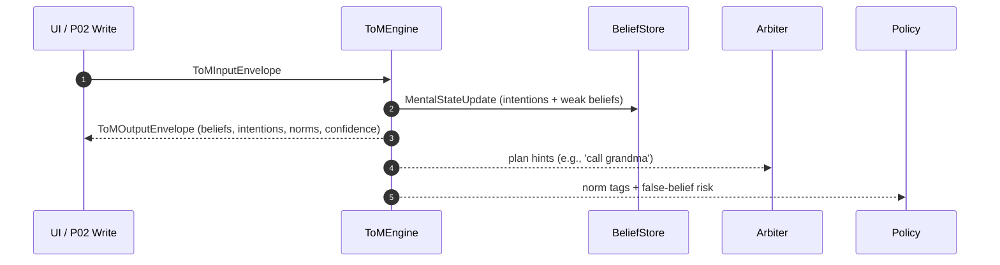

# social_cognition/ — Theory‑of‑Mind (ToM) for Family‑OS
**Compiled:** 2025-09-05T00:50:45Z  
**Audience:** Everyone — product, engineers, and curious parents/guardians.  
**Goal in one line:** Keep a small, explainable “mind model” for each person so agents can plan kindly, share safely, and prevent avoidable conflicts — **entirely on‑device**.

---

## Why should I care? (Plain‑English)
When a family member types or says something, it helps to know **what they probably believe**, **what they want**, and **what they might do next**. This module gives the system a tiny, privacy‑respecting sense of “what’s in their head” — just enough to plan helpfully and safely. It does **not** psychoanalyze; it simply tracks obvious signals, like “I should call grandma” → probably intends to call grandma.

**Promises we keep**
- **On device**: no cloud. Only small numbers/tags are stored.
- **Explainable**: you can see exactly **why** the system inferred something.
- **Family‑safe**: designed for homes; no raw audio/video ever leaves the device.

---

## Table of contents
- [social\_cognition/ — Theory‑of‑Mind (ToM) for Family‑OS](#social_cognition--theoryofmind-tom-for-familyos)
  - [Why should I care? (Plain‑English)](#why-should-i-care-plainenglish)
  - [Table of contents](#table-of-contents)
  - [What it is (concepts)](#what-it-is-concepts)
  - [How it fits Family‑OS](#how-it-fits-familyos)
    - [Output — ToMOutputEnvelope (mirrors ToMReport)](#output--tomoutputenvelope-mirrors-tomreport)
  - [End‑to‑end flow](#endtoend-flow)
  - [Algorithms (math you can read)](#algorithms-math-you-can-read)
    - [1) Intention detection from text (BDI‑lite)](#1-intention-detection-from-text-bdilite)
    - [2) Belief update (tiny, explainable)](#2-belief-update-tiny-explainable)
    - [3) Norm judgments (tiny lexicon)](#3-norm-judgments-tiny-lexicon)
    - [4) Perspective \& false‑beliefs](#4-perspective--falsebeliefs)
    - [5) Confidence (simple \& safe)](#5-confidence-simple--safe)
    - [6) Optional upgrade (Beta‑Binomial beliefs)](#6-optional-upgrade-betabinomial-beliefs)
  - [Data model \& storage](#data-model--storage)
  - [API (use in 10 lines)](#api-use-in-10-lines)
  - [Configuration knobs](#configuration-knobs)
  - [Testing \& evaluation](#testing--evaluation)
    - [Unit tests (what to cover)](#unit-tests-what-to-cover)
    - [Benchmarks we aim to align with](#benchmarks-we-aim-to-align-with)
  - [Privacy, bias \& safety notes](#privacy-bias--safety-notes)
  - [Troubleshooting](#troubleshooting)
  - [Roadmap](#roadmap)
  - [Glossary](#glossary)
  - [File map (what’s in this folder)](#file-map-whats-in-this-folder)

---

## What it is (concepts)

**Belief** — what a person currently thinks is true (with a probability).  
**Desire** — a goal they care about (with a strength).  
**Intention** — a plan they might act on (with a commitment).  
**Norm** — a social hint like *polite*, *repair*, *coercion* (tiny, auditable list).  
**Perspective** — what each person has **seen** so far; used to spot **false beliefs**.
**Space** — a memory “room” (personal, selective, shared…). ToM is per‑person **per‑space**.

We implement a lightweight **BDI** pattern (Belief–Desire–Intention) that’s tiny enough for phones and laptops.

---

## How it fits Family‑OS


  classDef orange fill:#fff2e6,stroke:#FF8800,stroke-width:2px
```

**What it enables**
- Arbiter gets **plan hints** (e.g., “call grandma”) to propose next‑step actions.
- Policy gets **norm** and **false‑belief** signals for **share safety**.
- Drives can shape **motivation** (e.g., encourage prosocial acts).

---

## Inputs/Outputs (envelopes)

### Input — ToMInputEnvelope
```json
{
  "person_id": "alice",              // whose mind we infer
  "actor_id": "alice",               // who produced/saw the event
  "space_id": "shared:household",    // memory space
  "event_id": "evt-2025-09-05-001",
  "text": "I think I should call grandma after dinner.",
  "affect_hint": [0.2, 0.35],        // optional (valence, arousal)
  "relations": { "alice:grandparent_of:bob": "grandparent" },
  "observed_event_ids": ["evt-2025-09-04-010","evt-2025-09-04-011"]
}
```

**Rules**
- `person_id`, `actor_id`, `space_id`, `event_id`, `text` are required.  
- All hints are optional; the system degrades gracefully.

### Output — ToMOutputEnvelope (mirrors ToMReport)
```json
{
  "event_id": "evt-2025-09-05-001",
  "space_id": "shared:household",
  "person_id": "alice",
  "inferred": {
    "belief:wants:should call grandma after dinner": 0.55
  },
  "intentions": [
    {"plan": "should call grandma after dinner.", "commitment": 0.72}
  ],
  "norm_judgments": [
    {"tag": "polite", "pressure": 0.15, "confidence": 0.6}
  ],
  "confidence": 0.68,
  "notes": ["heuristic_inference_v1"]
}
```

**Contract invariants**
- No raw media is stored. Only strings already in the event + small numbers/tags.
- All state is **per person per space** and syncs only to devices permitted in that space.

---

## End‑to‑end flow



---

## Algorithms (math you can read)

We aim for formulas that are **honest, small, and audible** (you can check the numbers).

### 1) Intention detection from text (BDI‑lite)
We scan for cues and add up weights:

- **Desire verbs**: *want, hope, need, plan…* → `+0.40`  
- **Deontic modals**: *should, must, ought…* → `+0.20`  
- **Future commit**: “will / going to / gonna / I'll” → `+0.30`  
- **Hedging**: *maybe, I guess, might…* → `−0.25`

**Commitment score**
```
commitment = clip( Σ weights , 0 , 1 )
```
We also try to capture the **plan** as the clause after these cues (up to ~160 chars).

### 2) Belief update (tiny, explainable)
Each intention adds a weak belief:
```
P( belief:wants:{plan} ) = max( 0.5 , commitment )
```
This is a **prior** for planners (not a promise).

### 3) Norm judgments (tiny lexicon)
We tag simple patterns (e.g., *please* → “polite” `+0.15`, *threat* → “coercion” `−0.6`). The point is **interpretability**. Later we can plug a compact classifier distilled from larger “social norms” datasets.

### 4) Perspective & false‑beliefs
We log which event IDs an actor has **seen**. If a ground‑truth proposition `p` is known with probability `T`, and the actor’s belief is `B`, then **divergence**:
```
divergence(p) = | T − B |
```
Large divergence suggests a **false‑belief risk** → the agent may choose **clarify** over **act**.

### 5) Confidence (simple & safe)
We combine signal confidences with a “Noisy‑OR” style:
```
c_fused = 1 − Π (1 − c_i)
```
If we only have intentions, we can approximate by averaging commitments:
```
c ≈ average(commitment_i) or 0.5 if none
```

### 6) Optional upgrade (Beta‑Binomial beliefs)
If we log how often a belief was supported/contradicted, we keep counts `(α, β)` and update:
```
posterior mean = α / (α + β)
```
with small priors like `(α0=1, β0=1)` so it starts neutral. This is an **optional** future extension; current code keeps it simple.

---

## Data model & storage

```
state[(space_id, person_id)] = MentalState {{ 
  beliefs:   {{ proposition -> Belief(truth_prob, confidence, source) }},
  desires:   {{ goal -> Desire(strength) }},
  intentions:{{ plan -> Intention(commitment, deadline?) }},
  affect_hint: (valence, arousal)?
}}
visibility[(space_id, actor_id)] = set(event_ids_seen)
```

- Stored in the **edge store** (SQLite/CRDT in production).  
- **Per space** — matches Family‑OS spaces (personal/selective/shared/etc.).  
- **Sync** uses MLS keys per space; only authorized devices replicate.

---

## API (use in 10 lines)

```python
from social_cognition import ToMEngine, ToMConfig, Observation, MemoryBeliefStore

store = MemoryBeliefStore()
tom = ToMEngine(store, ToMConfig())

obs = Observation(
  space_id="shared:household",
  event_id="evt-2025-09-05-001",
  actor_id="alice",
  person_id="alice",
  text="I think I should call grandma after dinner."
)

report = tom.observe(obs)    # returns ToMReport
print(report.intentions, report.beliefs, report.norms, report.confidence)

# Access state later:
st = store.get_state("shared:household", "alice")
print(list(st.intentions.keys()))  # plan strings we have recorded
```

---

## Configuration knobs

- **Cue weights** (desire, deontic, future, hedging).  
- **Min commitment** to accept an intention (default ≈ `0.35`).  
- **Norm lexicon** (polite/repair/aggressive/coercion).  
- **Max plan length** (default 160 chars).  
- **Confidence smoothing** (EMA `α` if you want).

All of these are constants in code today; can be moved to a YAML if needed.

---

## Testing & evaluation

### Unit tests (what to cover)
- Intention cues → commitments at edges (hedging negates over‑commit).
- Belief update → ensures `≥ 0.5` lower bound.  
- Norm tagging → match simple phrases.  
- Perspective → false‑belief divergence computed correctly.

### Benchmarks we aim to align with
- **Social IQa**: social commonsense QA (sanity checks for norms).  
- **SOTOPIA**: interactive role‑play tasks (multi‑turn social goals).  
- **ToMBench**: broader ToM skills incl. false‑belief robustness.

We will export small adapters later; for now we rely on unit tests + synthetic conversations.

---

## Privacy, bias & safety notes

- **Data minimization**: we never store raw audio/video; only event text and small numbers/tags.
- **Scope**: ToM is a **hint** system, not a diagnosis. Always defers to parental controls/policy.
- **Bias**: norm lexicons can reflect culture. Keep them **small, reviewable, and localizable**.
- **Failure mode**: if confidence is low, do **nothing smart**; prefer asking or waiting.

---

## Troubleshooting

- **“It inferred a plan too often.”** Lower the weights or raise the minimum commitment (e.g., from `0.35` to `0.5`).  
- **“It missed polite tags.”** Add phrases like “thanks a lot” to the norm lexicon.  
- **“False‑belief alerts too noisy.”** Only compute divergence when a reliable “truth” exists (e.g., from a confirmed calendar/log).

---

## Roadmap

1. **Dialogue‑act micro‑model (int8)**: classify request/promise/threat/apology/indirect request.  
2. **Belief calculus**: Beta‑Binomial with per‑source reliability.  
3. **Second‑order ToM**: triangles (what Alice thinks Bob thinks).  
4. **Norm store distillation**: compress large social‑norm datasets into on‑device embeddings + k‑NN.  
5. **Evaluation harness**: ToMBench & SOTOPIA adapters.

---

## Glossary

- **BDI** — Belief–Desire–Intention, a classic way to think about agents.
- **Commitment** — number in `[0,1]` for how likely a plan will happen.
- **Confidence** — rough trust in a particular inference; also `[0,1]`.
- **Norm** — a small, transparent social label like *polite* or *coercion*.
- **Perspective** — what an actor has seen so far; used for false‑belief checks.

---

## File map (what’s in this folder)

- `theory_of_mind.py` — **ToMEngine** (observe → infer → update → report).  
- `belief_state.py` — data classes + per‑space store + visibility.  
- `intent_inference.py` — cue detection & plan extraction.  
- `social_norms.py` — norm tagging (tiny, auditable).  
- `perspective_taker.py` — visibility logging + divergence helper.  
- `relations.py` — simple relation graph.  
- `envelopes.py` — input/output schemas.  
- `__init__.py` — convenience imports.

---

**Design principle:** *Small first, smart later.* Start with rules you can explain to a teenager; add tiny models only when needed and always on‑device.
