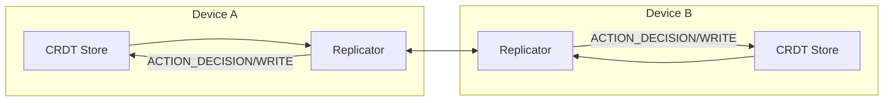
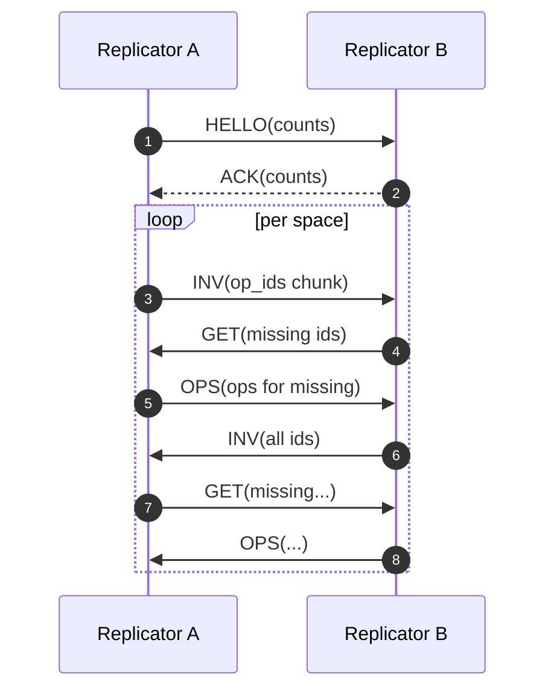

# sync/ — P07 Peer‑to‑Peer Sync (CRDT + E2EE hooks)

**Compiled:** 2025-09-06 03:30:08

This module implements offline‑first, conflict‑free replication across devices in a family space. It uses an
**operation‑based CRDT** (append‑only DAG) and a tiny **push‑pull replicator**. The crypto and transport layers are
**pluggable** so production builds can attach MLS (Messaging Layer Security) and real transports (BLE/WebRTC/LAN).

---

## 0) Where P07 sits (system view)



- **Inputs:** local operations from write path (`storage/*_store.py`), policy annotations (`policy/*`), and CRDT annotations from other subsystems.
- **Outputs:** the same operations on the remote device. Idempotent, space‑scoped, and verifiable.

---

## 1) Envelopes

### 1.1 Operation (CRDTOp)

```json
{ "op_id":"...","space_id":"shared:household","author_id":"device:phone1",
  "lamport":42,"ts":1736200000.1,"parents":["..."],"kind":"event.write",
  "payload":{"event_id":"evt-123","content":"Hello"} }
```

### 1.2 Replicator messages

| Type | Purpose | Shape (core fields) |
|---|---|---|
| `HELLO` | optional greeting | `{type:"HELLO", counts:{space->op_count}}` |
| `INV` | advertise inventory | `{type:"INV", space_id, op_ids:[...]}` |
| `GET` | request specific ops | `{type:"GET", space_id, op_ids:[...]}` |
| `OPS` | send concrete ops | `{type:"OPS", space_id, ops:[CRDTOp...]}` |
| `ACK` | ack hello | `{type:"ACK", counts:{...}}` |

**Crypto:** `Transport.send` is given a clear `Envelope` in dev. In production, the Replicator calls `crypto.wrap(env)` and the remote side calls `crypto.unwrap(blob)`.

---

## 2) CRDT model (quick math, simple & solid)

- Each space is a **DAG** of operations. An op is \\(o = \\langle id, author, ts, \\lambda, parents, kind, payload\\rangle\\).
- We track **heads** \\(H\\) (ops with no children). Adding operation `x` removes its parents from \\(H\\) and inserts `x`.
- Convergence: all devices apply the **same multiset of ops**. Effects are derived by higher layers (e.g., event stores).

**Lamport:** when creating local ops, lamport \\(\\lambda = \\max(\\lambda_{local}, \\max(\\lambda_{parents})) + 1\\). Stable total order is `(lamport, op_id)`.

---

## 3) Protocol (push‑pull)



- **Idempotent**: re‑sending the same op does nothing (`add_op` returns False).
- **Chunked**: inventories are chunked (default 256 ids). Real deployments would send summaries & Bloom filters instead.

---

## 4) Files

```
sync/
├─ __init__.py
├─ types.py          # CRDTOp, Envelope, SpaceHeads, SyncStatus
├─ interfaces.py     # Transport, CryptoProvider, CRDTStore
├─ crdt.py           # DAG core, lamport, heads, stable order
├─ crdt_log.py       # MemoryCRDTStore (dev) + local op helper
├─ keys.py           # NullCrypto + DevHMACCrypto (plug MLS here)
├─ replicator.py     # push-pull protocol (INV/GET/OPS/HELLO/ACK)
├─ sync_manager.py   # orchestration + in-memory duplex link
├─ status.py         # PeerState, ManagerStats
└─ README.md         # this file
```

---

## 5) API usage

```python
from sync import SyncManager

# Create two local managers linked with an in-memory transport
A, B, repA, repB = SyncManager.make_linked_pair("phoneA","tabletB")

# Create some local ops on A
A.create_local_op("shared:household","device:phoneA","event.write",{"event_id":"e1","content":"hey"})
A.create_local_op("shared:household","device:phoneA","event.write",{"event_id":"e2","content":"hello"})

# Run one sync round
repA.sync_once()
repB.sync_once()

# A and B now converge on the same ops
```

---

## 6) Performance & privacy

- **No raw media** is sent here; only **CRDT ops** already redacted at write path (P10).
- **Space‑scoped keys**: in production, wire `CryptoProvider` to your MLS group per space (see `security/mls_group.py`).
- **Resource bounds**: inventories are chunked. Transport must enforce rate‑limits and timeouts.
- **Replay safe**: ops are uniquely addressed by `op_id` (content hash over author/lamport/ts).

---

## 7) Future upgrades

- Replace full inventories with **Merkle/Bloom** summaries.
- Add **compaction** (send range by lamport) and **tombstone** GC with policy cascade.
- Add **live stream mode** (subscribe to new ops).

---

## 8) Tests

- `tests/unit/sync/test_roundtrip.py` — two peers converge after push‑pull.
- `tests/unit/sync/test_fork_merge.py` — concurrent edits converge.
- `tests/unit/sync/test_crypto.py` — DevHMACCrypto verifies integrity.

Run:
```bash
python -m ward test --path tests/sync/
```
