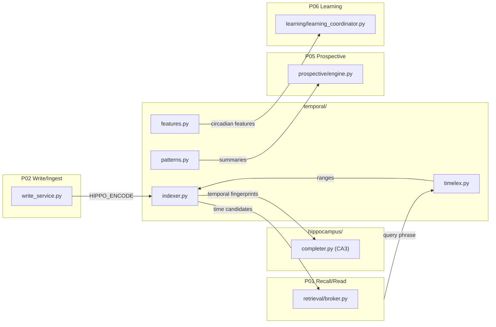
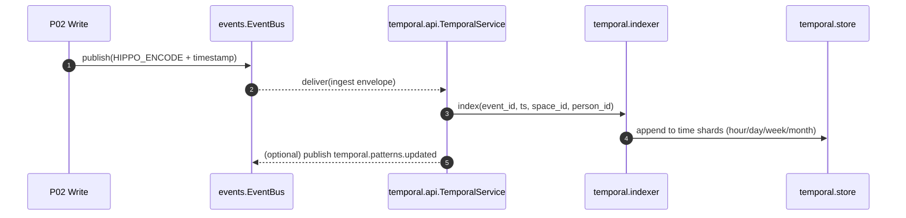
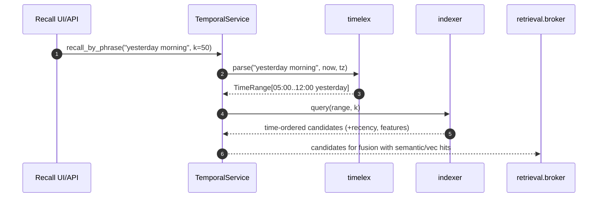
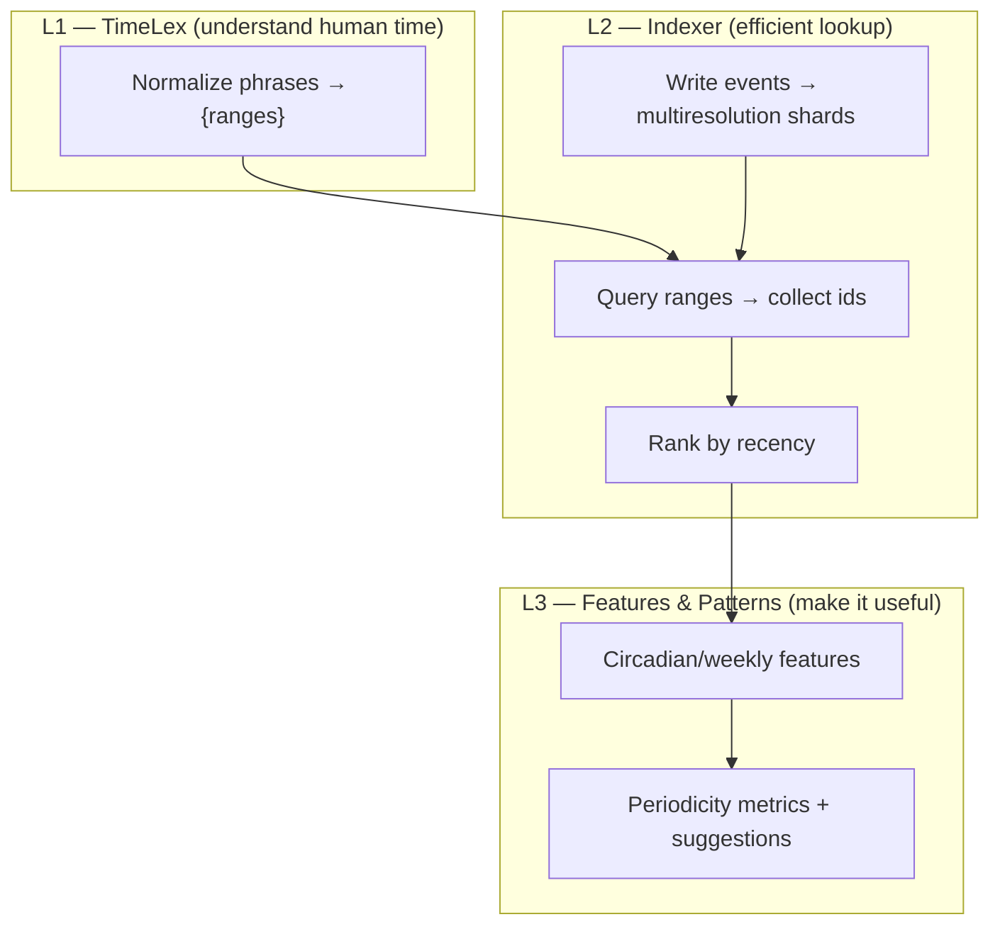

# temporal/ — Time Indexing, Relative Phrases & Patterns (P01, P03, P05, P06)

**Compiled:** 2025‑09‑06
**Philosophy:** *Production‑first, privacy‑first, explainable.*
The temporal module turns raw timestamps into **useful cognition**:

* Multi‑resolution **time indexing** for fast recall.
* Human‑friendly **relative time phrase parsing** (“yesterday morning”, “last Friday night”).
* **Recency** math for ranking; **circadian & weekly** features for prediction.
* **Pattern discovery** to power Prospective (reminders/triggers) and Learning.

It is purely **on‑device**, stores only **time metadata** (no content), and respects **space scoping** and **encryption** policies.

---

## 0) Where the Temporal module sits (system view)



* **Inputs:** ingestion events from P02 + recall queries from P01.
* **Outputs:** time‑ordered candidates (with recency & features), pattern summaries for Prospective, and compact temporal fingerprints for Hippocampus CA3.&#x20;

---

## 1) Files at a glance

```
family_temporal/
├─ __init__.py
├─ api.py            # TemporalService: ingestion, recall, summarize (facade)
├─ indexer.py        # TemporalIndexer: multiresolution keys, recency ranking
├─ store.py          # In-memory + optional SQLite-like persistence
├─ timelex.py        # Relative phrase parser ("last week", "yesterday morning", …)
├─ features.py       # Recency, circadian/weekly features, time-cell embeddings
├─ patterns.py       # Histograms + KL/autocorr → periodicity + suggestions
├─ types.py          # Dataclasses/envelopes
└─ demo.py           # Minimal working demo
```

> These files implement the envelopes and algorithms described below.&#x20;

---

## 2) Why this exists (plain language)

Humans remember **when** something happened using fuzzy phrases — “last night,” “this weekend,” “a couple of weeks ago.” Machines prefer precise timestamps. The temporal module bridges that gap:

* It **indexes** every event across hour/day/week/month resolutions.
* It **translates** human phrases into exact time ranges.
* It **scores** events by **recency** and **circadian alignment**, so recent or time‑matching items bubble up.
* It **finds patterns** (e.g., “Mondays at 6pm is a busy family time”) that inform **Prospective** suggestions.

No raw content leaves the device; only **times, counts, and z‑scored features** are stored.

---

## 3) I/O contracts (envelopes)

### 3.1 Ingest envelope (from P02, after redaction)

```json
{
  "event_id": "evt-2025-09-06-0001",
  "person_id": "alice",
  "space_id": "shared:household",
  "ts": "2025-09-06T13:22:04.120Z",
  "tz": "America/Chicago",
  "tags": ["note"],                 // optional
  "payload_hint": "grocery list"   // optional short hint only; no PII
}
```

* Required: `event_id`, `space_id`, `ts`.
* Optional: `person_id`, `tz` (defaults to device tz), light `tags` and `payload_hint`.
* Privacy: no content; hints are optional and already redacted upstream.

### 3.2 Query envelope (from P01 Recall UI/API)

```json
{
  "space_id": "shared:household",
  "person_id": null,                    // optional filter
  "phrase": "yesterday morning",
  "k": 50,
  "now": "2025-09-06T14:30:00Z",        // optional; else device now()
  "tz": "America/Chicago"               // optional; defaults to device tz
}
```

* `phrase` is parsed by **timelex**; the resulting ranges go to **indexer**.

### 3.3 Candidate record (to Retrieval/Hippo)

```json
{
  "event_id": "evt-...",
  "ts": "2025-09-05T08:12:00Z",
  "recency": 0.78,
  "features": {
    "sin_tod": 0.26, "cos_tod": 0.96,
    "sin_dow": -0.78, "cos_dow": 0.62,
    "is_weekend": 0.0
  },
  "reason": [
    "range=2025-09-05T05:00:00Z..2025-09-05T12:00:00Z",
    "recency=0.780"
  ]
}
```

* Reason strings are **explainable breadcrumbs** for UI/debugging.
* These flow to retrieval rankers and CA3.&#x20;

### 3.4 Pattern summary (to Prospective)

```json
{
  "space_id": "shared:household",
  "person_id": null,
  "total_events": 124,
  "hour_hist": [1,2,3,...],
  "dow_hist":  [10,20,25,18,16,12,23],
  "hour_peak": 18,
  "dow_peak": 0,
  "circadian_score": 0.41,
  "weekly_periodicity": 0.36,
  "suggestions": [
    "Peak hour ≈ 18:00; consider scheduling around that time.",
    "Peak day ≈ Mon.",
    "Weekly cycle present; consider a weekly plan or reminder."
  ]
}
```

---

## 4) Wiring to the Event Bus & Pipelines

Temporal subscribes/publishes via the **durable in‑process event bus**:

* **Topics used:** `write.ingest` (read), `temporal.patterns` (optional publish).
* **Delivery model:** at‑least‑once with WAL, durable consumer groups, retry & DLQ — your subscribers must be idempotent (use `event_id`/`idem_key`).&#x20;

**Sequence: ingest path**



**Sequence: recall path**



---

## 5) Algorithms & formulas (explainable math)

### 5.1 Recency score

We use a **half‑life** decay in hours, so each $h$ hours the score halves:

$$
s_\text{recency} = 2^{-\Delta t / h},
\quad \Delta t = \text{hours since event},\ 
h = \text{half-life (default 72h)}
$$

* Intuitive, monotone, and cheap.
* Personalizable later by Learning (P06) based on clickthrough/success.

### 5.2 Circadian & weekly features

For rankers and predictors:

$$
\text{HOD} \in [0,24),\ \text{DOW} \in [0,7)
$$

$$
\sin\left(\frac{2\pi\ \text{HOD}}{24}\right),\quad
\cos\left(\frac{2\pi\ \text{HOD}}{24}\right),\quad
\sin\left(\frac{2\pi\ \text{DOW}}{7}\right),\quad
\cos\left(\frac{2\pi\ \text{DOW}}{7}\right)
$$

We also include a simple `is_weekend` bit for many locales.

**Optional “time cells” embedding**: Fourier‑style multi‑harmonic basis (24h, 12h, 8h, …) concatenated; tiny and edge‑safe.

### 5.3 Periodicity (patterns)

* **Circadian score** = rescaled **KL divergence** of the hour histogram vs uniform (0..1).
* **Weekly periodicity** = absolute **autocorrelation** at lag 7 on a 7‑bin day histogram.

These produce human‑readable **suggestions** for Prospective (e.g., “Weekly cycle present”).&#x20;

---

## 6) Phrase parsing (timelex)

Supported patterns (examples):

| Phrase                                      | Meaning (device tz)                                                                                                       |
| ------------------------------------------- | ------------------------------------------------------------------------------------------------------------------------- |
| `today`, `yesterday`, `last night`          | whole day (or night band)                                                                                                 |
| `this week`, `last week`, `this/last month` | calendar‑aligned ranges                                                                                                   |
| `yesterday morning/afternoon/evening/night` | day with a **daypart** window: morning ≈ 05:00–12:00; afternoon ≈ 12:00–17:00; evening ≈ 17:00–22:00; night ≈ 22:00–05:00 |
| `N days/weeks/months ago`                   | sliding window ending at `now`                                                                                            |
| `last/next Monday`                          | resolves to the nearest past/future weekday                                                                               |
| `this morning/afternoon/evening`            | daypart anchored to “today”                                                                                               |

**Design notes**

* Pure rules, no external deps.
* Returns **one or more** ranges (e.g., “last 3 weekends” → multiple).
* DST safe: ranges computed in tz‑aware local time and converted to UTC for index queries.

---

## 7) Data model & storage

### 7.1 Indexing strategy

* **Multi‑resolution shards:** hour → day → week → month keys.
* Insert into all relevant shards so queries are fast without scanning everything.
* Shard key example:

  * Hour: `YYYY‑MM‑DD‑HH|space_id`
  * Day: `YYYY‑MM‑DD|space_id`
  * Week (ISO): `YYYY‑Www|space_id`
  * Month: `YYYY‑MM|space_id`

### 7.2 Store (`store.py`)

* In‑memory maps with optional file‑backed/SQLite‑like persistence.
* **Space‑scoped** namespaces (indices per memory space).
* Only **ids and timestamps** are persisted; no content.

### 7.3 Offsets & WAL (when used with bus)

If you wire temporal to the **events bus**, durable subscribers use **WAL** and **offset files** with DLQ on failure — see the system bus documentation.&#x20;

---

## 8) API (developer quickstart)

```python
from datetime import datetime, timezone
from family_temporal.api import TemporalService
from family_temporal.types import TemporalEvent

svc = TemporalService()

# Ingest an event
svc.ingest(TemporalEvent(
    event_id="evt-1",
    person_id="alice",
    space_id="shared:household",
    ts=datetime.now(timezone.utc),
    tz="UTC",
    tags=["note"],
    payload_hint="grocery list"
))

# Recall by phrase
cands = svc.recall_by_phrase(
    phrase="yesterday morning",
    space_id="shared:household",
    person_id=None,  # or "alice"
    k=20
)

# Pattern summary for Prospective
summary = svc.summarize(space_id="shared:household")
```

---

## 9) Performance characteristics

* **Indexing:** O(1) inserts per resolution (constant number of shard writes).
* **Range query:** O(S + log N) where S is number of shards intersecting the range (bounded) and N is events scanned within those shards; results trimmed by `k`.
* **Recency & feature computation:** O(M) per candidate, where M is a tiny fixed number of terms (sines/cosines).

Temporal is **fast enough** for on‑device family histories (tens of thousands of events) with negligible latency.

---

## 10) Privacy, security & policy

* Stores **only**: `event_id`, `space_id`, `person_id` (optional), timestamp, timezone id, light tags, and feature scalars.
* **Never** stores raw content, audio, or images.
* Indices are **space‑scoped**; replication follows the space’s **MLS keys**.
* Works offline; no network calls.

When used with the event bus and policy stack, delivery and access are **policy‑gated** (RBAC/ABAC/Consent) and **auditable** via receipts and offsets.&#x20;

---

## 11) Edge cases & correctness

* **DST transitions:** timelex uses tz‑aware local math; indexer stores UTC timestamps but also keeps local bucket keys for correctness when clocks shift.
* **Leap days:** covered via standard library date arithmetic.
* **Week numbering:** ISO week rules (Monday start).
* **Dayparts:** overridable constants (morning/afternoon/evening/night) per locale if needed.
* **Multiple ranges:** phrases like “last 3 weekends” expand to multiple contiguous sub‑ranges.
* **Clock skew:** `now` can be supplied explicitly by caller to ensure consistency across devices.

---

## 12) How it connects (and when)

* **P02 (Write/Ingest):** call `TemporalService.ingest(...)` immediately after redaction; low cost, safe to do on every event.
* **P01 (Recall):** on user queries with time phrases, call `recall_by_phrase` to produce **temporal candidates** for the retrieval broker.
* **Hippocampus (CA3):** supply **temporal fingerprints** (hour/day/dow) to bias completion near requested periods.
* **P05 (Prospective):** run `summarize(space_id)` daily/weekly to refresh **pattern suggestions** (peak hours/days, weekly cycles).
* **P06 (Learning):** feed circadian features and recency into predictors; adapt half‑life with outcome signals.

---

## 13) Developer mental model

Think of temporal as three layers:



* **L1** turns language into time.
* **L2** turns time into efficient candidate sets.
* **L3** turns candidate sets into **ranked**, **explainable**, and **predictive** signals.

---

## 14) Testing guidance

* **Parser tests:** phrases → exact UTC ranges for multiple timezones (including DST boundaries).
* **Indexer tests:** insertion & retrieval across shard boundaries (hour→day, month start/end, ISO week turns).
* **Recency tests:** monotonic decay and configurable half‑life.
* **Pattern tests:** known synthetic histograms → expected circadian/weekly scores.
* **Privacy tests:** store never contains raw content; only whitelisted fields.
* **Event bus tests:** durable replay & idempotent handlers (Ack/Nack/Retry/DLQ).&#x20;

---

## 15) What this enables (capabilities)

* **Natural recall:** “last Sunday dinner,” “yesterday morning notes,” “this week’s photos.”
* **Time‑aware ranking:** recent & time‑matching items float to the top.
* **Proactive help:** “You often plan at 6pm on Mondays — schedule reminders around then?”
* **Low‑cost on‑device context:** feed circadian features to many models without exposing any content.

---

## 16) Future work (roadmap)

* **Holiday & school calendar anchoring**: “on Diwali 2024,” “during summer break.”
* **Personalized half‑life** tuning (learn per person/space).
* **Seasonality regression** with tiny Fourier basis (edge‑safe).
* **Multi‑space joins** for shared memories (“our last weekend together”).
* **Localized dayparts** and cultural calendars (lunar/Hijri/Hebrew) as optional packs.

---

## 17) Quick reference (API cheatsheet)

```python
# Ingest one event
TemporalService.ingest(TemporalEvent(...))

# Parse → ranges (low-level)
TimeLex().parse("last Friday night", now, tz)

# Range query (low-level)
TemporalIndexer.query_ranges(space_id, ranges, k)

# High-level recall
TemporalService.recall_by_phrase("yesterday morning", "shared:household", person_id=None, k=50)

# Pattern summary
TemporalService.summarize("shared:household")
```

---

## 18) Cross‑module citations

* **Temporal module overview, math, envelopes, and file layout**: temporal/ README & code.&#x20;
* **Event bus semantics (WAL, durable groups, Ack/Nack, DLQ) used when wiring temporal to the bus**: events/ README.&#x20;

---
