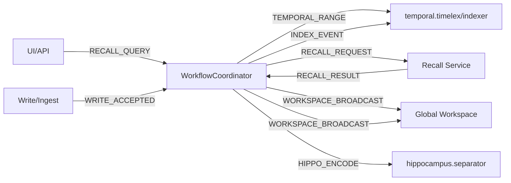
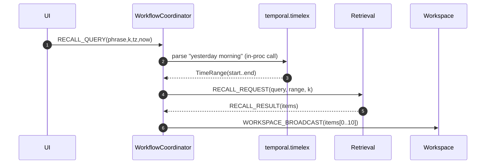

# workflows/ — Orchestrated Cognitive Flows (P01–P05 glue)
**Compiled:** 2025-09-06T22:57:02.057130Z  
**Philosophy:** *Deterministic, event‑driven, policy‑aware.* Workflows wire your cognitive subsystems together — from UI queries to hippocampal encoding — with **durable state**, **idempotency**, and **clear envelopes**.

> This module sits **on top of the durable in‑process EventBus** and treats every step as a small transaction. See `events/` for bus guarantees (WAL, durable consumer groups, at‑least‑once). fileciteturn1file8

---

## 0) Where `workflows/` sits (system view)



**Inputs:** trigger events like `RECALL_QUERY`, `WRITE_ACCEPTED`.  
**Outputs:** derived events such as `TEMPORAL_RANGE`, `RECALL_REQUEST`, `HIPPO_ENCODE`, and `WORKSPACE_BROADCAST`.

Temporal phrase parsing and recency math are provided by **family_temporal** (timelex/indexer). fileciteturn1file9

---

## 1) Event envelopes

### 1.1 `RECALL_QUERY` (UI → Workflows trigger)
```json
{
  "meta": {"topic":"ui","type":"RECALL_QUERY","space_id":"shared:household","trace_id":"trace-1"},
  "payload": {"phrase":"yesterday morning","k":20,"tz":"America/Chicago","now":"2025-09-06T10:00:00Z"}
}
```

### 1.2 `TEMPORAL_RANGE` (Workflows → Temporal/others)
```json
{
  "meta": {"topic":"temporal","type":"TEMPORAL_RANGE","space_id":"shared:household"},
  "payload": {"temporal_range":{"start":"...","end":"...","tz":"..."}, "phrase":"yesterday morning"}
}
```

### 1.3 `RECALL_REQUEST` (Workflows → Retrieval)
```json
{
  "meta": {"topic":"recall","type":"RECALL_REQUEST","space_id":"shared:household","trace_id":"trace-1"},
  "payload": {"query":"...","k":20,"range":{"start":"...","end":"..."}, "space_id":"shared:household"}
}
```

### 1.4 `RECALL_RESULT` (Retrieval → Workflows waits)
```json
{
  "meta": {"topic":"recall","type":"RECALL_RESULT","space_id":"shared:household","trace_id":"trace-1"},
  "payload": {"items":[{"id":"evt-1","score":0.83}]}
}
```

### 1.5 `WORKSPACE_BROADCAST` (Workflows → Workspace/UI)
```json
{"kind":"recall_results","items":[{"id":"evt-1","score":0.83}]}
```

### 1.6 `WRITE_ACCEPTED` (Write/Ingest → Workflows trigger)
```json
{
  "meta": {"topic":"write","type":"WRITE_ACCEPTED","space_id":"shared:household","trace_id":"trace-2"},
  "payload": {"event_id":"evt-w-1","ts":"2025-09-06T12:42:00Z","tags":["note"]}
}
```

---

## 2) Execution model

The coordinator executes **StepSpec**s of a **WorkflowSpec**. Steps are either:

- `immediate`: run a handler right away (publish derived events).  
- `wait_event`: suspend the run and **wait** for a matching event (with `timeout_sec`).

All runs are persisted to `workspace/.workflows` with a **JSON file per run** and a global **idempotency index** keyed by `spec_id|trigger.idem_key`. On restart, the supervisor can load PENDING/RUNNING runs and resume.

> The underlying EventBus provides **WAL, ack/nack with retries, durable consumer groups, and DLQ**; Workflows rely on these guarantees without re‑implementing them. fileciteturn1file8

---

## 3) Math & rules used

- **Temporal normalization**: UI phrases (e.g., “yesterday morning”) are turned into hour ranges via `timelex`.  
- **Recency bias** downstream: retrieval uses an exponential half‑life weighting `2^(-Δt/h)` to sort candidates. fileciteturn1file9

These are *explainable* and computed **on device**.

---

## 4) Files

```
family_workflows/
├─ __init__.py
├─ errors.py                       # Typed errors
├─ types.py                        # Envelopes & dataclasses
├─ store.py                        # Durable JSON store + idempotency index
├─ policies.py                     # Thin policy adapter (wire to policy/*)
├─ middleware.py                   # Hooks for metrics/logging
├─ workflow_base.py                # Coordinator, step runners
├─ recall_workflow.py              # RECALL_QUERY → RECALL_REQUEST → WORKSPACE_BROADCAST
├─ sequence_flow_workflow.py       # WRITE_ACCEPTED → HIPPO_ENCODE → INDEX_EVENT → BROADCAST
├─ demo_bus.py                     # Minimal in‑memory bus for demo/tests
└─ demo.py                         # End‑to‑end demo
```

---

## 5) Mermaid — Recall workflow



---

## 6) Integration points

- **Event Bus**: subscribe triggers with a durable group `"workflows"`, publish derived events. The `events/` module guarantees WAL + DLQ + replay. fileciteturn1file8  
- **Temporal**: leverage `timelex.parse_phrase()` to normalize UI phrases and optionally its **indexer** for range queries and periodicity summaries. fileciteturn1file9
- **Policy**: the built‑in `PolicyGate` is a stub; wire it to `policy/rbac.py`, `policy/abac.py`, and `policy/consent.py` for real enforcement.
- **Observability**: attach workflow middleware to emit metrics and traces; or wrap bus with `events.middleware` (tracing/metrics). fileciteturn1file8

---

## 7) Quickstart (demo)

```python
from family_workflows.demo import main
import asyncio; asyncio.run(main())
```
This will:
1. Register the recall and write sequence workflows,
2. Publish a `RECALL_QUERY` and a `WRITE_ACCEPTED`,
3. Emit derived events and write run files under `/mnt/data/workflow_workspace/store`.

---

## 8) Policy & privacy

- **Space‑scoped**: workflows propagate `space_id` across derived events to keep data fenced.
- **No raw content stored**: only step outputs and run metadata (timestamps, ids).
- **Idempotent**: duplicate triggers don’t spawn multiple runs.

---

## 9) Future upgrades

- Per‑step **circuit breakers** and **rate limits** (P17 QoS)  
- **Pause/Resume/Cancel** admin APIs  
- **Graph workflows** (DAG) with conditional branches  
- **Compensating actions** for partial failures (sagas)  
- Built‑in **E2E tests** via synthetic buses and goldens

---

## 10) Minimal code examples

**Build and register the recall workflow**
```python
from family_workflows.workflow_base import WorkflowCoordinator
from family_workflows.recall_workflow import build_recall_workflow
from family_workflows.store import WorkflowStore
from family_workflows.demo_bus import InMemoryBus

bus = InMemoryBus()
store = WorkflowStore("./workspace/.workflows")
coord = WorkflowCoordinator(bus, store)
await coord.register(build_recall_workflow())
```

**Trigger via event**
```python
from family_workflows.types import Event, EventMeta
ev = Event(meta=EventMeta(topic="ui", type="RECALL_QUERY", space_id="shared:household"),
           payload={"phrase":"yesterday evening","k":10,"tz":"UTC"})
await bus.publish(ev)
```

---

**References**  
- `events/` module: WAL, durable groups, acks, retries, DLQ — this module builds on that substrate. fileciteturn1file8  
- `family_temporal/` module: phrase parsing (“yesterday morning”), recency math, and time index integration. fileciteturn1file9
